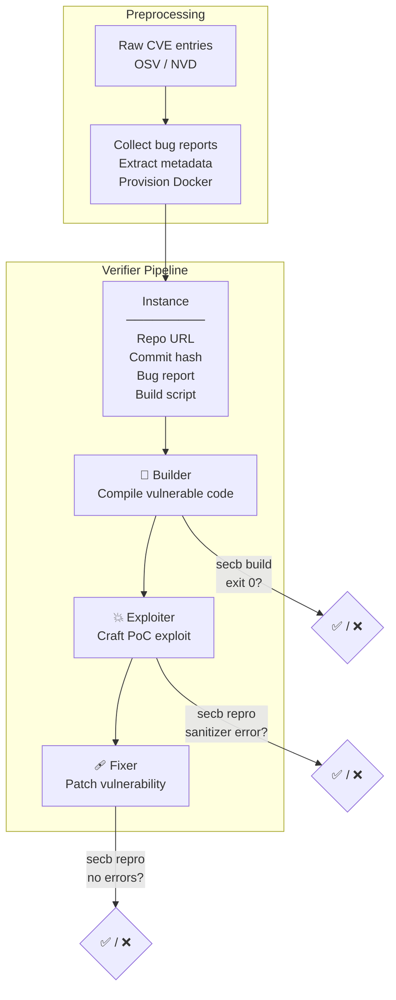

# ARISE: Tree-Structured Agents for Cybersecurity Benchmark Construction

## 1. Problem and Approach
We build a tree-structured AI agent system that automates cybersecurity benchmark construction — and investigate whether agent topology and self-configuration can improve success rates over flat single-agent pipelines.

A **cybersecurity benchmark** is a standardized set of real-world vulnerability instances (CVEs) with verified, execution-based ground truth — each instance must be compilable, exploitable, and patchable to count as valid.

We **temporarily** adopt [SEC-bench](https://arxiv.org/abs/2506.11791)'s benchmark definition and success criteria as-is.
Our hypothesis: a tree-structured system with **hierarchical task decomposition**, **rich context passing**, and **budget-aware resource allocation** will outperform SEC-bench's flat single-agent pipeline. Longer-term, we aim to add auto-healing and auto-configuration capabilities.

---

## 2. Related Work: SEC-bench

SEC-bench starts with a **preprocessing** step: given raw CVE entries, it collects bug reports, extracts vulnerability metadata, and provisions Docker environments. The output is a set of self-contained instances — each with a repository URL, vulnerable commit hash, bug report, and build script — ready for agents to work on.

Each verified instance is then fed through three sequential agents:



### Builder → Exploiter → Fixer

| Agent | Question it answers | What it does | Success = |
|-------|-------------------|--------------|-----------|
| **Builder** | *Can we compile the vulnerable project?* | Checks out the vulnerable commit, fixes the build script, resolves dependencies, compiles | `secb build` exits 0 |
| **Exploiter** | *Can we trigger the exact bug?* | Crafts a proof-of-concept input that reproduces the sanitizer error (ASan, MSan, UBSan, etc.) from the bug report | `secb repro` triggers the matching sanitizer error |
| **Fixer** | *Can we patch it?* | Produces a minimal unified diff that eliminates the vulnerability without breaking functionality | `secb repro` after patching produces **no** sanitizer errors |

**Why automate this?** Existing security benchmarks (CyberSecEval, BigVul, PrimeVul, CVEFixes) rely on manual curation — limiting their scope, coverage, and ability to keep pace with newly discovered CVEs. SEC-bench's argument: if AI agents can automate the reproduce-exploit-patch pipeline, benchmark construction scales far beyond what manual expert review alone can achieve.

### SEC-bench Baseline Numbers

**Success Rates**:

| Agent          | Success Rate          |
|----------------|-----------------------|
| Builder        | 81.7%                 |
| Exploiter      | 39.4% (abs: 32.2%)   |
| Fixer          | 69.2% (abs: 22.3%)   |
| **End-to-end** | **22.3%**             |

---

## 3. ARISE: Our Agent Topology

Same task. Same success criteria. Different agent architecture.

### Core Architecture

```
         Root (task: create security benchmark of: CVE-XXXX-YYYY)
           │
    ┌──────┼──────┐
    ▼      ▼      ▼
 Thinker Thinker Thinker    ← decompose subtasks
    │      │
   ┌┴┐   ┌┴┐
   ▼  ▼  ▼  ▼
  W1  W2 W3  W4             ← execute code via AI agents
```

| Node Type | Role |
|-----------|------|
| **Root** | Receives the full CVE task |
| **Thinker** | Breaks a task into subtasks (AI-decided decomposition) |
| **Worker** | Executes atomic coding tasks via OpenHands agents |

### Core Features (production system — `develop` branch)

| Feature | What it does |
|---------|-------------|
| Complexity Evaluation | LLM evaluates each task — routes to WORKER (atomic) or MANAGER (decompose further) |
| Hierarchy Limits | Enforces max depth, max children per node, max total agents, and USD cost ceiling |
| Context Passing | Local: parent→child, child→parent, sibling→sibling. Global: shared artifact store, decision log, and progress tracker across the entire hierarchy |
| CVE Instance Inference | Regex-based extraction of CVE ID, repo, commit hash, sanitizer type from task description |

### Experimental Design Choices (from [experiment branch](system/design_choice/))

These 7 incremental design choices were evaluated in Experiment 2 and are hypothesized to drive the performance gains:

| DC | Name | What it adds |
|----|------|-------------|
| 1 | [Naive Tree](system/design_choice/naive_tree.md) | Base tree with full agent autonomy — agents decide to work or decompose |
| 2 | [Complexity Budgeted Tree](system/design_choice/budgeted_tree.md) | Budget threshold restrains tree growth; prevents runaway agent spawning |
| 3 | [Significance Scoring](system/design_choice/budgeted_tree_plus.md) | LLM assigns weight per subtask; budget split proportionally so critical tasks get more resources |
| 4 | [Thinker Justification](system/design_choice/context_passing_tree.md) | Parent passes reasoning (why assigned, suggested approach, expected deliverables) to children |
| 5 | [Worker Feedback + Shared Context](system/design_choice/context_passing_plus_tree.md) | Workers report results to parent; approved results published to global dashboard for sibling reuse |
| 6 | [Boss Key Extraction](system/design_choice/context_passing_with_source_summary.md) | Extracts structured key info (bug summary, error messages, repro steps, referenced files) from boss context |
| 7 | [CWE Inference](system/design_choice/context_passing_with_CWE_tree.md) | Infers CWE patterns from bug report → provides targeted fix strategies and recommended sanitizers |

### Not Yet Implemented

| Feature | What it would do |
|---------|-----------------|
| Hyperparameter Auto-Tuning | Agents adjust their own temperature, max tokens, and iteration limits based on task outcome |
| Model Auto-Selection | Agents pick the best LLM per subtask (e.g., cheaper model for simple builds, stronger model for exploit crafting) |
| Auto-Healing | On worker failure, retry the subtree with different config instead of just re-running the same setup |

---

## 4. Results

Both experiments compare against SEC-bench **Verifier** rates from paper Table 1 (898 seed → 200 verified). SEC-bench rates are **conditional** (each stage only runs if the previous succeeded). ARISE rates are **unconditional** (out of all instances — stages run independently).

| | Builder | Exploiter | Fixer | End-to-end | Source |
|--|---------|-----------|-------|------------|--------|
| **SEC-bench Verifier** | 81.7% | 39.4% | 69.2% | 22.3% | Paper Table 1 (n=898) |

### Experiment 1: Naive Tree (n=23, DC1 only)

Models: gpt-4o-mini (orchestration) + Claude Sonnet 4 (workers via Claude Code).

| Metric    | ARISE (n=23) | SEC-bench (abs) |
|-----------|-------------|-----------------|
| Builder   | 87.0%       | 81.7%           |
| Exploiter | 39.1%       | 32.2%           |
| Fixer     | 26.1%       | 22.3%           |
| E2E       | 26.1%       | 22.3%           |
| Cost      | $8.96/inst  | $0.87/inst      |

> **Note:** This experiment had setup flaws that underestimated ARISE's results. For example, in `upx.cve-2023-23457`, workers generated a valid PoC at `/testcase/repro.sh`, but `secb repro` expected the hardcoded path `/testcase/POC2` — verification exited 127 (file not found), counting as a false negative. Actual performance is likely slightly higher.

### Experiment 2: Full-Featured Tree (n=21, all 7 design choices)

Models: gpt-4o-mini (orchestration) + GPT-4o (workers via OpenHands).

| Metric    | ARISE (n=21) | SEC-bench (abs) |
|-----------|-------------|-----------------|
| Builder   | 90.5%       | 81.7%           |
| Exploiter | 81.0%       | 32.2%           |
| Fixer     | 81.0%       | 22.3%           |
| Cost      | $2.67/inst  | $0.87/inst      |


<details>
<summary><b>Concrete Example: How ARISE handled gpac.cve-2023-0770</b></summary>

**Vulnerability**: Heap buffer overflow in `gpac` MP4 parser (AddressSanitizer).

**SEC-bench SecVerifier result**: Builder ✓, Exploiter ✗, Fixer ✗ (stuck at exploit stage).

**ARISE result**: Builder ✓, Exploiter ✓, Fixer ✗ (exploit succeeded, patch failed validation).

**What happened in the tree**:

1. **Root** received the full CVE task and spawned 3 Thinkers (Builder, Exploiter, Fixer phases)
2. **Builder Thinker** decomposed into 2 Workers:
   - Worker 1: Set up Docker build environment, checkout vulnerable commit
   - Worker 2: Fix build script, compile with AddressSanitizer flags
   - Both succeeded → `secb build` passed
3. **Exploiter Thinker** decomposed into Workers:
   - Worker 1 (via **Boss Key Extraction**, DC6): Analyzed bug report, extracted error signature and crash location
   - Worker 2 (via **Sibling Context**): Inherited Worker 1's file path findings, crafted PoC input
   - Worker 2 triggered the exact AddressSanitizer error → `secb repro` passed
4. **Fixer Thinker** decomposed into Workers:
   - Worker received **CWE inference** context (CWE-122: Heap-based Buffer Overflow, suggested bounds check)
   - Generated a patch, but it failed validation — patch prevented the crash but introduced a new sanitizer warning

**Why this is interesting**: SecVerifier's single Exploiter agent couldn't craft the PoC. ARISE's decomposition let one worker focus on *understanding* the vulnerability while another focused on *crafting the payload*, with shared context bridging them. The Fixer still failed — showing that 81% isn't 100%, and patch validation remains hard.

</details>

---

## 5. Limitations

1. **No direct correlation with cybersecurity** — The tree-structured topology itself is generic. There is no cybersecurity-specific logic in the architecture; domain knowledge enters only through CWE inference and system prompt. The same framework could be applied to non-security tasks.
2. **High performance not yet properly investigated** — The 81% Exploiter/Fixer results have not been rigorously validated. There may be label leakage (e.g., CWE inference giving workers information that SEC-bench agents don't receive), unintentional cheating (e.g., shared context leaking ground-truth patch content), or other confounds inflating the numbers.
3. **Cost** — 3x more expensive per instance ($2.67 vs $0.87). Acceptable given the performance jump, but unoptimized.

