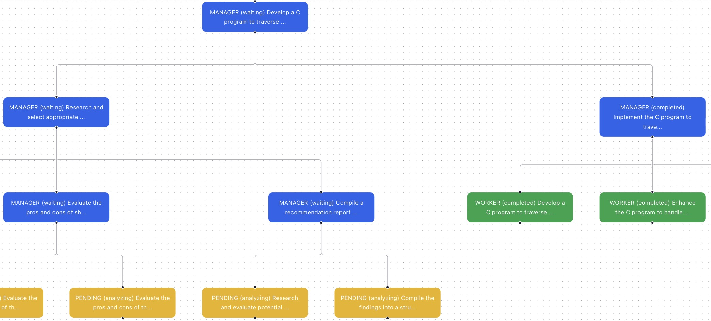

import BudgetedTree from '@site/src/components/budgeted_tree';

# Design Choice 2: Recursive Planning and Working With Budget Allowance

## Budgeted Tree-Structured Agentic System 
This system is building on top of the naive tree-structured agentic system by adding budget management, but with only rudimentary task assignment and reward allocation systems to make it work. This system is designed to test if the budget management alone can restrain the tree growth and improve the overall performance.

## Case Study Task
### Task Objective
Write C code with only one file that counts all files recursively in the current directory.

### Interactive Diagram

Below is an interactive React Flow diagram that captures a snapshot of the high-level structure. You can pan, zoom, and explore relationships between agents. **Click on the nodes to see their details**.
<BudgetedTree/>

### Generated Files 
Below is a snapshot of the files generated by this agentic system for a sample task.
```bash
tree ./output/12dad0e4-f455-4fc0-92e2-0c04644a92e1
./output/12dad0e4-f455-4fc0-92e2-0c04644a92e1
|-- __pycache__
|   |-- test_count_files.cpython-312-pytest-9.0.1.pyc
|   `-- test_count_files.cpython-312.pyc
|-- count_files
|-- count_files.c
|-- dir_traversal
|-- dir_traversal.c
|-- test_count_files.py
|-- test_dir
|   |-- file1.txt
|   |-- file2.txt
|   |-- link_to_file1.txt -> /app/output/12dad0e4-f455-4fc0-92e2-0c04644a92e1/test_dir/file1.txt
|   `-- subdir
|       `-- file3.txt
|-- test_results_documentation.txt
`-- test_results.txt

4 directories, 13 files
```

### Analysis
1. **Tree Growth and Better Context for Worker Node**: Compared to the naive tree, the tree structure grew less rapidly as each agent spawned multiple subordinate agents with current budget taken into account. In this system, agents quickly proliferated and most of them become thinking nodes, but worker nodes are enabled when the contexts provided by ancestor thining nodes are sufficient to be clear instructions.
2. **No Branch Pruning**: Since there is no task assignment mechanism, there is no way to prune unproductive or excessively similar branches with the similar high-level objectives. In the following example, two competing branches are created to count files: left branch tries to research exisiting tools and the right branch decides to implement directly based on its own knowledge. Both branches are valid but redundant. Right branch's implmentation may be better with the result of the left branch's research, which is why their manager node create task in this way. However, the researching branch can be excessively deep compared to the right branch, leading imbalance subtree structure. A branch termination mechanism, part of task assignment mechanism, should be implemented to prune competing branches to save budget and time.

3. **Complete and Sound Approach**: With budget constraints, agents are able to focus on more complete and sound approaches to solve the task. For example, in this case study, after the simple implementations, agents also create test folders to verify the correctness of the code, and edge cases like symbolic links are also considered. When some agents have sufficient amount of budget, even documentations on the testing part are created. A simpler and memory safe python script is used to verify the work, and because of the containerized environment, agents are able to compile the code, run the tests and verify the results automatically and autonomously. With a reward allocation mechanism, agents are incentivized to produce more focused work that if the budget is low, they would not waste resources on verifications or testings.