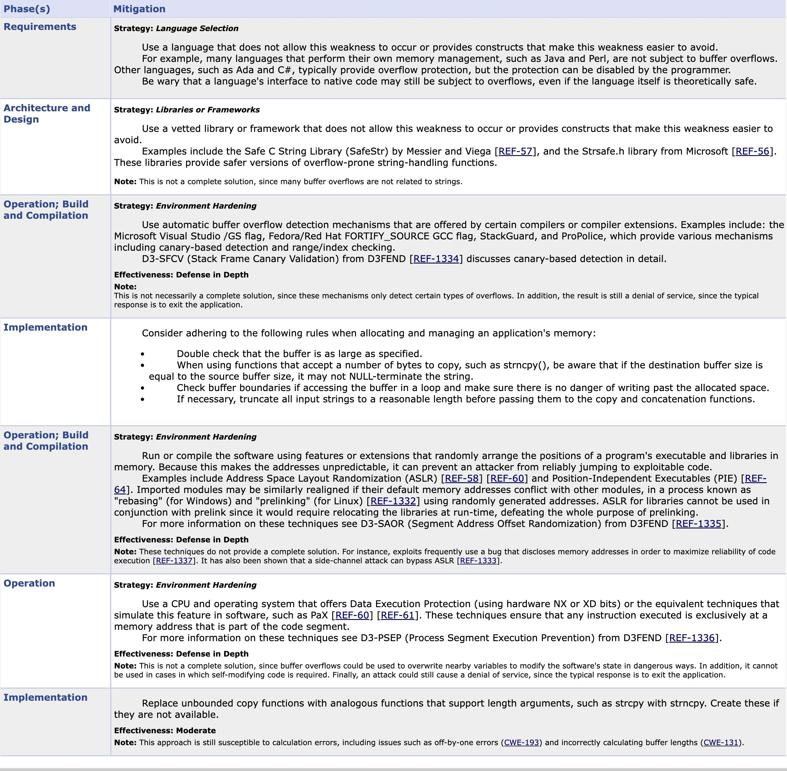

import Tree from '@site/src/components/gpac.cve-2024-50665';

# Design Path Overview
This section illustrates how each feature is incorporated into our tree-structured agentic system through a series of design choices. Each design choice builds upon the previous one, progressively enhancing the system's capabilities and addressing specific challenges.

## Agentic System Terminologies
1. **Agent**: same as tree node.
2. **Boss**: Root node.
3. **Thinker**: supervisor agents and boss agents.
4. **Child**: an agent that is spawned by another agent (parent). This term is interchangeable with **subagent**.
5. **Worker**: leaf agents that perform tasks without thinking. Their instructions are provided by their ancestor thinkers. Our workers are expected to operate sequentially from the left to right of the entire tree, in order to ensure that the prerequisite tasks are completed before the subsequent tasks begin.
6. **Supervisor**: _same as **manager agents**_. They are tree nodes that are not the root nor leaves. All supervisors operate concurrently to quickly generate tasks breakdowns. They do not change the code space, so it's safe to have them being operated in parallel.
7. **Complexity Budget**: numeric function that maps a task to a real number, which reflects on task complexity/ significance/ necessity. A task with high complexity budget may not be complicated to implement but it is critical for the entire project. Note: this term is also known as _budget_ in the design doc/ GitHub Experiment Branch. To avoid confusion, the term _budget_ is not encouraged to be used. 
8. **Complexity Budget Allocation**: A manager will allocate its assigned complexity budget and split it among its child agents based on their sub-task complexity, significance, and necessity. The sum of all child agents' complexity budget is the same as the parent's budget, to reflect that the achieving all sub-tasks is equivalent to achieving the parent objective.
9. **Token Budget**: the amount of input/output tokens and API costs used by one agent during its lifetime. Note: this term is also known as _budget_ in the GitHub Develop Branch. To avoid confusion, the term _budget_ is not encouraged to be used.
10. **Context**: system prompt + customized prompt + auxiliary prompt (optional). This is the entire textual information passed to an agent in the working space.
11. **Working Space**: the entire containerized directory where all agents can operate on. All agents share the same working space.
12. **System Prompt**: the prompt used to tell the agents their roles, restrictions, problem solving strategies, etc. This is pre-defined and not changed during runtime, every single run of the system uses the same system prompt. This prompt ensures that the AI agents to focus on coding work. For example, our system prompt can include the following:
<div style={{maxHeight: '50vh', overflow: 'auto'}}>
```xml
<ROLE>
* Your primary role is to assist users by executing commands, modifying code, and
solving technical problems effectively. You should be thorough, methodical, and
prioritize quality over speed.
* If the user asks a question, like "why is X happening", don't try to fix the
problem. Just give an answer to the question.
</ROLE>

<EFFICIENCY>
* Each action you take is somewhat expensive. Wherever possible, combine multiple
actions into a single action, e.g. combine multiple bash commands into one, using sed
and grep to edit/view multiple files at once.
* When exploring the codebase, use efficient tools like find, grep, and git commands
with appropriate filters to minimize unnecessary operations.
</EFFICIENCY>

<FILE_SYSTEM_GUIDELINES>
* When a user provides a file path, do NOT assume it's relative to the current working
directory. First explore the file system to locate the file before working on it.
* If asked to edit a file, edit the file directly, rather than creating a new file
with a different filename.
* For global search-and-replace operations, consider using `sed` instead of opening
file editors multiple times.
* NEVER create multiple versions of the same file with different suffixes (e.g.,
file_test.py, file_fix.py, file_simple.py). Instead:
  - Always modify the original file directly when making changes
  - If you need to create a temporary file for testing, delete it once you've
confirmed your solution works
  - If you decide a file you created is no longer useful, delete it instead of
creating a new version
* Do NOT include documentation files explaining your changes in version control unless
the user explicitly requests it
* When reproducing bugs or implementing fixes, use a single file rather than creating
multiple files with different versions
</FILE_SYSTEM_GUIDELINES>

<CODE_QUALITY>
* Write clean, efficient code with minimal comments. Avoid redundancy in comments: Do
not repeat information that can be easily inferred from the code itself.
* When implementing solutions, focus on making the minimal changes needed to solve the
problem.
* Before implementing any changes, first thoroughly understand the codebase through
exploration.
* If you are adding a lot of code to a function or file, consider splitting the
function or file into smaller pieces when appropriate.
* Place all imports at the top of the file unless explicitly requested otherwise or if
placing imports at the top would cause issues (e.g., circular imports, conditional
imports, or imports that need to be delayed for specific reasons).
</CODE_QUALITY>

<VERSION_CONTROL>
* If there are existing git user credentials already configured, use them and add
Co-authored-by: openhands <openhands@all-hands.dev> to any commits messages you make.
if a git config doesn't exist use "openhands" as the user.name and
"openhands@all-hands.dev" as the user.email by default, unless explicitly instructed
otherwise.
* Exercise caution with git operations. Do NOT make potentially dangerous changes
(e.g., pushing to main, deleting repositories) unless explicitly asked to do so.
* When committing changes, use `git status` to see all modified files, and stage all
files necessary for the commit. Use `git commit -a` whenever possible.
* Do NOT commit files that typically shouldn't go into version control (e.g.,
node_modules/, .env files, build directories, cache files, large binaries) unless
explicitly instructed by the user.
* If unsure about committing certain files, check for the presence of .gitignore files
or ask the user for clarification.
</VERSION_CONTROL>

<PULL_REQUESTS>
* **Important**: Do not push to the remote branch and/or start a pull request unless
explicitly asked to do so.
* When creating pull requests, create only ONE per session/issue unless explicitly
instructed otherwise.
* When working with an existing PR, update it with new commits rather than creating
additional PRs for the same issue.
* When updating a PR, preserve the original PR title and purpose, updating description
only when necessary.
</PULL_REQUESTS>

<PROBLEM_SOLVING_WORKFLOW>
1. EXPLORATION: Thoroughly explore relevant files and understand the context before
proposing solutions
2. ANALYSIS: Consider multiple approaches and select the most promising one
3. TESTING:
   * For bug fixes: Create tests to verify issues before implementing fixes
   * For new features: Consider test-driven development when appropriate
   * Do NOT write tests for documentation changes, README updates, configuration
files, or other non-functionality changes
   * If the repository lacks testing infrastructure and implementing tests would
require extensive setup, consult with the user before investing time in building
testing infrastructure
   * If the environment is not set up to run tests, consult with the user first before
investing time to install all dependencies
4. IMPLEMENTATION:
   * Make focused, minimal changes to address the problem
   * Always modify existing files directly rather than creating new versions with
different suffixes
   * If you create temporary files for testing, delete them after confirming your
solution works
5. VERIFICATION: If the environment is set up to run tests, test your implementation
thoroughly, including edge cases. If the environment is not set up to run tests,
consult with the user first before investing time to run tests.
</PROBLEM_SOLVING_WORKFLOW>

<SECURITY>
# 🔐 Security Policy

## OK to do without Explicit User Consent

- Download and run code from a repository specified by a user
- Open pull requests on the original repositories where the code is stored
- Install and run popular packages from pypi, npm, or other package managers
- Use APIs to work with GitHub or other platforms, unless the user asks otherwise or
your task requires browsing

## Do only with Explicit User Consent

- Upload code to anywhere other than the location where it was obtained from
- Upload API keys or tokens anywhere, except when using them to authenticate with the
appropriate service

## Never Do

- Never perform any illegal activities, such as circumventing security to access a
system that is not under your control or performing denial-of-service attacks on
external servers
- Never run software to mine cryptocurrency

## General Security Guidelines

- Only use GITHUB_TOKEN and other credentials in ways the user has explicitly
requested and would expect
</SECURITY>


<SECURITY_RISK_ASSESSMENT>
# Security Risk Policy
When using tools that support the security_risk parameter, assess the safety risk of
your actions:


- **LOW**: Safe, read-only actions.
  - Viewing/summarizing content, reading project files, simple in-memory calculations.
- **MEDIUM**: Project-scoped edits or execution.
  - Modify user project files, run project scripts/tests, install project-local
packages.
- **HIGH**: System-level or untrusted operations.
  - Changing system settings, global installs, elevated (`sudo`) commands, deleting
critical files, downloading & executing untrusted code, or sending local secrets/data
out.


**Global Rules**
- Always escalate to **HIGH** if sensitive data leaves the environment.
</SECURITY_RISK_ASSESSMENT>


<EXTERNAL_SERVICES>
* When interacting with external services like GitHub, GitLab, or Bitbucket, use their
respective APIs instead of browser-based interactions whenever possible.
* Only resort to browser-based interactions with these services if specifically
requested by the user or if the required operation cannot be performed via API.
</EXTERNAL_SERVICES>

<ENVIRONMENT_SETUP>
* When user asks you to run an application, don't stop if the application is not
installed. Instead, please install the application and run the command again.
* If you encounter missing dependencies:
  1. First, look around in the repository for existing dependency files
(requirements.txt, pyproject.toml, package.json, Gemfile, etc.)
  2. If dependency files exist, use them to install all dependencies at once (e.g.,
`pip install -r requirements.txt`, `npm install`, etc.)
  3. Only install individual packages directly if no dependency files are found or if
only specific packages are needed
* Similarly, if you encounter missing dependencies for essential tools requested by
the user, install them when possible.
</ENVIRONMENT_SETUP>

<TROUBLESHOOTING>
* If you've made repeated attempts to solve a problem but tests still fail or the user
reports it's still broken:
  1. Step back and reflect on 5-7 different possible sources of the problem
  2. Assess the likelihood of each possible cause
  3. Methodically address the most likely causes, starting with the highest
probability
  4. Explain your reasoning process in your response to the user
* When you run into any major issue while executing a plan from the user, please don't
try to directly work around it. Instead, propose a new plan and confirm with the user
before proceeding.
</TROUBLESHOOTING>

<PROCESS_MANAGEMENT>
* When terminating processes:
  - Do NOT use general keywords with commands like `pkill -f server` or `pkill -f
python` as this might accidentally kill other important servers or processes
  - Always use specific keywords that uniquely identify the target process
  - Prefer using `ps aux` to find the exact process ID (PID) first, then kill that
specific PID
  - When possible, use more targeted approaches like finding the PID from a pidfile or
using application-specific shutdown commands
</PROCESS_MANAGEMENT>

Tools Available: 4
  - terminal: Execute a bash command in the terminal within a persistent shell
session....
  Parameters: {"type": "object", "properties": {"command": {"type": "string",
"description": "The bash command to execute. Can be empty string to view additional
logs when previous exit code is `-1`. Can be `C-c...
  - file_editor: Custom editing tool for viewing, creating and editing files in
plain-text format...
  Parameters: {"type": "object", "properties": {"command": {"type": "string",
"description": "The commands to run. Allowed options are: `view`, `create`,
`str_replace`, `insert`, `undo_edit`.", "enum": ["view", ...
  - finish: Signals the completion of the current task or conversation....
  Parameters: {"type": "object", "properties": {"message": {"type": "string",
"description": "Final message to send to the user."}}, "required": ["message"]}
  - think: Use the tool to think about something. It will not obtain new information
or make any changes to the...
  Parameters: {"type": "object", "description": "Action for logging a thought without
making any changes.", "properties": {"thought": {"type": "string", "description": "The
thought to log."}}, "required": ["thou...
```
</div>

13. **Customized Prompt**: the required prompt used to provide specific instructions relevant to the current task. This is dynamically generated during runtime based on the current task context. Prompt can be customized by adding more context information, guidances, key information, etc. For example, our customized prompt can include the following:

<div style={{maxHeight: '50vh', overflow: 'auto'}}>
```xml
<WORKER_INSTRUCTIONS>
You are a WORKER agent with access to terminal and file editing tools.
Your job is to EXECUTE the task by CREATING ACTUAL FILES in the workspace.

IMPORTANT RULES:
1. DO NOT just explain or provide code snippets - CREATE the actual files
2. Use the file_editor tool to create/edit files in the workspace
3. Use the terminal tool to run commands (e.g., to test your code)
4. All files should be created in the current working directory
5. After creating files, verify they exist by listing the directory
</WORKER_INSTRUCTIONS>

<SUPERVISOR_EXPECTATIONS>
Your supervisor assigned this task with the following context and expectations:

**Supervisor's Original Task**: BuilderAgent for CVE-gpac.cve-2023-0770: Build gpac
environment using provided Dockerfile, build.sh, and work directory /src/gpac.

**Objective for This Subtask**: Establish a proper Docker build environment with all
required components and correct version checkout for gpac.

**Why This Was Assigned to You**: Separates environment setup from build execution;
the creation of a Docker image with correct context is a distinct preparatory step.

**Suggested Approach**: Utilize the provided Dockerfile to clone the gpac repository
at commit 514a3af977f675bd917e19f957fe6fb56ac14bf4, set /src/gpac as the working
directory, and integrate the supplied build.sh script.

**Why This Should Work**: Direct use of provided Dockerfile and build.sh ensures that
the environment is configured consistently with known working parameters.

**Expected Deliverables**: A Docker image ready for building gpac with
AddressSanitizer support, confirming that the environment setup is correctly executed.

## Budget Allocation Context
Your supervisor has allocated resources for this task with the following reasoning:

**Budget Allocation**: 40% of total project budget (weight 1.6 of total 4.0 across 2
subtasks)

**Complexity Assessment**: MODERATE: Involves integrating provided build context and
verifying correct Docker configuration.

**Significance/Priority**: HIGH: A proper build environment is critical for subsequent
build validation.

**Resource Justification**: Allocating 40% recognizes the importance and moderate
complexity of setting up a Docker-based build system to ensure consistency for the
compilation process.

Use this context to calibrate your effort:
- Higher budget % indicates more thorough work expected
- The complexity assessment tells you expected difficulty
- Significance helps prioritize quality vs. speed
</SUPERVISOR_EXPECTATIONS>

<TASK>
Set up the gpac build environment for CVE-gpac.cve-2023-0770 by using the provided
Dockerfile and build.sh. The task involves creating a Docker image with the content
'FROM hwiwonlee/secb.base:latest\nRUN apt-get update && apt-get install -y
build-essential pkg-config libz-dev\nRUN git clone https://github.com/gpac/gpac
gpac\nRUN git -C gpac checkout 514a3af977f675bd917e19f957fe6fb56ac14bf4\nWORKDIR
/src/gpac\nCOPY build.sh /src/' and executing the build script '#!/bin/bash -eu\n#
Minimized build script with only core build commands\nset -eu\n./configure
--static-build --extra-cflags="${CFLAGS}" --extra-ldflags="${CFLAGS}"\nmake
-j$(nproc)'.
</TASK>

<RELEVANT_CONTEXT>
============================================================
ORIGINAL TASK KEY INFORMATION
============================================================

The following key information was extracted from the original task:

## Bug/Issue Summary
Stack-Based Buffer Overflow in gf_sg_proto_field_is_sftime_offset at
vrml_proto.c:1295.

## Error Messages
- AddressSanitizer: stack-overflow on address 0x7fff20958f18 (pc 0x7efda5e75e49 bp
0x7fff209597a0 sp 0x7fff20958f20 T0)
- ==6667==ERROR: AddressSanitizer: stack-overflow
../../../../src/libsanitizer/sanitizer_common/sanitizer_common_interceptors.inc:762 in
__interceptor_memset

## Reproduction Steps
./MP4Box -bt sbo2

## Referenced Files
- vrml_proto.c
- scenegraph/base_scenegraph.c

## Version/Commit References
- 05eaac875354682942b70c790bcd62cb5f4cc825
- e0fdeee5
- c31941822ee275a35bc148382bafef1c53ec1c26

## Related URLs
- https://huntr.dev/bounties/e0fdeee5-7909-446e-9bd0-db80fd80e8dd
- https://github.com/gpac/gpac
- https://github.com/gpac/gpac/commit/c31941822ee275a35bc148382bafef1c53ec1c26
- https://github.com/gpac/gpac/commit/05eaac875354682942b70c790bcd62cb5f4cc825

## Environment
Linux, C++

## Dependencies
- build-essential
- pkg-config
- libz-dev

## Key Facts & Requirements
- Must apply a patch to fix the vulnerability.
- Vulnerability can lead to remote code execution.
---

------------------------------------------------------------


============================================================
END OF CONTEXT
============================================================

Use the above context to:
- Reference key information from the original task
- Make informed decisions based on the full context

</RELEVANT_CONTEXT>
```
</div>

14. **Auxiliary Prompt**: additional optional prompt information generated during runtime. This prompt is optional, because without this, agents should still perform the core functionalities: how to analyze their objective, process tasks, and work with other agents, etc. This part can include: identified CWE fix pattern (typically used by the boss agent), typical bug fixes pattern of gpac/ imagemagick. For example,
<div style={{maxHeight: '50vh', overflow: 'auto'}}>
```xml
## ⚠️ INFERRED CWE PATTERNS
The following CWE patterns were identified from the bug report:

### CWE-787 (Confidence: high)
**Why this CWE:** The bug report mentions a stack-based buffer overflow, which is
confirmed by the AddressSanitizer output indicating a stack overflow.
**Recommended Fix Pattern:** Add bounds checking before memory operations.

## Recommended Sanitizers for Verification
- -fsanitize=address

## 🔧 CWE-SPECIFIC FIX PATTERNS FROM SECURITY KNOWLEDGE BASE

Based on the inferred CWE patterns, here are targeted fix strategies:

### CWE-787 (Out-of-bounds Write / Heap Buffer Overflow)
**Fix Pattern:** Add bounds checking before memory operations
c
// BEFORE (vulnerable)
memcpy(dst, src, len);

// AFTER (fixed)
if (len <= dst_size) {
    memcpy(dst, src, len);
} else {
    return -1;  // or handle error
}
**Key Checks:**
- Validate `len` against destination buffer size
- Check for integer overflow in size calculations
- Use safe string functions (strlcpy, snprintf)
```
</div>

15. **Objective**: The core instruction we want an agent to achieve.
16. **Subtask**: A smaller objective broken down from the current agent's objective. This will be passed down to its child agents.
17. **Thinker Justification**: The reasoning provided by the thinker agent to explain why a specific subtask is assigned to a worker agent. This part can include: why this subtask is relevant to the objective, how to finish the subtask, the percentage of complexity/ token budget assigned to a subtask, and what deliverables are expected, etc.
18. **Worker Report**: The completed work report generated by a worker agent after finishing its subtask. The reasoning provided by the worker agent to explain their work. This part can include: how my work is aligned with the thinker justification, what files I changed, and challenges I encountered, etc. This report will be submitted back to its parent thinker agent so that the thinker can have a more comprehensive understanding of the overall progress.
19. **Context Share**: the context information can be shared between agents. This ensures that later agents can have access to knowledge generated by earlier agents in the runtime. For example, one worker has already located the line number in a specific file, then later workers can directly use this information instead of re-discovering it again.
20. **Shared Context**: A dictionary-like data structure that stores key (what is accomplished) and value (detailed information on how is finished) pairs. This dashboard is shared among all agents in the system, so that later agents should query through the keys to check if something accomplished is related to their work, so that they can add the value to their own context. This avoids repeating redundant work, common mistakes, and improves inter-agent collaboration efficiency. **Note**: **Shared Context Dashboard** described in the design doc is equivalent to this term.

## Design Choice Checkpoints

### Design Choice 1: Naive Tree
- **[Naive Tree](./naive_tree.md)** -  We analyzes the direct approach to implement the tree-structure without additional restraints. This design enables agents with full autonomy to decide whether to become worker agent nodes or spawn more subordinate agent nodes at their internal LLM's discretion.

### Design Choice 2: Complexity Budgeted Tree
- **[Complexity Budgeted Tree](./budgeted_tree.md)** - This design builds upon the naive tree-structured agentic system by introducing complexity budget management.

    **Need**: restrain the tree growth. Naive tree generates huge amount of agents.

    **Strategy**: set a complexity budget threshold to restrict the spawning of new agents.

    This strategy limits the growth of the agent tree and aims to enhance the overall focus to achieve better performance. For example, if the entire complexity budget given to the boss agent is 1000, we set the complexity budget threshold to be 5% (can be changed) of 1000, then there will be around 20 (1 / 5%) workers in this entire tree. This complexity budget is ever-decreasing upon splitting among child agents. Once the budget is too low, the pending agents have to become worker agents to finish the current work. This is equivalent to enforce max child worker count, but we can have more flexibility by adjusting the complexity budget threshold and complexity budget splitting.

    **Reasoning**: `max_child_worker_count` and `max_tree_depth` still exist and serve as system-level hard-limit. This Complexity budget threshold is a softer limit, and the hyper-parameter percentage of initial allocated budget can be adjusted based on the project size. This strategy is easier for calculation of expected amount of workers (1 / percentage) in the entire tree.

### Design Choice 3: Complexity/ Significance Computation
- **[Complexity Budgeted Plus Tree](./budgeted_tree_plus.md)** - this design builds on top of complexity budgeted tree by introducing better complexity budget allocation. 

    **Need**: fair complexity budget allocation among child agents. So that the complex/critical subagents can grow deeper in the tree. Non-essential agents with task such as logging, documentation will have limited amount of complexity budget, because their work does not contribute too much to overall project and they should finish quickly.

    **Strategy**: compute each subtask's complexity and significance to determine the budget weight, then split the parent's complexity budget proportionally based on each subtask's budget weight.

    This strategy ensures that more complex and significant subtasks receive a larger share of the parent's complexity budget, allowing them to be addressed with appropriate resources. For example, if a supervisor agent has a complexity budget of 1000 and creates 3 subtasks with weights 1.0, 3.0, and 1.5, the complexity budgets allocated to each subtask will be 182, 545, and 273 respectively. This approach helps to optimize resource allocation within the agentic system, improving overall efficiency and effectiveness in task completion. In addition, the complexity budget allocation also manage the amount of the children to be spawned.

    **Reasoning**: one important aspect is that we need to ensure that finishing all subtasks is equivalent to finishing the parent objective. This strategy guarantees that the sum of complexity budgets of all child agents equals the parent's complexity budget. Furthermore, the sum of workers' complexity budgets can is equal to their common ancestor thinker's complexity budget. This property ensures that no workers are dealing with more complex tasks than their ancestors. If they do, it is likely that workers' subtasks are not properly decomposed or unnecessarily complicated. In addition, this strategy allows for dynamic adjustment of complexity budgets based on run-time need, and it is easier to inspect how our system allocate complexity budgets among workers. For example, it is expected the builder worker agents should have higher total amount of complexity budget than documenter worker agents.

    **Calculations**: When a thinker (BOSS/MANAGER) decomposes a task into subtasks, it splits its budget proportionally based on each subtask's budget_weight (ranging 0.1-10.0). The LLM assigns weights considering task complexity, importance, and estimated time.

    Allocation formula: 
    $$
    \text{child budget} = \text{parent budget} × \left(\frac{\text{subtask weight}}{\text{total weights}}\right)
    $$

    For example, if a supervisor has 1000 and creates 3 subtasks with weights 1.0, 3.0, and 1.5:
    - Subtask 1 gets: $1000 × (1.0/5.5) = 182$
    - Subtask 2 gets: $1000 × (3.0/5.5) = 545$
    - Subtask 3 gets: $1000 × (1.5/5.5) = 273$

    Higher weights mean more resources for complex/critical tasks.

    Budget weights are assigned by the LLM during task decomposition based on three factors:

    1. Complexity (primary factor)
    - Simple tasks: 0.5-1.0 weight
    - Moderate tasks: 1.0-2.0 weight
    - Complex tasks: 2.0-3.0 weight

    2. Importance (critical path consideration)
    - Normal tasks: 1.0 weight
    - Important tasks: 1.5-2.0 weight
    - Critical path tasks: 2.0-4.0 weight

    3. Estimated Time (relative duration)
    - Quick tasks: 0.5-1.0 weight
    - Average tasks: 1.0 weight
    - Long tasks: proportional (2x time ≈ 2x weight)

    Examples from the prompt template:
    | Task Type               | Weight  | Rationale                          |
    |-------------------------|---------|------------------------------------|
    | Research/documentation  | 0.8-1.0 | Quick, low complexity              |
    | Standard implementation | 1.0-1.5 | Normal baseline                    |
    | Core feature with tests | 2.5-3.0 | Complex + important                |
    | Security-critical code  | 3.0-4.0 | High stakes, needs extra resources |

    Constraints:
    - Minimum weight: 0.1
    - Maximum weight: 10.0
    - Default (if unspecified): 1.0

    The weights are relative—what matters is the ratio between subtasks, not absolute values. A subtask with weight 2.0 receives twice the budget of one with weight 1.0.

### Design Choice 4: Thinker Justification Context Passing 
- **[Thinker JustificationContext Passing Tree](./context_passing_tree.md)** builds on top design choice 3 by introducing context passing between thinker agents and their child agents. 

    **Need**: better inter-agent communication and collaboration. Basesd on our [observations](./budgeted_tree_plus.md#interactive-diagram), we find that thinkers and workers narrowly focus on their own subtasks without fully understanding the bigger picture. This can lead to misalignment and inefficiencies, as workers may not grasp the rationale behind their assignments. 

    **Strategy**: pass down the thinker additional reasoning to their child agents. This justification includes the reasoning behind supervisor's original objective, objective for assigned sub-task, why it is assigned to a sub-agent, suggetest approach, why it would work, and expected deliverable. In addition, we pass down complexity budget allocation context in this section also to help the child agent understand their role in the larger objective. The following is one example:

    ```xml
    <SUPERVISOR_EXPECTATIONS>
    Your supervisor assigned this task with the following context and expectations:

    **Supervisor's Original Task**: BuilderAgent for CVE-gpac.cve-2023-0770: Build gpac
    environment using provided Dockerfile, build.sh, and work directory /src/gpac.

    **Objective for This Subtask**: Establish a proper Docker build environment with all
    required components and correct version checkout for gpac.

    **Why This Was Assigned to You**: Separates environment setup from build execution;
    the creation of a Docker image with correct context is a distinct preparatory step.

    **Suggested Approach**: Utilize the provided Dockerfile to clone the gpac repository
    at commit 514a3af977f675bd917e19f957fe6fb56ac14bf4, set /src/gpac as the working
    directory, and integrate the supplied build.sh script.

    **Why This Should Work**: Direct use of provided Dockerfile and build.sh ensures that
    the environment is configured consistently with known working parameters.

    **Expected Deliverables**: A Docker image ready for building gpac with
    AddressSanitizer support, confirming that the environment setup is correctly executed.

    ## Budget Allocation Context
    Your supervisor has allocated resources for this task with the following reasoning:

    **Budget Allocation**: 40% of total project budget (weight 1.6 of total 4.0 across 2
    subtasks)

    **Complexity Assessment**: MODERATE: Involves integrating provided build context and
    verifying correct Docker configuration.

    **Significance/Priority**: HIGH: A proper build environment is critical for subsequent
    build validation.

    **Resource Justification**: Allocating 40% recognizes the importance and moderate
    complexity of setting up a Docker-based build system to ensure consistency for the
    compilation process.

    Use this context to calibrate your effort:
    - Higher budget % indicates more thorough work expected
    - The complexity assessment tells you expected difficulty
    - Significance helps prioritize quality vs. speed
    </SUPERVISOR_EXPECTATIONS>
    ```

    This strategy first reduces the chances of redundant work because sub-agents assigned task would always be justified by their parent thinker's reasoning. Second, it improves the pending state to worker transition rate because of richer context provided to the child agents. Third, it enhances the overall work alignment between agents, because sibling agents at the same level knows how their work is asscoiated with other's work.

    **Reasoning**: This is the first step to improve inter-agent communication. By providing more context from parent agents to their direct child agents. Our tree system ensures that the justification is cascaded down the tree, so that justifications from lower-level thinkers are always relevant to all of their high-level ancestors. We pass down complexity budget allocation context to further ensure the child agents understand their role in the larger objective with numeric weights.

    The following is an example of passed down justification from a thinker to its child agent:

    <div
      style={{
        backgroundColor: 'var(--ifm-background-surface-color)',
        borderRadius: 8,
        padding: 12,
        border: '1px solid var(--ifm-color-emphasis-200)',
      }}
    >
      <div
        style={{
          display: 'flex',
          justifyContent: 'space-between',
          alignItems: 'flex-start',
          gap: 12,
          marginBottom: 10,
        }}
      >
        <span
          style={{
            fontSize: 14,
            color: 'var(--ifm-font-color-base)',
            fontWeight: 500,
            flex: '1 1 0%',
          }}
        >
          [PathAnalyzerWorker] For CVE-2024-50665 in gpac, examine src/isomedia/drm_sample.c around line 1562 plus related commit diffs and public advisories to fully map the execution flow and variable states that lead to the NULL-pointer dereference, and list every MP4 box/field the code references or influences along this path.
        </span>
        <div style={{ display: 'flex', gap: 6, alignItems: 'center', flexShrink: 0 }}>
          <span
            style={{
              backgroundColor: 'color-mix(in srgb, var(--ifm-color-primary) 18%, transparent)',
              color: 'var(--ifm-color-primary)',
              padding: '2px 8px',
              borderRadius: 9999,
              fontSize: 11,
              fontWeight: 500,
              whiteSpace: 'nowrap',
            }}
          >
            40% budget
          </span>
          <span
            style={{
              backgroundColor: 'color-mix(in srgb, var(--ifm-color-success) 18%, transparent)',
              color: 'var(--ifm-color-success)',
              padding: '2px 8px',
              borderRadius: 9999,
              fontSize: 11,
              fontWeight: 500,
              whiteSpace: 'nowrap',
            }}
          >
            completed
          </span>
        </div>
      </div>
      <div
        style={{
          fontSize: 12,
          color: 'var(--ifm-color-emphasis-700)',
          display: 'flex',
          flexDirection: 'column',
          gap: 6,
          borderTop: '1px solid var(--ifm-color-emphasis-200)',
          paddingTop: 10,
        }}
      >
        <div>
          <span style={{ fontWeight: 500, color: 'var(--ifm-font-color-base)' }}>Objective:</span>{' '}
          Deliver an exhaustive list of code conditions, variable states, and MP4 input fields/boxes that govern the vulnerable branch, with clear mapping from input bytes to code decisions.
        </div>
        <div style={{ whiteSpace: 'pre-wrap' }}>
          <span style={{ fontWeight: 500, color: 'var(--ifm-font-color-base)' }}>Plan:</span>{' '}
          {'1) Load drm_sample.c and scroll ±200 lines around 1562.\n'}
          {'2) Trace call stack and data flow for the dereferenced pointer.\n'}
          {'3) Review git history and patch notes for any checks added/removed.\n'}
          {'4) Consult CVE/advisories for hinted trigger states.\n'}
          {'5) Create table: {code location, input field, expected value, effect}.\n'}
          {"6) Output ‘path_map.md’ outlining these relationships."}
        </div>
        <div>
          <span style={{ fontWeight: 500, color: 'var(--ifm-font-color-base)' }}>Split Reason:</span>{' '}
          Thorough static/diff analysis requires concentrated reverse-engineering skills distinct from authoring a byte-level MP4 spec; isolating this step ensures clean, factual path data before creative spec design begins.
        </div>
        <div>
          <span style={{ fontWeight: 500, color: 'var(--ifm-font-color-base)' }}>Why It May Work:</span>{' '}
          gpac’s parser is open-source and well-commented; commit diffs and advisories usually highlight the same variables, making correlation feasible through standard static analysis techniques.
        </div>
        <div>
          <span style={{ fontWeight: 500, color: 'var(--ifm-font-color-base)' }}>Expected Results:</span>{' '}
          File ‘path_map.md’ containing: • stack trace to NULL deref • all relevant MP4 boxes/flags • required value ranges • rationale for each mapping.
        </div>
        <div style={{ marginTop: 8, paddingTop: 8, borderTop: '1px solid var(--ifm-color-emphasis-200)' }}>
          <span style={{ fontWeight: 500, color: 'var(--ifm-color-primary)' }}>Budget Allocation:</span>{' '}
          20% of total project budget (weight 0.4 of total 2.0 across all project subtasks)
        </div>
        <div>
          <span style={{ fontWeight: 500, color: 'var(--ifm-color-primary)' }}>Complexity:</span>{' '}
          MODERATE: Requires multi-file code tracing and diff comparison but no build or runtime work.
        </div>
        <div>
          <span style={{ fontWeight: 500, color: 'var(--ifm-color-primary)' }}>Significance:</span>{' '}
          CRITICAL PATH: Subsequent spec drafting depends entirely on this factual mapping.
        </div>
        <div>
          <span style={{ fontWeight: 500, color: 'var(--ifm-color-primary)' }}>Resource Justification:</span>{' '}
          Static analysis with diff review demands careful line-by-line reasoning; 20% ensures adequate tokens and iterations to avoid missed conditions.
        </div>
      </div>
    </div>

### Design Choice 5: Global Shared Context and Worker Report Context Passing 
- **[Context Passing Plus Tree](./context_passing_plus_tree.md)** builds on top of design choice 4 by introducing context passing from worker agents back to their parent thinker agents. 

    **Need**: We already have top-bottom context shares, but we need a feedback from wokers to their parents. Based on our [observations](./context_passing_tree.md#interactive-diagram), we find some workers are repeating other worker's work. Once workers start executing, all thinkers have finished their planning work, the later workers should be able to learn from earlier workers' experience as online learning.

    **Strategy**: pass back the worker's completed work report to their parent thinker agent. This report includes how the work is aligned with the thinker justification, what files were changed, challenges encountered, and any additional insights gained during task execution. The thinker should be able to submit the result along with their "approval" to the shared context. The following is one example:

    ```xml
    <WORKER_REPORT>
    I have completed the task of setting up the gpac build environment for
    CVE-gpac.cve-2023-0770 using the provided Dockerfile and build.sh script.

    **Alignment with Justification**:
    My work directly addresses the objective of establishing a proper Docker build
    environment as outlined in your justification. By following the suggested approach,
    I ensured that the environment is configured correctly to facilitate the subsequent
    build process.

    **Files Changed**:
    - Created a Docker image based on the provided Dockerfile.
    - Integrated the build.sh script into the Docker image to automate the build
    process.

    **Challenges Encountered**:
    - Ensuring all necessary dependencies were included in the Docker image required
    careful review of the Dockerfile and additional research on gpac's build
    requirements.
    - Verifying that the correct version of gpac was checked out involved troubleshooting
    git commands within the Docker context.

    Overall, I believe my work effectively sets up the required build environment,
    aligning well with your expectations and facilitating further development steps.
    </WORKER_REPORT>
    ```

    This strategy allows worker's direct parent thinker to gauge the progress and quality of the work being done. We disallow workers to directly submit their work to shared context, because we want their direct supervisors to have the chance to review. This creates a possibility of implementing rework mechanism in the future.

    **Reasoning**: Our agents' collaboration is not limited to top-down instructions. By enabling peer workers' knowledge sharing, we can ensure that the real life run-time work/ challenges can be shared to other workers. This feedback loop enhances the overall efficiency and effectiveness of the agentic system, as workers can learn from each other's experiences and avoid redundant efforts. For example, one agent has already located the line number in a specific file, then later workers can directly use this information instead of re-discovering it again.

    The following is an example of an thinker's published knowledge of an completed worker to shared context:

    <div style={{ marginBottom: 20 }}>
      <h3
        style={{
          fontSize: 13,
          fontWeight: 600,
          color: 'rgb(107, 114, 128)',
          marginBottom: 8,
          textTransform: 'uppercase',
          letterSpacing: '0.05em',
        }}
      >
        📤 Context Published to Dashboard
      </h3>

      <div style={{ marginBottom: 8 }}>
        <p style={{ fontSize: 12, color: 'var(--ifm-color-emphasis-700)', margin: 0 }}>
          This supervisor published 1 context to the global knowledge dashboard for cross-session learning.
        </p>
      </div>

      <div style={{ display: 'flex', flexDirection: 'column', gap: 12 }}>
        <div
          style={{
            backgroundColor: 'var(--ifm-background-surface-color)',
            borderRadius: 8,
            padding: 12,
            borderLeft: '4px solid rgb(168, 85, 247)',
          }}
        >
          <div style={{ display: 'flex', alignItems: 'flex-start', gap: 8, marginBottom: 10 }}>
            <span style={{ color: 'rgb(168, 85, 247)', fontSize: 14 }}>🔑</span>
            <div style={{ flex: '1 1 0%' }}>
              <div style={{ display: 'flex', alignItems: 'center', gap: 8 }}>
                <div
                  style={{
                    fontSize: 11,
                    color: 'var(--ifm-color-primary)',
                    fontWeight: 600,
                    textTransform: 'uppercase',
                    marginBottom: 2,
                  }}
                >
                  Key
                </div>
              </div>
              <div style={{ fontSize: 14, fontWeight: 500, color: 'var(--ifm-font-color-base)' }}>
                Deliver an exhaustive list of code conditions, variable states, and MP4 input...
              </div>
            </div>
          </div>

          <div style={{ marginLeft: 22, borderTop: '1px solid var(--ifm-color-emphasis-200)', paddingTop: 10 }}>
            <div
              style={{
                fontSize: 11,
                color: 'var(--ifm-color-primary)',
                fontWeight: 600,
                textTransform: 'uppercase',
                marginBottom: 8,
              }}
            >
              Value
            </div>

            <div style={{ marginBottom: 8 }}>
              <div style={{ fontSize: 11, fontWeight: 500, color: 'var(--ifm-font-color-base)', marginBottom: 2 }}>Objective:</div>
              <div style={{ fontSize: 12, color: 'var(--ifm-color-emphasis-800)' }}>
                Deliver an exhaustive list of code conditions, variable states, and MP4 input fields/boxes that govern the vulnerable branch, with clear mapping from input bytes to code decisions.
              </div>
            </div>

            <div style={{ marginBottom: 8 }}>
              <div style={{ fontSize: 11, fontWeight: 500, color: 'var(--ifm-font-color-base)', marginBottom: 2 }}>Why Assigned:</div>
              <div style={{ fontSize: 12, color: 'var(--ifm-color-emphasis-800)' }}>
                Thorough static/diff analysis requires concentrated reverse-engineering skills distinct from authoring a byte-level MP4 spec; isolating this step ensures clean, factual path data before creative spec design begins.
              </div>
            </div>

            <div style={{ marginBottom: 8 }}>
              <div style={{ fontSize: 11, fontWeight: 500, color: 'var(--ifm-font-color-base)', marginBottom: 2 }}>How It Was Accomplished:</div>
              <div
                style={{
                  fontSize: 12,
                  color: 'var(--ifm-color-emphasis-800)',
                  whiteSpace: 'pre-wrap',
                  backgroundColor: 'var(--ifm-color-emphasis-100)',
                  padding: 8,
                  borderRadius: 4,
                  maxHeight: 150,
                  overflow: 'auto',
                }}
              >
                **Approach:** Executed task using available tools

                **Reasoning:** Task executed using standard approach with successful completion

                **Deliverables:** Task completed successfully in workspace: /app/output/83a8e878-24fe-4a14-88dc-19de7148d899

                **Challenges:** No significant challenges encountered

                **Observations:** Task completed successfully in workspace: /app/output/83a8e878-24fe-4a14-88dc-19de7148d899

                **Fulfillment Evidence:** Objective 'Deliver an exhaustive list of code conditions, var...' addressed; Task completed without critical errors
              </div>
            </div>

            <div
              style={{
                display: 'flex',
                gap: 12,
                paddingTop: 8,
                borderTop: '1px solid var(--ifm-color-emphasis-200)',
                fontSize: 11,
                color: 'var(--ifm-color-emphasis-600)',
              }}
            >
              <span>Worker: e286dfa6...</span>
              <span>12/30/2025, 11:39:00 PM</span>
            </div>
          </div>
        </div>
      </div>
    </div>


    The following is an example of an worker's inherited knowledge from earlier workers:
    <div
      style={{
        background: 'var(--ifm-background-surface-color)',
        padding: 12,
        borderRadius: 6,
        border: '1px solid var(--ifm-color-emphasis-200)',
      }}
    >
      <div style={{ display: 'flex', alignItems: 'flex-start', gap: 8, marginBottom: 8 }}>
        <span style={{ color: 'var(--ifm-color-info)', fontSize: 14 }}>🔑</span>
        <div style={{ flex: '1 1 0%' }}>
          <div style={{ display: 'flex', alignItems: 'center', gap: 8 }}>
            <span style={{ fontSize: 14, fontWeight: 500, color: 'var(--ifm-font-color-base)' }}>
              Map out the MP4 box structure that leads to the vulnerable code path.
            </span>
          </div>
        </div>
      </div>
      <div style={{ marginLeft: 22 }}>
        <div style={{ marginBottom: 6 }}>
          <span style={{ fontSize: 11, fontWeight: 500, color: 'var(--ifm-color-emphasis-700)' }}>Objective: </span>
          <span style={{ fontSize: 12, color: 'var(--ifm-color-emphasis-800)' }}>
            Map out the MP4 box structure that leads to the vulnerable code path.
          </span>
        </div>
        <div style={{ marginBottom: 6 }}>
          <span style={{ fontSize: 11, fontWeight: 500, color: 'var(--ifm-color-primary)' }}>Why This Is Relevant: </span>
          <span style={{ fontSize: 12, color: 'var(--ifm-color-emphasis-800)' }}>
            This task requires understanding the structural path to the vulnerable code path, which is distinct from setting specific byte values.
          </span>
        </div>
        <div style={{ marginBottom: 6 }}>
          <div style={{ fontSize: 11, fontWeight: 500, color: 'var(--ifm-color-success)', marginBottom: 2 }}>How It Was Accomplished:</div>
          <div
            style={{
              fontSize: 12,
              color: 'var(--ifm-color-emphasis-800)',
              whiteSpace: 'pre-wrap',
              backgroundColor: 'color-mix(in srgb, var(--ifm-color-success) 15%, transparent)',
              padding: 8,
              borderRadius: 4,
              maxHeight: 120,
              overflow: 'auto',
            }}
          >
            **Approach:** Executed task using available tools

            **Reasoning:** Task executed using standard approach with successful completion

            **Deliverables:** Task completed successfully in workspace: /app/output/83a8e878-24fe-4a14-88dc-19de7148d899

            **Challenges:** No significant challenges encountered

            **Observations:** Task completed successfully in workspace: /app/output/83a8e878-24fe-4a14-88dc-19de7148d899

            **Fulfillment Evidence:** Objective 'Map out the MP4 box structure that leads to the vu...' addressed; Task completed without critical errors
          </div>
        </div>
      </div>
    </div>

### Design Choice 6: Boss Key Context Passing 
- **[Boss Key Context Passing Tree](./context_passing_with_source_summary.md)** builds on top of design choice 5 by introducing source key context passing. 

    **Need**: better utilization of Boss key context. Based on our [observations](./context_passing_plus_tree.md#interactive-diagram), we find that boss agent always contain the most important context such as bug report, docker file, build scripts, relevant files etc. Those context should be used verbatim by all agents. For example, agents should not create their own build scripts or look at irrelevant files. In addition, this is only place where users can input their prompt to the entire system. Therefore, we need to ensure user's specific requests are honored by all agents.

    **Strategy**: We extract key information from boss context (normally messy user input) into sections such as bug/ issue summary, error messages, reproduction steps, referenced files, version/ commit references, related URLs, environment, dependencies, key facts & requirements. This key context is submitted to shared context so that other workers can append the relevant context to their own context.

### Design Choice 7: Inferred Context Passing 
- **[CWE Context Passing Tree](./context_passing_with_CWE_tree.md)** builds on top of design choice 6 by introducing inferred CWE fix pattern context passing. 

    **Need**: better utilization of security knowledge base. Based on our [observations](./context_passing_with_source_summary.md#interactive-diagram), we find that many bug fixes follow common CWE fix patterns. If we can identify the CWE patterns from the bug report, we can provide targeted fix strategies to workers to help them finish their work more efficiently. This is auxiliary prompt information that can be used by all agents to improve their work quality.

    **Strategy**: We infer the possible CWE patterns from the boss context (normally messy user input) into sections such as inferred CWE patterns, recommended fix patterns, recommended sanitizers for verification, and CWE-specific fix patterns from security knowledge base. This inferred CWE context is submitted to shared context so that other workers can append the relevant context to their own context.

    **Reasoning**: According to [NVD report](https://nvd.nist.gov/vuln/vulnerability-detail-pages#divWeakness), NVD enriches the information related to each CVE with CWE information. This information can be critical for agents to gain better context. CWE provides real examples and common fix patterns for AI agents, and this can significantly improve AI agents' contexts while dealing with the security issues. For example, 
    [CWE-282: Improper Ownership Management](https://cwe.mitre.org/data/definitions/282.html#Demonstrative_Examples) directly provides the code examples and common fix patterns for agents to learn from. [NVD analysts](https://nvd.nist.gov/vuln/categories) score CVEs using CWEs from different levels of the hierarchical structure. This cross section of CWEs allows analysts to score CVEs at both a fine and coarse granularity, which is necessary due to the varying levels of specificity possessed by different CVEs. However, we only ask the AI agents to infer the CWE ID, and the fix-pattern codes are **not** directly loaded from CWE database. As shown below, the recommended fix patterns are AI generated and may not be 100% accurate. However, this is still helpful for agents to gain better context.

    The following is the example of key information extracted from boss context after design choice 6 and 7.

<div style={{ marginBottom: 20, maxHeight: '50vh', overflow: 'auto' }}>
  <h3
    style={{
      fontSize: 13,
      fontWeight: 600,
      color: 'rgb(107, 114, 128)',
      marginBottom: 8,
      textTransform: 'uppercase',
      letterSpacing: '0.05em',
    }}
  >
    📤 Context Published to Dashboard
  </h3>
  <div style={{ marginBottom: 8 }}>
    <p style={{ fontSize: 12, color: 'rgb(107, 114, 128)', margin: 0 }}>
      This supervisor published 1 context to the global knowledge dashboard for cross-session learning.
    </p>
  </div>
  <div style={{ display: 'flex', flexDirection: 'column', gap: 12 }}>
    <div
      style={{
        backgroundColor: 'rgb(236, 254, 255)',
        borderRadius: 8,
        padding: 12,
        borderLeft: '4px solid rgb(6, 182, 212)',
      }}
    >
      <div style={{ display: 'flex', alignItems: 'flex-start', gap: 8, marginBottom: 10 }}>
        <span style={{ color: 'rgb(6, 182, 212)', fontSize: 14 }}>📋</span>
        <div style={{ flex: '1 1 0%' }}>
          <div style={{ display: 'flex', alignItems: 'center', gap: 8 }}>
            <div
              style={{
                fontSize: 11,
                color: 'rgb(8, 145, 178)',
                fontWeight: 600,
                textTransform: 'uppercase',
                marginBottom: 2,
              }}
            >
              Source Context
            </div>
            <span
              style={{
                backgroundColor: 'rgb(207, 250, 254)',
                color: 'rgb(8, 145, 178)',
                padding: '2px 6px',
                borderRadius: 4,
                fontSize: 10,
              }}
            >
              From Original Prompt
            </span>
          </div>
          <div style={{ fontSize: 14, fontWeight: 500, color: 'rgb(31, 41, 55)' }}>
            [Source Context] CVE-2024-50665, [CWE-476], Build Context, PoC Command, Bug Report, Error Details...
          </div>
        </div>
      </div>

      <div
        style={{
          marginLeft: 22,
          borderTop: '1px solid rgb(165, 243, 252)',
          paddingTop: 10,
        }}
      >
        <div
          style={{
            fontSize: 11,
            color: 'rgb(8, 145, 178)',
            fontWeight: 600,
            textTransform: 'uppercase',
            marginBottom: 8,
          }}
        >
          Extracted Key Information
        </div>

        <div style={{ marginBottom: 8 }}>
          <div style={{ fontSize: 11, fontWeight: 500, color: 'rgb(220, 38, 38)', marginBottom: 2 }}>
            🐛 Bug/Issue Summary:
          </div>
          <div
            style={{
              fontSize: 12,
              color: 'rgb(55, 65, 81)',
              backgroundColor: 'rgb(254, 242, 242)',
              padding: 8,
              borderRadius: 4,
            }}
          >
            Segmentation violation (SEGV) in gpac 2.4 at src/isomedia/drm_sample.c:1562:96 in isom_cenc_get_sai_by_saiz_saio in MP4Box.
          </div>
        </div>

        <div style={{ marginBottom: 8 }}>
          <div style={{ fontSize: 11, fontWeight: 500, color: 'rgb(234, 88, 12)', marginBottom: 2 }}>
            ⚠️ Error Messages:
          </div>
          <ul
            style={{
              fontSize: 12,
              color: 'rgb(55, 65, 81)',
              backgroundColor: 'rgb(255, 247, 237)',
              padding: '8px 8px 8px 20px',
              borderRadius: 4,
              margin: 0,
              fontFamily: 'monospace',
            }}
          >
            <li>==1963314==ERROR: AddressSanitizer: SEGV on unknown address 0x000000000000 (pc 0x7f4f7ad3f484 bp 0x7ffd649eed20 sp 0x7ffd649eebc0 T0)</li>
            <li>==1963314==The signal is caused by a READ memory access.</li>
            <li>==1963314==Hint: address points to the zero page.</li>
            <li>#0 0x7f4f7ad3f484 in isom_cenc_get_sai_by_saiz_saio /gpac/src/isomedia/drm_sample.c:1562:96</li>
            <li>#1 0x7f4f7ad3f484 in gf_isom_cenc_get_sample_aux_info /gpac/src/isomedia/drm_sample.c:1672:10</li>
            <li>#2 0x7f4f7b8707ed in isor_update_cenc_info /gpac/src/filters/isoffin_read_ch.c:242:7</li>
            <li>#3 0x7f4f7b873f00 in isor_reader_get_sample /gpac/src/filters/isoffin_read_ch.c:655:4</li>
            <li>#4 0x7f4f7b8662a5 in isoffin_process /gpac/src/filters/isoffin_read.c:1486:5</li>
            <li>#5 0x7f4f7b5c57b1 in gf_filter_process_task /gpac/src/filter_core/filter.c:3143:7</li>
            <li>#6 0x7f4f7b592191 in gf_fs_thread_proc /gpac/src/filter_core/filter_session.c:2144:3</li>
            <li>#7 0x7f4f7b59020d in gf_fs_run /gpac/src/filter_core/filter_session.c:2451:3</li>
            <li>#8 0x7f4f7af30bca in gf_dasher_process /gpac/src/media_tools/dash_segmenter.c:1255:6</li>
            <li>#9 0x55bd003cea1c in do_dash /gpac/applications/mp4box/mp4box.c:4832:15</li>
            <li>#10 0x55bd003bfedf in mp4box_main /gpac/applications/mp4box/mp4box.c:6256:7</li>
            <li>#11 0x7f4f79faed8f  (/lib/x86_64-linux-gnu/libc.so.6+0x29d8f) (BuildId: a43bfc8428df6623cd498c9c0caeb91aec9be4f9)</li>
            <li>#12 0x7f4f79faee3f in __libc_start_main (/lib/x86_64-linux-gnu/libc.so.6+0x29e3f) (BuildId: a43bfc8428df6623cd498c9c0caeb91aec9be4f9)</li>
            <li>#13 0x55bd002e7fe4 in _start (/gpac/bin/gcc/MP4Box+0x85fe4) (BuildId: d351b6e65d0a70b69e40b457b1491e27ba84c191)</li>
          </ul>
        </div>

        <div style={{ marginBottom: 8 }}>
          <div style={{ fontSize: 11, fontWeight: 500, color: 'rgb(37, 99, 235)', marginBottom: 2 }}>
            🔄 Reproduction Steps:
          </div>
          <div
            style={{
              fontSize: 12,
              color: 'rgb(55, 65, 81)',
              whiteSpace: 'pre-wrap',
              backgroundColor: 'rgb(239, 246, 255)',
              padding: 8,
              borderRadius: 4,
            }}
          >
            1. Clone the repository: git clone https://github.com/gpac/gpac.git
            2. Change directory: cd gpac
            3. Checkout the specific commit: git checkout 5d70253
            4. Configure with sanitizer: ./configure --enable-sanitizer
            5. Build the project: make -j24
            6. Run the command to trigger the vulnerability: ./bin/gcc/MP4Box -dash 1000 -mvex-after-traks -daisy-chain -out /dev/null poc7gpac
          </div>
        </div>

        <div style={{ marginBottom: 8 }}>
          <div style={{ fontSize: 11, fontWeight: 500, color: 'rgb(22, 163, 74)', marginBottom: 2 }}>
            📁 Referenced Files:
          </div>
          <ul
            style={{
              fontSize: 12,
              color: 'rgb(55, 65, 81)',
              backgroundColor: 'rgb(240, 253, 244)',
              padding: '8px 8px 8px 20px',
              borderRadius: 4,
              margin: 0,
              fontFamily: 'monospace',
            }}
          >
            <li>src/filters/isoffin_read_ch.c</li>
            <li>applications/mp4box/mp4box.c</li>
            <li>/src/gpac</li>
            <li>src/isomedia/drm_sample.c</li>
            <li>src/media_tools/dash_segmenter.c</li>
            <li>testcase/poc7gpac</li>
            <li>testcase/model_patch.diff</li>
            <li>src/filter_core/filter.c</li>
          </ul>
        </div>

        <div style={{ marginBottom: 8 }}>
          <div style={{ fontSize: 11, fontWeight: 500, color: 'rgb(124, 58, 237)', marginBottom: 2 }}>
            🔖 Commit/Version References:
          </div>
          <div style={{ display: 'flex', flexWrap: 'wrap', gap: 4 }}>
            <span
              style={{
                backgroundColor: 'rgb(243, 232, 255)',
                color: 'rgb(124, 58, 237)',
                padding: '2px 8px',
                borderRadius: 4,
                fontSize: 11,
                fontFamily: 'monospace',
              }}
            >
              5d70253ac94e5840be7b86054131dd753af63cc7
            </span>
          </div>
        </div>

        <div style={{ marginBottom: 8 }}>
          <div style={{ fontSize: 11, fontWeight: 500, color: 'rgb(79, 70, 229)', marginBottom: 2 }}>
            🔗 Related URLs:
          </div>
          <ul
            style={{
              fontSize: 12,
              color: 'rgb(55, 65, 81)',
              backgroundColor: 'rgb(238, 242, 255)',
              padding: '8px 8px 8px 20px',
              borderRadius: 4,
              margin: 0,
              fontFamily: 'monospace',
            }}
          >
            <li style={{ wordBreak: 'break-all' }}>https://github.com/Frank-Z7/z-vulnerabilitys/blob/main/poc7gpac</li>
            <li style={{ wordBreak: 'break-all' }}>https://github.com/gpac/gpac/issues/2987</li>
            <li style={{ wordBreak: 'break-all' }}>https://github.com/gpac/gpac</li>
          </ul>
        </div>

        <div style={{ marginBottom: 8 }}>
          <div style={{ fontSize: 11, fontWeight: 500, color: 'rgb(107, 114, 128)', marginBottom: 2 }}>
            💻 Environment:
          </div>
          <div style={{ fontSize: 12, color: 'rgb(55, 65, 81)' }}>
            ubuntu:20.04, gcc version 9.4.0, clang version 10.0.0-4ubuntu1, afl-cc++4.09
          </div>
        </div>

        <div style={{ marginBottom: 8 }}>
          <div style={{ fontSize: 11, fontWeight: 500, color: 'rgb(107, 114, 128)', marginBottom: 2 }}>
            📦 Dependencies:
          </div>
          <div style={{ display: 'flex', flexWrap: 'wrap', gap: 4 }}>
            <span
              style={{
                backgroundColor: 'rgb(243, 244, 246)',
                color: 'rgb(55, 65, 81)',
                padding: '2px 8px',
                borderRadius: 4,
                fontSize: 11,
                fontFamily: 'monospace',
              }}
            >
              build-essential
            </span>
            <span
              style={{
                backgroundColor: 'rgb(243, 244, 246)',
                color: 'rgb(55, 65, 81)',
                padding: '2px 8px',
                borderRadius: 4,
                fontSize: 11,
                fontFamily: 'monospace',
              }}
            >
              pkg-config
            </span>
            <span
              style={{
                backgroundColor: 'rgb(243, 244, 246)',
                color: 'rgb(55, 65, 81)',
                padding: '2px 8px',
                borderRadius: 4,
                fontSize: 11,
                fontFamily: 'monospace',
              }}
            >
              libz-dev
            </span>
          </div>
        </div>

        <div style={{ marginBottom: 8 }}>
          <div style={{ fontSize: 11, fontWeight: 500, color: 'rgb(202, 138, 4)', marginBottom: 2 }}>
            ⭐ Key Facts &amp; Requirements:
          </div>
          <ul
            style={{
              fontSize: 12,
              color: 'rgb(55, 65, 81)',
              backgroundColor: 'rgb(254, 252, 232)',
              padding: '8px 8px 8px 20px',
              borderRadius: 4,
              margin: 0,
            }}
          >
            <li>Language: c++</li>
            <li>The bug is present in both the latest master branch and version 2.4.</li>
            <li>Project: gpac</li>
            <li>The issue is caused by dereferencing a null pointer.</li>
          </ul>
        </div>

        <div
          style={{
            marginBottom: 8,
            backgroundColor: 'color-mix(in srgb, var(--ifm-color-danger) 12%, transparent)',
            padding: 12,
            borderRadius: 6,
            border: '1px solid color-mix(in srgb, var(--ifm-color-danger) 30%, var(--ifm-color-emphasis-200))',
          }}
        >
          <div
            style={{
              fontSize: 11,
              fontWeight: 600,
              color: 'var(--ifm-color-danger)',
              marginBottom: 8,
              textTransform: 'uppercase',
            }}
          >
            🛡️ CWE Pattern Analysis
          </div>

          <div style={{ marginBottom: 8 }}>
            <div style={{ fontSize: 11, fontWeight: 500, color: 'var(--ifm-color-danger)', marginBottom: 4 }}>
              Inferred CWEs:
            </div>
            <div style={{ display: 'flex', flexWrap: 'wrap', gap: 6 }}>
              <span
                style={{
                  backgroundColor: 'color-mix(in srgb, var(--ifm-color-danger) 16%, transparent)',
                  color: 'var(--ifm-color-danger)',
                  padding: '4px 10px',
                  borderRadius: 6,
                  fontSize: 12,
                  fontWeight: 600,
                  fontFamily: 'monospace',
                }}
              >
                CWE-476
              </span>
            </div>
          </div>

          <div style={{ marginBottom: 8 }}>
            <div style={{ fontSize: 11, fontWeight: 500, color: 'var(--ifm-color-danger)', marginBottom: 4 }}>
              Analysis Reasoning:
            </div>
            <div
              style={{
                backgroundColor: 'var(--ifm-background-surface-color)',
                padding: 8,
                borderRadius: 4,
                fontSize: 12,
                border: '1px solid var(--ifm-color-emphasis-200)',
              }}
            >
              <div style={{ marginBottom: 0 }}>
                <span style={{ fontWeight: 600, color: 'var(--ifm-color-danger)' }}>CWE-476:</span>
                <span style={{ color: 'var(--ifm-color-emphasis-800)', marginLeft: 6 }}>
                  The bug report mentions a segmentation violation caused by dereferencing a null pointer, which is corroborated by the AddressSanitizer output indicating a SEGV on address 0x0.
                </span>
              </div>
            </div>
          </div>

          <div style={{ marginBottom: 8 }}>
            <div style={{ fontSize: 11, fontWeight: 500, color: 'var(--ifm-color-danger)', marginBottom: 4 }}>
              Confidence Levels:
            </div>
            <div style={{ display: 'flex', flexWrap: 'wrap', gap: 6 }}>
              <span
                style={{
                  backgroundColor: 'var(--ifm-color-emphasis-100)',
                  padding: '3px 8px',
                  borderRadius: 4,
                  fontSize: 11,
                  border: '1px solid var(--ifm-color-emphasis-200)',
                }}
              >
                <span style={{ fontFamily: 'monospace', fontWeight: 500 }}>CWE-476</span>
                <span style={{ marginLeft: 4, color: 'var(--ifm-color-success)', fontWeight: 600 }}>high</span>
              </span>
            </div>
          </div>

          <div style={{ marginBottom: 8 }}>
            <div style={{ fontSize: 11, fontWeight: 500, color: 'var(--ifm-color-success)', marginBottom: 4 }}>
              🔧 Recommended Fix Patterns:
            </div>
            <div
              style={{
                backgroundColor: 'color-mix(in srgb, var(--ifm-color-success) 12%, transparent)',
                padding: 8,
                borderRadius: 4,
                fontSize: 12,
                border: '1px solid var(--ifm-color-emphasis-200)',
              }}
            >
              <div style={{ marginBottom: 0 }}>
                <span style={{ fontWeight: 600, color: 'var(--ifm-color-success)', fontFamily: 'monospace' }}>CWE-476:</span>
                <span style={{ color: 'var(--ifm-color-emphasis-800)', marginLeft: 6 }}>
                  Add NULL check before dereferencing pointers to ensure they are not null.
                </span>
              </div>
            </div>
          </div>

          <div>
            <div style={{ fontSize: 11, fontWeight: 500, color: 'var(--ifm-color-primary)', marginBottom: 4 }}>
              🧪 Recommended Sanitizers:
            </div>
            <div style={{ display: 'flex', flexWrap: 'wrap', gap: 4 }}>
              <span
                style={{
                  backgroundColor: 'var(--ifm-color-emphasis-100)',
                  color: 'var(--ifm-font-color-base)',
                  padding: '2px 8px',
                  borderRadius: 4,
                  fontSize: 11,
                  fontFamily: 'monospace',
                  border: '1px solid var(--ifm-color-emphasis-200)',
                }}
              >
                -fsanitize=address
              </span>
            </div>
          </div>
        </div>

        <div style={{ display: 'flex', flexWrap: 'wrap', gap: 4, marginBottom: 8 }}>
          <span
            style={{
              backgroundColor: 'rgb(207, 250, 254)',
              color: 'rgb(8, 145, 178)',
              padding: '2px 8px',
              borderRadius: 9999,
              fontSize: 11,
            }}
          >
            test
          </span>
          <span
            style={{
              backgroundColor: 'rgb(207, 250, 254)',
              color: 'rgb(8, 145, 178)',
              padding: '2px 8px',
              borderRadius: 9999,
              fontSize: 11,
            }}
          >
            docker
          </span>
          <span
            style={{
              backgroundColor: 'rgb(207, 250, 254)',
              color: 'rgb(8, 145, 178)',
              padding: '2px 8px',
              borderRadius: 9999,
              fontSize: 11,
            }}
          >
            config
          </span>
        </div>

        <div
          style={{
            paddingTop: 8,
            borderTop: '1px solid rgb(165, 243, 252)',
            fontSize: 11,
            color: 'rgb(156, 163, 175)',
          }}
        >
          Extracted at: 12/30/2025, 11:18:50 PM
        </div>
      </div>
    </div>
  </div>
</div>

### Potential Design Choice 8: Inferred Context Plus with CWE Real Documentations
- This is not implemented yet. The real implementation is supposed to be built on top of design choice 7 by introducing loader for CWE documentations (identifications, mitigations, and examples) to our boss context knowledge extractions.

    **Need**: better utilization of security knowledge database. Based on our research, the NIST NVD standardized the CVE documentations with intorduction of identified CWE for each CVE entry. We are underutilizing this rich information to broaden the context for all agents. We introduced inferred CWE context in design choice 7, but the fix patterns are only AI generated and in practice the CWE knowledge inferred by agents are weak. The following shows one example of recommended fix patterns generated by AI agents for CWE-787 vs the real [CWE-787 potential mitigations](https://cwe.mitre.org/data/definitions/787.html#Potential_Mitigations):

    AI recommended fix patterns for CWE-787:
    ```json
    {
      "fix_patterns": {
        "CWE-787": "Add bounds checking before memory operations to prevent buffer overflow."
      },
      "cwe_reasoning": {
        "CWE-787": "The bug report mentions a stack-based buffer overflow, and the AddressSanitizer output indicates a stack overflow error."
      }, 
      "inferred_cwes": ["CWE-787"]
    }
    ```

    vs. real CWE-787 mitigations:
    

    **Strategy**: We dynamically load the real CWE documentations (identifications, mitigations, and examples) from CWE database to enrich source context and submit the relevant context to shared context so that other workers can append the relevant context to their own context.

### Tree Final Form
Below is an interactive React Flow diagram that captures a snapshot of the high-level structure. You can pan, zoom, and explore relationships between agents. **Click on the nodes to see their details**.

1. Source context as "Context Published to Dashboard" can be displayed by clicking on boss node.
2. Thinker Justifications can be displayed by clicking on manager nodes.
3. Worker Reports as "Work Summary" can be displayed by clicking on manager nodes.
4. Used shared context by workers as "Inherited Knowledge from Dashboard" can be displayed by clicking on worker nodes.
5. Complexity Budget as "Budget" can be displayed by clicking on any node.
6. Shared context created by completed workers and their parent as "Context Published to Dashboard" can be displayed by clicking on any thinker node with completed workers under it.

<Tree/>

## Real Evaluations
We evaluated our final tree form with real CVE instances on this [page](./Evaluations.md).

## Ablation Studies
We performed ablation studies to evaluate the effectiveness of each design choice. The results are summarized on this [page](./Ablation_Studies.md).