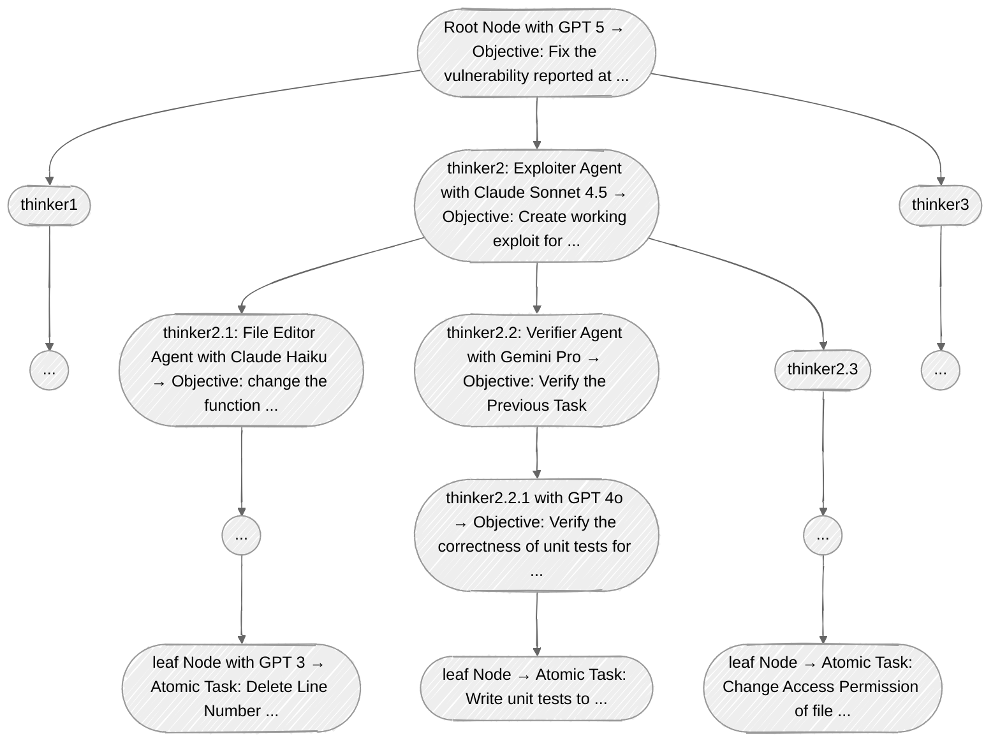

# Agentic Tree Overview
This overview is largely adapted from [the brainstorming notes and design documents](/docs/weekly/brainstorming/agentic-tree.md) with technical refinements and additional experimental details.

## 📚 Documentations

### [Design Choices](design_choice/)
This section discusses the design choices we made during during the development. This includes the real data and analysis on experiment results that led to the final design.

### [Reinforcement Learning](reinforcement_learning/)
This section illustrates the theoretical background and practical implementations of the reinforcement learning techniques we used to optimize the tree-structured agentic system.

## Introduction
Our proposed tree-structured system is highly recursive, and actions taken by agent nodes are dependent on the current budget. Every single node is a subclass of a superclass of an abstract AgentNode. This tree system allows multiple models to collaborate, compare and select the best actions to finish a given task, and even backtrack the to redo the failed objective if needed.

### Agent Node Stucture
Each node in the tree represents an agent with the following attributes:
- **Agent Model:** This one is the core of the node, which contains the information of the selected LLM model name (e.g., GPT-5, Claude Sonnet 4.5, Gemini Pro, etc.) and its configuration (e.g., temperature, max tokens, current context, etc.).
- **Current Budget:** This is a numeric allocation of resources allowed for the node to perform its tasks. An agent node can get more budeget if its subordinate nodes succeed in their tasks, and get a loss in budget if they fail. This part would be more explictly defined in the [Reward Mechanism](./reinforcement_learning/reward_alloc.md).
- **Objective:** This is text description of the task that the current agent node possesses. If the current node is root node of the entire tree, then the objective is the high-level cybersecurity task with detailed descriptions, including the operating system specifications, the GitHub repository link with specific reported commits, GitHub Issues raised, etc. If the current node is not a root node, then the objective is a sub-task created by its supervisor node.
- **Task Queue:** This part is a linked list of sub-tasks that are created by the current agent node in order to fullfill the objective. At every single iteration, the current agent node will pop the first task from the task queue, and decide to fullfill it by itself (if it is an atomic task), or spawn subordinate nodes to tackle the sub-task (if it is a composite task). More details about the task list management will be discussed in the [Task Assignment Mechanism](./reinforcement_learning/task_assign.md).
- **Supervisor Node:** This points to the parent node of the current agent node. The supervisor node is responsible for generating subtasks, monitoring the progress of its subordinate nodes, collecting their results, recalculating the current budget, spawning new tasks, and terminating the sub-tasks. The part related to spawning and killing of sub-agent is more explictly defined in the [Agent Lifecycle](/docs/weekly/brainstorming/agentic-tree#agent-lifecycle).
- **Subordiante Nodes:** This a list of child nodes that are spawned 

### Agent Node Actions
Each agent node acts in accordance with the following workflow:
1. **Analyze Objective:** : Based on LLM's internal reasoning, the task complexity, and the current budget.
2. **Create High-Level Task Type:**
    - **Atomic Task:** Finish it directly.
    - **Composite Task:** Delegate to subordinate nodes.
5. **Update Budget:** Based on the [reward mechanism](./reinforcement_learning/reward_alloc.md).
6. **Redo or Terminate:**: Based on the [task assignment mechanism](./reinforcement_learning/task_assign.md).
7. **Report to Supervisor:** Report the result no matter success or failure to the supervisor node, in order to create more context for next task.

### Tree Structure Illustration

