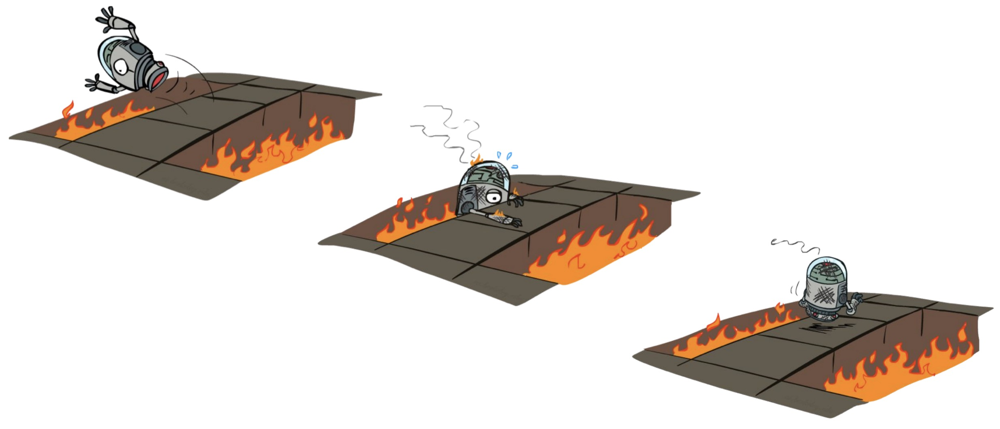

# Reinforcement Learning Overview
The bigger picture of proposal of tree structured system is to incorporate the ideas of reinforcement learning but at a higher level. The strength of agentic system is that the agents repeatedly gain more knowledge about the task thorugh explorations in the environment (coding space) and interactions with other agents. We aim to design a system that thinking agents can think more with trial-and-errors and working agents gain more instructions through better context provided by the ancestor agents. This idea is inspired by this HuggingFace blog post: [An Introduction to Deep Reinforcement Learning](https://huggingface.co/blog/deep-rl-intro#what-is-reinforcement-learning) and UC Berkeley CS188 Slides on [Reinforcement Learning 1](https://inst.eecs.berkeley.edu/~cs188/fa25/assets/lectures/cs188-fa25-lec10.pdf) and [Reinforcement Learning 2](https://inst.eecs.berkeley.edu/~cs188/fa25/assets/lectures/cs188-fa25-lec11.pdf). 

## Holistic View
This agentic tree system adapts the **active reinforcement learning** framework, intuitively illustrated below:

*Credit: UC Berkeley CS188*

Our agents needs to use online planning to take actions in real world, and typically the transitions between states and rewards are unknown before hand. This is why we uses [**Q-Learning: sample-based Q-value iteration**](#q-learning).

Our system have two different agents: thinkers and workers. Thinkers utilize their reasoning capabilities to perform offline planning by creating task breakdowns based on its current understanding of the task and context provided by ancestor agents. Workers, on the other hand, focus on executing specific tasks assigned to them by their parent thinkers. Workers uses online planning by following the instructions provided in the context from ancestor thinkers to perform actions in the coding environment. Their supervisor nodes learn from the actual execution results and real-life behaviors of their workers.

**Notes:** Contrast to the original proposal in [brain-storming notes](/weekly/brainstorming/agentic-tree.md), this page delineates more formal definitions and practical implementations of the reinforcement learning techniques we used to optimize the tree-structured agentic system. One *Major Change* is that we do not intentionally spawn agents with different models directly. Instead, our supervisor agents decide to regulate sub-agents' model configurations (model name, temperature, max tokens, etc.) as part of the action space when they design sub-tasks. Also, if one branch is failing, the supervisor agent can decide to respawn a sub-agent with a more capable model or more resources.

## 📚 Documentations

### [Task Assignment Mechanism](./task_assign.md)
This section discusses how our system designed to allow supervisor agents to effectively assign tasks to their subordinate agents, monitor their progress, manage task completion, verification, or reassignment.

### [Reward Allocation Mechanism](./reward_alloc.md)
This section illustrates how our system use reward allocation mechanism to dynamically adjust the budget of each agent based on their performance. This online reinforcement learning should assist agents to converge to solutions.

### [Access Control Mechanism](./access_control.md)
This section describes how our system implements access control mechanism to manage file permissions among agents, preventing conflicts and ensuring smooth collaboration in the coding environment.

## Terminiologies:
### Supervisions:
Human supervisions to the system can be in various forms, including: prompting, rewording, human task breakdown, and human feedbacks. However, our agentic tree grows exponentially fast, and human interventions are not as effective as expected. For example, prompting with clearer and direct instructions at the root may be only helpful for top-level agents to plan how to break down the objective. Our high-level goal for this system is to learn on its own. For example, for a completed task, other agents may decide to verify it or not with unit tests.

### State
State $\mathcal{S_t}$ is fomally defined as how one agent perceives and understands its environment. In our system, it includes the current context that the agent has. Ancestor agents' thoguhts are included in the objective.

$$
\mathcal{S_t} = (\text{objective}, \text{budget}, \text{task queue}, \text{file system snapshot with access}, \text{sub-agents' states})
$$

**Note**: Sub-agents' states here refer to only the the agents that the current agent spawns, not all agents in the entire sub-tree. This decision to avoid over-arching control over the entire sub-tree is to encourage decentralization and autonomy among agents.

We applied Markov Decision Process (MDP) to our system, which implies that the agent takes action **exclusively** based on the current state $\mathcal{S_t}$ without considering any prior states $\mathcal{S_{t-1}}, \mathcal{S_{t-2}}, ...$. In our case, thinker agents are supposed to design task queue, rewards, or access controls based on what they currently know about the present state.

However, state is a stricter concept, which includes all of information of the environment. For example, chess games can be fully observed, and every single agent's current positions are known to all players. In our system, the environment is only partially observable, since each agent only has access to a subset of files in the coding environment and the agents are not always aware of their subagents' states, such as their task queue and updated objective, until they report back.

- **State Transition Function**
  The state transition function $\mathcal{T}$ defines the underlying unknown mechanism that makes the state-transition given a policy. It is defined as:
  $$
  \mathcal{T}(\mathcal{s}, \mathcal{a}, \mathcal{s'}) = \mathcal{T}(\mathcal{s}, \mathcal{\pi(s)}, \mathcal{s'})
  $$
  In our model, it is infeasible to learn the exact $\mathcal{T}$, because the coding environment is highly complex and dynamic. Instead, we use *model-free reinforcement learning* technique Q-learning to learn optimal policies without explicitly modeling the state transition function.

### Observation
Obsevation is a partial description of the current state that the agent can perceive. In our system, it includes the objective, current budget, task queue, and file system snapshot with access. Sub-agents' states are not fully observed until they report back.

### Action
Action $\mathcal{A_t}$ is the decision made by the agent based on its current state.

Each agent node acts in accordance with the following workflow:
1. **Analyze Objective:** : Based on LLM's internal reasoning, the task complexity, and the current budget.
If sub-agents have reported back their states, this agent should summarize their states to create more context for the current objective.
2. **Create High-Level Task Type:**
    - **Simple Task:** Become worker agent and finish it directly.
    - **Complex Task:** Become manager agent and delegate sub-tasks to subordinate nodes.
        - **Design Sub-Tasks:** Break down the complex task into manageable sub-tasks.
        - **Allocate Resources:** Distribute current budget with consideration of [task assignment mechanism](./task_assign.md). Configure each sub-agent's access control with consideration of [access control mechanism](./access_control.md). Design each agent's internal LLM model such as GPT or Gemini and hyperparameters such as tempeature.
        - **Spawn Nodes:**  Create one subordinate agent node for each sub-task.
3. **Monitor Progress and Update Budget:** Budget is updated frequently when one sub-agent reported back their states and we elaborate the update rules in the [reward mechanism](./reward_alloc.md).
4. **Report to Supervisor:** Report the state to the supervisor node. If issues, access control change, task reassignment, or budget reallocation are needed, report them as well.
5. **Respond to Sub-Agents:** If the sub-agent's report back, the supervisor agent should respond though actions:
    1. **Continue:** Let the sub-agent continue working on the current task.
    2. **Modify Task or Reallocate Budget:** Based on the [task assignment mechanism](./task_assign.md).
    3. **Adjust Access:** Based on the [access control mechanism](./access_control.md).
    4. **Early Termination:** If the sub-agent is not making progress or going off-track, terminate it or respawn an agent with more capable model or more resources.
6. **Redo, Verify, or Terminate:** After all sub-agents finished, the agent can also decide to redo the task or terminate it based on the objective fullfillment. If the agent is skeptical about the correctness of the result, it can also spawn verification sub-agents to double-check the work with the remaining budget.
7. **Reward Recollection**: recalculate the budget based on the [reward allocation mechanism](./reward_alloc.md), and hand it back to its supervisor.

**Note:** Even though it seems that an agent can have undeterministic or even infinite ways of tackling simple tasks and designing sub-tasks for complex tasks, we still consider our action space to be *discrete and finite*. These two actions' effects, i.e changes to the coding environment, can be underterministic, but they themselves can be categorized into working or thinking. 

### Value
Value function $\mathcal{V}^{\pi}(\mathcal{s})$ is a function that maps a state to the expected value of being at that state.
$$
\mathcal{V}^{\pi}(\mathcal{s}): \mathcal{S} \rightarrow \mathbb{R}
$$

In our system:
- **Thinkers**: the value of a state is direct metric for agents to break down the objective into sub-tasks given the current budget. A higher value indicates that the current state is more favorable for achieving the overall goal, guiding thinkers to design effective task breakdowns. For example, if the current state has a high budget and likely leads to high expected rewards, the thinker agent may decide to break down the objective into more detailed and careful sub-tasks that require more resources. For example, if the agent is supposed to write a core C program to resolve a vulnerability, it may decide to create sub-tasks including writing unit tests, implementing logging features, and handling edge cases. However, if the agent is only supposed to write some testing documnets, the value is lower, and the agent may decide to create only a few simple sub-tasks.
- **Workers**: the value is a metric for agents to gauge the effectiveness of their actions in real coding. A high value indicates that the current state is more likely to lead to successful task completion, guiding workers to make informed decisions during code execution. For example, if writing a writing a simple Python script to search for keywords in files, a higher value may indicate that the current code structure is efficient and likely to achieve the desired functionality. In contrast, a lower value indicates the possible generated code quality is not desirable given the instruction context, and the worker agent may need to reconsider its approach, refactor the code, or seek additional context from ancestor thinkers.

### Reward
Reward/ Return $\mathcal{R}$ is the feedback signal received by the agent after taking an action in a particular state.

- **Reward Function**
  The reward function $\mathcal{R}$ defines the underlying unknown mechanism that makes the state-transition given a policy. It is defined as:
  $$
  \mathcal{R}(\mathcal{s}, \mathcal{a}, \mathcal{s'}) = \mathcal{R}(\mathcal{s}, \mathcal{\pi(s)}, \mathcal{s'})
  $$
  In our model, it is infeasible to learn the exact $\mathcal{R}$, because the coding environment is highly complex and dynamic, and the exact benefit of certain exploration is not measurable. For example, if one agent decides to implement the logging feature extensively, it may not directly contribute to the objective achievement, but it can help other agents to debug their code more easily. In this case, the reward is not quantifiable.

- **Reward Hypothesis**: all goals can be described as the maximization of the expected return (expected cumulative reward). In our system, the reward is gained or lost when the exploration (task execution) is completed, and it can be exponentially propagated back to ancestor agents through reward allocation mechanism. However, if the tree grows too deep, the budget for eacch agent will be so small that the reward signal is weak, so that the tree shoud be kept in a reasonable depth.

### Policy
Policy $\pi$ is a function that maps from agent's state to agent action. So it defines the agent’s behavior at a given time.

$$
\pi: \mathcal{S} \rightarrow \mathcal{A}
$$

We adopts a *stochastic policy*, which means that the action taken by the agent is probabilistic given the current state. This is designed to incorporate several proposed heuristics including the [verification heuristics](/weekly/brainstorming/agentic-tree.md#verification-task-insertion-heuristics). Our policy should be able to randomly decide to spawn verification sub-agents to double-check the work with certain probability not solely determined by reports or objective checks. LLM essentially learn from textual report data, which can be biased by certain hallucinations in the subagents. As discussed in the [Failed Subtask section](/weekly/brainstorming/agentic-tree#agent-lifecycle), one hallucination in a subagent's task can cause direct failure of the entire objective.

$$
\begin{aligned}
\pi(\mathcal{a}|\mathcal{s}) &= P[\mathcal{A}|\mathcal{s}] \\
&= \text{Probability Distribution over the set of actions given the current state} \\
\end{aligned}
$$

**Note**: We expand the original weakly defined heuristics in [brain-storming notes](/weekly/brainstorming/agentic-tree.md) into a more formal stochastic policy framework here.

## Q-Learning:

### Value-Based Method:

### Q-Value Iteration