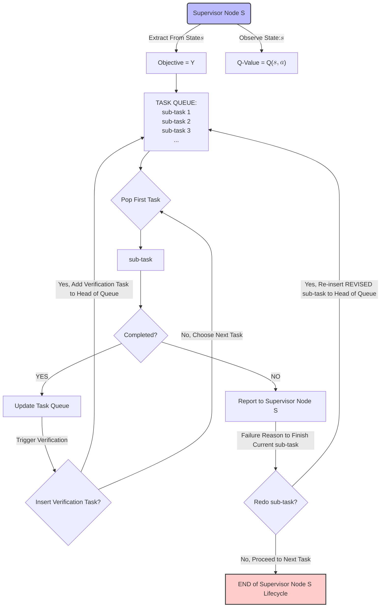

# Task Assignment Overview
As observed in our [budgeted tree experiment](/docs/projects/arise-sec-lion/system/design_choice/budgeted_tree.md), the lack of a proper task assignment mechanism leads to one prominent issue: catestrophic breakdown. One supervisor agent's inproper/inaccurate task breakdown can cause all of sub-agents derail from the main objective. 

To mitigate this issue or similar task assignment problems, a task assignment mechanism is necessary to ensure that the sub-tasks designed by supervisor agents are accurate, non-redundant, and productive. The generated work can be verified or redone.

In our [Q-Value based reinforcement learning framework](./intro.md), the task assignment mechanism is one of actions an agent should be guided to take while maximizing its Q-Value. Created sub-tasks, along with their completion statuses, feedbacks from sub-agents, configurations of sub-agents of assigned tasks are essential part of agent's state $\mathcal{S}$ representation.

## Task Assignment Mechanism Workflow
The following diagram is a revised version of workflow presented in [brain-storming note](/docs/weekly/brainstorming/agentic-tree#task-assignment-mechanism). This part also clearly delineates the agent's responsibilities in task assignment.

- **Key Changes**:
    1. Introduce Task Fullfillment Queue.
    2. Formalize Redo, Verify against Objective, or Termination Heuristics by Q-Learning method.
    3. Incorporate Sub-Agent Feedback Reports and Corresponding Response Actions.
    4. However, update on Budget Recollection and Q-Value Adjustment is not shown here for simplicity, but should be considered as part of the overall workflow.

- **Feature Functions**:
As illustrated in [Approximate Q-Learning Framework](./intro.md#approximate-q-learning), the task assignment mechanism can be formalized as a set of feature functions: $f_i: (\mathcal{S}, \mathcal{A}) \rightarrow \mathbb{R}$.
    1. Objective Complexity: action $\mathcal{a}$ is to analyze objective by agent's reasoning.
    $$
    f_1(\mathcal{s}, \mathcal{a}) =
    \begin{cases}
        1 &\text{if task is complex} \\
        0 &\text{if task is simple}
    \end{cases}
    $$
    2. Objective Fullifillment: action $\mathcal{a}$ is to gather all finished reports from sub-tasks to check if the objective is fulfilled. The summary report of all sub-tasks is compared against the original objective.
    $$
    f_2(\mathcal{s}, \mathcal{a}) =
    \begin{cases}
        1 &\text{if objective is fulfilled} \\
        0 &\text{if objective is not fulfilled}
    \end{cases}
    $$
    3. Task Queue Length: action $\mathcal{a}$ is to check the length of task queue.
    $$
    f_3(\mathcal{s}, \mathcal{a}) = \text{length of task queue}
    $$
    4. Sub-Agent Feedback: action $\mathcal{a}$ is to analyze feedback reports from sub-agents.
    $$
    f_4(\mathcal{s}, \mathcal{a}) =
    \begin{cases}
        1 &\text{if feedback is positive} \\
        0 &\text{if feedback is neutral} \\
        -1 &\text{if feedback is negative}
    \end{cases}
    $$
    5. Individual Task Completion Status: action $\mathcal{a}$ is to inspect if one sub-task is completed.
    $$
    f_5(\mathcal{s}, \mathcal{a}) =
    \begin{cases}
        1 &\text{if the chosen sub-task is completed} \\
        0 &\text{if the chosen sub-task is not completed}
    \end{cases}
    $$
    6. Individual Completed Task Budget Gain/ Loss: action $\mathcal{a}$ is to calculate the budget gain/loss from one completed sub-task from a specific sub-agent.
    $$
    f_6(\mathcal{s}, \mathcal{a}) = \text{given budget} - \text{remaining budget}
    $$
    7. Current Budget On Hold: action $\mathcal{a}$ is to check the current existing budget possessed by this agent.
    $$
    f_7(\mathcal{s}, \mathcal{a}) = \text{current budget}
    $$
    8. MORE ACTIONS TO BE DEFINED...

