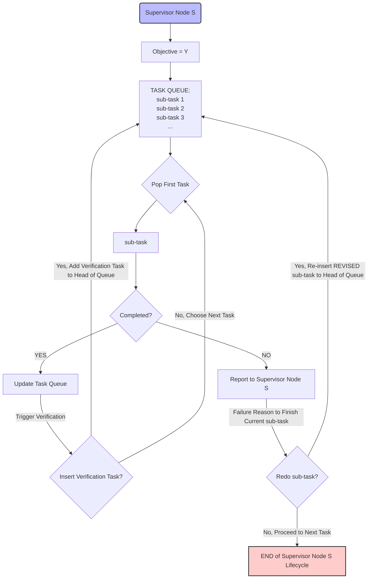

# Task Assignment Overview
As observed in our [budgeted tree experiment](/docs/projects/arise-sec-lion/system/design_choice/budgeted_tree.md), the lack of a proper task assignment mechanism leads to one prominent issue: catestrophic breakdown. One supervisor agent's inproper/inaccurate task breakdown can cause all of sub-agents derail from the main objective. 

To mitigate this issue or similar task assignment problems, a task assignment mechanism is necessary to ensure that the sub-tasks designed by supervisor agents are accurate, non-redundant, and productive. The generated work can be verified or redone.

In our [Q-Value based reinforcement learning framework](./intro.md), the task assignment mechanism is one of actions an agent should be guided to take while maximizing its Q-Value. Created sub-tasks, along with their completion statuses, feedbacks from sub-agents, configurations of sub-agents of assigned tasks are essential part of agent's state $\mathcal{S}$ representation.

## Task Assignment Mechanism Workflow
The following diagram is a revised version of workflow presented in [brain-storming note](/docs/weekly/brainstorming/agentic-tree#task-assignment-mechanism).

Key Changes:
1. Introduce Task Fullfillment Queue.
2. Formalize Redo, Verify against Objective, or Termination Heuristics by Q-Learning method.
3. Incorporate Sub-Agent Feedback Reports and Corresponding Response Actions.
4. However, update on Budget Recollection and Q-Value Adjustment is not shown here for simplicity, but should be considered as part of the overall workflow.

