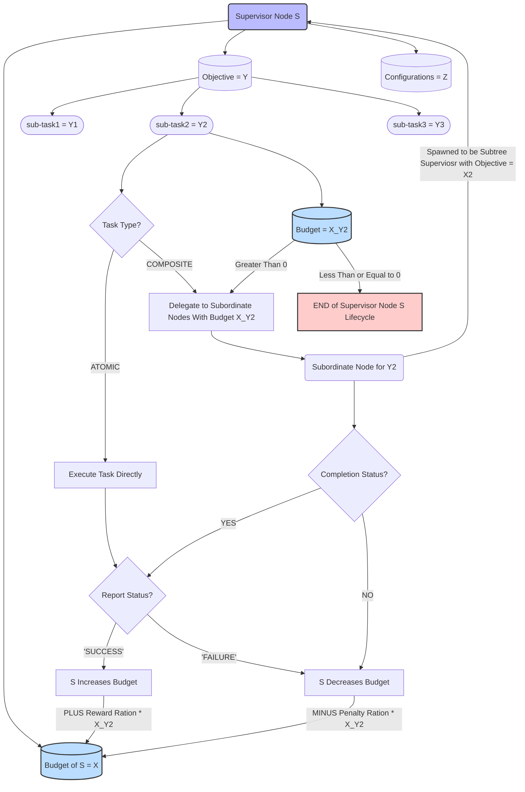

# Reward Allocation Overview
This overview is partially adapted from [the brainstorming notes and design documents](/docs/weekly/brainstorming/agentic-tree.md) and improved upon by the real experiments conducted during the development of ARISE SEC-LION based on this GitHub [commit](https://github.com/arise-ai-security/arise-sec-lion/commit/7b58977a52112dc8c342d95490000923cab095aa).

### Porposed Reward Mechanism Workflow
The following diagram illustrates the proposed reward allocation mechanism for the tree-structured agentic system. Each supervisor node allocates budgets to its subordinate nodes based on task types and monitors their performance to adjust budgets accordingly. 

