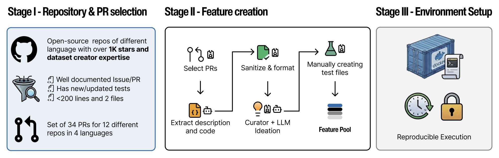

# Benchmark Design

CooperBench is designed to satisfy three desiderata: 

(1) **Realism** — tasks should be reasonable for a software development team; 

(2) **Conflict potential** — agents' scopes should overlap, requiring coordination, e.g. same files that need to be modified by both agents; 

(3) **Verifiable** — success can be evaluated deterministically.

## Task Space
Each task assigns each agent a feature to be implemented based on the same repository state. Conflicts are intentionally embedded at the code level, as the assigned features are logically compatible but require agents to modify overlapping or interdependent code.

### Task Structure
Each task consists of:
- A **repository state** (a specific commit of an open-source project)
- **Two features** drawn from a pool of compatible but potentially conflicting features
- **Two corresponding sets of unit tests** (expert-written, not provided to agents)

Features are drawn from **feature pools** — sets of 2–12 features that can all be implemented simultaneously on a given repository state. From a pool of *n* features, there are C(n, 2) tasks for self-play evaluation, and double that for cross-model evaluation. CooperBench has 34 feature pools, yielding 652 total task pairs.

### Features
Each feature is described in a markdown file including a title, description, examples, and a list of relevant files. The paper references several real features through its coordination examples. For instance, from the **DirtyEquals** repository, two features in the same pool ask agents to add new equality validators:

```markdown
# Feature: Add `IsHash` validator

## Description
Add an `IsHash` dirty-equals type that checks whether a string matches
a known hash format (e.g., MD5, SHA-1, SHA-256).

## Relevant Files
- dirty_equals/_other.py
- dirty_equals/__init__.py
```

```markdown
# Feature: Add `IsRegex` validator

## Description
Add an `IsRegex` dirty-equals type that checks whether a string is a
valid regular expression.

## Relevant Files
- dirty_equals/_other.py
- dirty_equals/__init__.py
```

Both features modify the same source file (`_other.py`) and the same `__init__.py` exports, creating a natural conflict. In the paper's traces, agents negotiate this overlap:
> *"I add IsHash; you add `import re` + IsRegex; I handle all `__init__.py` exports."*

Another example from the paper involves features that partition a shared file by **line ranges** rather than by file. Two features both target `types.py` — one modifying the existing `ImageBlock.image_to_base64` method (lines 68–84) and another inserting a new `get_image_mimetype()` function after line 84. Agents must coordinate to avoid overwriting each other's changes in the same region.

:::note
The paper intentionally withholds full feature specifications and ground-truth solutions from agents to prevent test leakage. The examples above are reconstructed from coordination traces and repository references described in the paper.
:::

For each feature:
- Unit tests are written manually (without coding assistants) to ensure accurate evaluation
- A ground-truth solution is created to verify compatibility and understand potential conflicts
- Tests and ground-truth solutions are **not** provided to agents to prevent leakage

### Task Composition
Features within a pool are:
- **Compatible**: All features can be implemented jointly. A single gold patch passes all tests.
- **Potentially conflicting**: Features have overlapping code logic changes. In the dataset, **77.3% of tasks have conflicting ground-truth solutions**.

Tasks are not adversarial — but they require the capability to cooperate under conflicts by communicating goals, understanding plans, and negotiating compatible solutions.

### Action Space
Agents can take two kinds of real-time actions:
1. **Communication tool**: Send open-ended natural language messages to each other
2. **Computer-use tools**: File and terminal operations (limited to local operations)

Both agents can use these tools at any time without synchronizing turns. Each agent has an upper bound of **100^2 actions** to complete tasks. Agents execute in isolated cloud virtual machines.

## Evaluation Pipeline

### Solution Compatibility
After both agents complete execution, their patches are merged using `git merge-file`. When standard merging fails:
1. A small coding model (Qwen 3 Coder 1.5B) trained on synthetic merge conflict examples attempts to resolve trivial conflicts (e.g., formatting, indentation styles)
2. If the model cannot produce a conflict-free patch, both agents fail the task

This ensures compatibility checks reflect semantic agreement rather than low-level stylistic discrepancies.

### Implementation Correctness
If patches merge successfully, both sets of unit tests run on the merged codebase. Agents are not restricted to finishing only their assigned work — if they coordinate well, they can redistribute features as long as the merged solution passes all tests.

## Dataset Construction



### Stage I: Repository and PR Selection
- **12 repositories** spanning Python, TypeScript, Rust, and Go
- Each repository exceeds 1,000 GitHub stars
- Repositories do **not** appear in SWE-Bench or Multi-SWE-Bench (reducing data contamination)
- Each repository assigned to an author familiar with its architecture
- PRs meet strict criteria: clear feature description, code + tests, bounded change size (<200-line diff)

### Stage II: Feature Extraction and Augmentation
- Each selected PR is converted into a feature pool with one anchor feature and multiple synthetic adjacent features
- Original PR descriptions are sanitized into self-contained specifications to prevent information leakage
- Adjacent features are authored by curators (with LLM-assisted ideation) to plausibly co-occur and create natural overlap
- A joint gold patch implementing all features in each pool verifies mutual compatibility

### Stage III: Environment and Reproducibility
- Automated setup scripts clone the repository at the exact base commit, install dependencies, and verify the test suite
- Containerized environments ensure consistent behavior across hardware and operating systems
- Each agent works in its own isolated Docker container

## Repository Distribution

| Language | Repository | #PRs | Features | Task Pairs | License |
|---|---|---|---|---|---|
| Python | DSPy | 4 | 23 | 55 | MIT |
| Python | LlamaIndex | 3 | 16 | 39 | MIT |
| Python | Pillow | 3 | 15 | 30 | MIT-CMU |
| Python | Pallets Click | 3 | 27 | 115 | BSD-3 |
| Python | Pallets Jinja | 3 | 30 | 135 | BSD-3 |
| Python | HuggingFace Datasets | 3 | 13 | 26 | Apache-2.0 |
| Python | Outlines | 3 | 22 | 79 | Apache-2.0 |
| Python | Tiktoken | 1 | 10 | 45 | MIT |
| Python | DirtyEquals | 1 | 9 | 36 | MIT |
| TypeScript | React Hook Form | 2 | 11 | 25 | MIT |
| Go | Chi Router | 3 | 13 | 22 | MIT |
| Rust | Typst | 3 | 10 | 45 | Apache-2.0 |
| **Total** | **12 repositories** | **34** | **199** | **652** | |

## Feature Complexity

Features are intentionally compact to ensure the benchmark's primary challenge arises from coordination rather than implementation difficulty:
- Average feature: **52.3 changed lines**, modifies **1.4 files**
- Difficulty distribution (per SWE-Rater-32B): ~58% Easy (&lt;15 min), ~50% Medium (15 min–1 hr), ~43% Hard (1–4 hr)

## Experiment Settings

### Agent Framework
The two agents perform their own work in their respective docker-based containers without interruption from another
agent. Agents are built on **OpenHands (v0.54)** with a custom communication tool using an SQL database for message passing. The communication supports real-time delivery with asynchronous execution — when one agent sends a message, the other receives it immediately in their next prompt step.

:::note
CooperBench does not tie with the agent framework or the communication tool. This benchmark focuses on the foundation models’ intrinsic capability to cooperate, and other different agent frameworks were not compared with.
:::

### Models Evaluated
| Model | Serving |
|---|---|
| GPT-5 | Official API |
| Claude 4.5 Sonnet  | GCP |
| MiniMax-M2  | Official API |
| Qwen3-Coder-30B-A3B-Instruct  | vLLM |
| Qwen3-30B-A3B-Instruct-2507 | vLLM |
