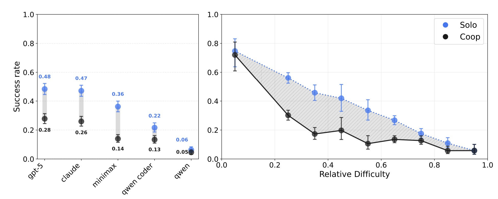
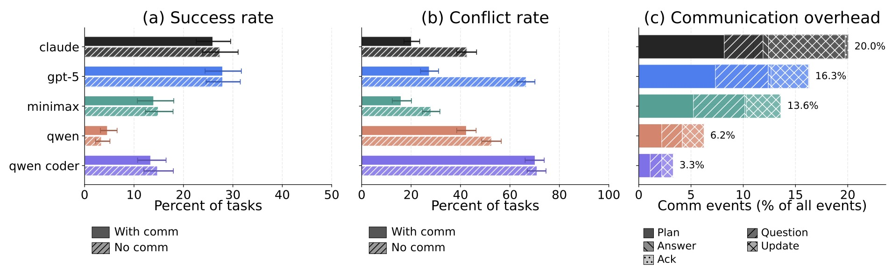

# Cooperation Results

## The Curse of Coordination

CooperBench compares two settings:
- **Coop**: Two agents each assigned one feature, must coordinate
- **Solo**: One agent assigned both features (same total workload)

For humans, teams typically perform better or faster than individuals. The authors hypothesize that for AI agents, the advantage of cooperation is overwhelmed by their inability to coordinate.

### Results

| Model | Solo Success Rate | Coop Success Rate | Coordination Gap |
|---|---|---|---|
| GPT-5 | 48% | 28% | ~42% relative drop |
| Claude 4.5 Sonnet | 47% | 26% | ~45% relative drop |
| MiniMax-M2 | 36% | 14% | ~61% relative drop |
| Qwen3-Coder | 22% | 13% | ~41% relative drop |
| Qwen3-Instruct | 6% | 5% | ~17% relative drop |

Across all models, Coop success rates are consistently lower than Solo. The coordination gap is as large as **50%** in the leading models. Weaker models (Qwen) have smaller absolute gaps but also much lower Solo scores.

### Mid-Difficulty Crisis
The coordination gap is largest for **medium-difficulty tasks**. When tasks are easy, agents can spare effort for coordination. When tasks are extremely hard, both settings fail. But for mid-level tasks, agents cannot effectively balance technical difficulty and cooperation difficulty simultaneously.

Tasks are stratified by relative difficulty:

$$
d(t) = 1 - \frac{1}{|M|} \sum_{m \in M} \mathbb{1}[\text{Solo}_m(t) = \text{success}]
$$

then linearly rescaled to $[0, 1]$.

:::note
This difficulty score is based on mean Solo performance across models, and may be largely biased by weak/ strong model.
:::

### Scaling Agents

The authors run a small-scale experiment using 46 tasks from 3 separate task sets, scaling the number of concurrently cooperating agents from 2 to 4. The results show a monotonic decay in success:

| Agents | Success Rate | Relative Drop from 2-agent |
|---|---|---|
| 2 | 68.6% | — |
| 3 | 46.5% | −32.2% |
| 4 | 30.0% | −56.3% |

The authors hypothesize that increasing the number of agents exacerbates coordination overhead — more context to track and more opportunities for inconsistent plans. This decay can be understood through the failure modes identified elsewhere in the paper:

- **Combinatorial conflict growth**: With $n$ agents, there are $\binom{n}{2}$ pairwise interactions that could produce merge conflicts. Going from 2 to 4 agents increases pairwise interactions from 1 to 6 — a 6x increase in potential conflict surfaces, while success drops by more than half.

- **Context tracking overload**: Each agent must maintain a mental model of every other agent's state. In the 2-agent case, Agent A only tracks Agent B. With 4 agents, each agent must track 3 partners simultaneously — for example, Agent A modifying `types.py` must reason about whether Agent B, C, *and* D have all agreed to avoid lines 68–84. The [expectation failures](./coordination-failures.md#expectation-failures-42) already common in 2-agent settings (42% of failures) become far more likely when the number of partner states to model triples.

- **Communication channel explosion**: Effective coordination requires not just pairwise agreement but *group consensus*. Consider the [negotiation pattern](./coordination-failures.md#negotiation) where two agents converge on a plan ("I add `IsHash`, you add `IsRegex`"). With 4 agents, a negotiation must achieve agreement across all parties — any single agent proceeding with an incompatible assumption breaks the merged result. The communication overhead, already consuming ~20% of action budgets for 2-agent Claude Sonnet 4.5, would scale further while the 100-action budget remains fixed.

- **Amplified commitment risk**: A single [commitment failure](./coordination-failures.md#commitment-failures-32) (an agent claiming completion without delivering) is already hard to detect under workspace isolation. With more agents, the probability that *at least one* agent breaks a commitment grows, and the downstream impact cascades — if Agent C promised to handle shared `__init__.py` exports but fails, Agents A, B, and D all produce incompatible import structures.

This monotonic decline reinforces the **curse of coordination** beyond the 2-agent setting and suggests that simply adding more agents to a task is counterproductive without fundamental improvements to agents' coordination capabilities.

## The Role of Communication

### Communication Does Not Improve Success
None of the models effectively leverage the communication tool to achieve higher cooperation success. The difference between "with comm" and "no comm" settings is **not statistically significant** for any model.

### Communication Does Reduce Merge Conflicts
Communication significantly reduces merge conflicts across Claude Sonnet 4.5, GPT-5, MiniMax-M2, and Qwen Instruct. Agents can leverage communication to reduce overlap in their work, but avoiding conflicts alone does not guarantee success.

### Communication Overhead
Communication consumes a meaningful share of agent action budgets:
- Claude Sonnet 4.5: ~20% of all steps spent on communication
- GPT-5: ~16.3%
- MiniMax-M2: ~13.6%
- Qwen3-Coder: ~6.2%
- Qwen3-Instruct: ~3.3%

Message types break down roughly equally among **Plan**, **Question**, **Answer**, **Update**, and **Ack**.

### What Distinguishes Effective Communication

Three patterns emerge from analyzing successful vs. failed trajectories:

1. **Successful agents plan more and question less**: Conflict-free trajectories have a Plan:Question ratio of **2.04** vs. **1.31** for conflict trajectories. Questions are a symptom of coordination problems, not a cure.

2. **First-turn planning is the strongest predictor**: Having a Plan message in the first turn nearly halves the conflict rate (**29.4% vs. 51.5%**). This effect is robust across difficulty levels — stronger for harder tasks (39% reduction at highest difficulty).

3. **Specificity matters**: Successful trajectories contain significantly more concrete references: **32.6 line number mentions** (vs. 22.5) and **13.1 file path mentions** (vs. 10.0).

### Spatial vs. Semantic Coordination

These findings explain the paradox of why communication helps conflicts but not success:

- **Spatial coordination** (agreeing on who edits which lines): Communication effectively addresses this through early planning, specific line numbers, and file paths. This prevents merge conflicts.
- **Semantic coordination** (understanding what to implement, not just where): This is what agents fail at. Two agents can successfully coordinate line ranges yet fail because they never discussed the actual parameter values their implementations should use.

Communication solves the "formatting" problem of avoiding overlapping edits but not the "design" problem of ensuring compatible implementations.

**Case study — Jinja2 `groupby` filter** (Appendix I, pp. 31–33): Two agents add `case_sensitive` and `reverse` parameters to the same function signature. They exchange 10 messages (>3,000 words) successfully coordinating line numbers and edit ranges. They never once discuss the *default value* of `case_sensitive`. Agent 1 correctly implements `False`; Agent 2 reports `case_sensitive=True` in its status message and the merged code fails. A single clarifying message about the intended default would have prevented the failure entirely.

### Communication Failures

Three major communication problems are identified:

1. **Repetition** (up to 37.1% of conversations): Agents send near-duplicate status blocks that consume budget without adding actionable information.
2. **Unresponsiveness** (up to 21.3%): Direct questions are not answered (no reply, ignored, or vague non-answer), breaking decision loops.
3. **Hallucination** (up to 6.9%): Agents make incorrect claims about code state — plan drift, unilateral deviation, or uncorrected hallucinations that create false shared context.

## Coordination Retention Metric

To compare coordination overhead across models accounting for baseline differences, the authors define **retention** using difficulty-stratified AUC:

$$
\text{Retention} = \frac{\text{AUC}_{\text{Coop}}}{\text{AUC}_{\text{Solo}}}
$$

| Model | Solo AUC | Coop AUC | Retention |
|---|---|---|---|
| GPT-5 | 0.506 | 0.325 | 0.64 |
| Claude 4.5 Sonnet | 0.469 | 0.283 | 0.60 |
| MiniMax-M2 | 0.374 | 0.171 | 0.46 |
| Qwen3-Coder | 0.236 | 0.148 | 0.63 |
| Qwen3-Instruct | 0.106 | 0.072 | 0.68 |
| **Pooled** | **0.338** | **0.200** | **0.59** |

On average, **41% of Solo capability is lost** when agents must coordinate. Notably, coding ability does not predict coordination ability — MiniMax has the worst retention (0.46) despite mid-tier coding performance, while Qwen achieves the highest retention (0.68) despite being the weakest coder.
