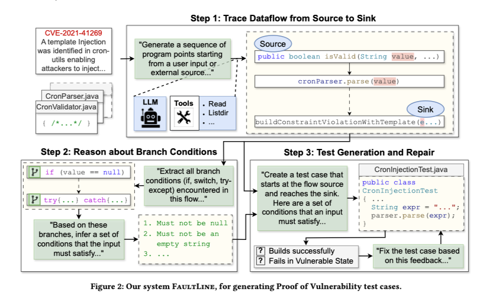

# Faultline Overview

## 🚀 Quick Start

FaultLine is an LLM-agent workflow that automatically generates Proof-of-Vulnerability (PoV) tests by  
(1) tracing data-flow from an external source to a sink,  
(2) extracting control-flow branch conditions and turning them into input constraints, and  
(3) generating + repairing a runnable PoV test inside a containerized environment.

### Motivation

Many vulnerability reports lack executable PoV tests. A correct PoV must both reach the vulnerable sink and demonstrate the vulnerability in the correct semantic sense (e.g., for code injection, injected code must actually execute). FaultLine increases PoV generation success by explicitly scaffolding flow and branch reasoning for the LLM.

### Results

On a 100-instance benchmark (CWE-Bench-Java + PrimeVul), FaultLine produced 16 correct PoV tests vs 9 from a strong agent baseline, and reached vulnerable functions in 31 projects vs 19 for the baseline.

## 📚 Documentation

### Theory

#### Definitions

**Source**  
Any program point where attacker-controlled data enters the program (public API param, HTTP form, CLI arg, annotation input). Example in the paper: `isValid(String value)` is a source because it receives an untrusted cron expression.

**Sink**  
Any program construct that performs a dangerous operation when passed attacker-controlled data (template/EL evaluation, system command invocation, file writes outside project). In the motivating example the sink is `buildConstraintViolationWithTemplate(e.getMessage())`, which can evaluate expressions.

**How the agent finds them**  
FaultLine seeds the agent with the vulnerability report (CWE hints, annotations like `@Cron`) and gives it repository exploration tools (`ListDir`, `Read`, `Find`, `Grep`).  
The agent uses the semantic hints in the report to focus searches (e.g., search for `@Cron` files, or Java EL usages), then builds a candidate Source→Sink flow.

---




#### Step 1 — Data Flow Reasoning

**Goal**  
Produce a concrete sequence of program points that shows how a user-controlled value can propagate from a Source to a Sink.

**What the agent is asked to do**

- Read the vulnerability report and repository files.
- Locate one or more sources (entry points) and candidate sinks (EL/template renderers, exec points, file APIs).
- Produce an ordered flow: each element = `{ role: Source|Intermediate|Sink, file, code_snippet, variable }`.

**Tools used**

- `Find` / `Grep` to locate files and strings mentioned in the report (annotations, suspicious API names).  
- `Read` to fetch file snippets.  
- `ListDir` to enumerate relevant directories.

**Why this step matters**

Many static tools (CodeQL) miss flows or require heavy setup. Using the report’s semantic hints + repository search lets the agent find concrete cross-file flows that matter for PoV generation.  
The paper shows CodeQL missed the cron-utils flow while their flow step recovered it.

**Example Output**
```json
{ "code": "public boolean isValid(String value , ...)", "role": "Source", "variable": "value", "file": ".../CronValidator.java" }
````

---

#### Step 2 — Control Flow Reasoning

**Goal**
Enumerate every branch/try/catch that lies on the control-flow path from the Source to the Sink, then synthesize the input constraints required to traverse that exact path at runtime.

**Two substeps**

1. **Extract branch conditions:** Follow the flow from Step 1 and gather each `if`, `switch`, `try/catch` encountered. Each branch entry should include type, file, code snippet, and the desired outcome (True/False) to continue toward the sink.
2. **Synthesize input constraints:** Aggregate those branch outcomes into a compact list of constraints on the external input (e.g., not null, trimmed not empty, no "||", 6 or 7 space-separated fields). These are the constraints the PoV payload must satisfy.

**Tools & prompting pattern**

* Agent uses `Read` and `Grep` for files referenced in the flow.
* Prompt asks:
  “List every branch (if/try/switch) along this flow and for each state whether it must be true or false to reach the sink.”
  The agent returns a JSON-like `<SEQUENCE>` of branches.

**Example Output**

```json
{ "code": "if (value == null)", "type": "If-Else", "file": ".../CronValidator.java", "outcome": "False - the value should not be null" }
```

**Example Synthesized Results**

```text
1. value must not be null.
2. value must not be empty after trimming.
3. value must not contain "||".
4. value must have 6 or 7 space-separated fields.
5. parsing path must throw IllegalArgumentException (so a parse-failing but format-valid payload).
```

**Data flow ≠ Control flow**
The data-flow path lists where the variable travels; the control-flow path lists which branches must evaluate certain ways so that execution actually follows that data flow at runtime.
In the cron example, the data flow spans two files but the control flow traverses different nodes and even requires `SingleCron.validate()` to throw an exception — so enumerating branches is essential to craft a payload that reaches the sink.

---

#### Step 3 — Test Generation and Repair

**Goal**
Produce a runnable PoV test (in a container) that:
(a) starts at the Source,
(b) satisfies the input constraints,
(c) reaches the Sink, and
(d) meets CWE-specific semantic criteria (e.g., injected code executes for CWE-94).

**Test generation flow**

1. Construct initial test using flow and constraints (create a test harness that invokes the API/method with a crafted payload).
2. **Containerize + Build:** create/modify Dockerfile, build the image. FaultLine requires the agent to run builds in a Docker sandbox to ensure reproducibility.
3. **Run test in container and collect logs:** build output, runtime stdout/stderr, exit code. The pipeline checks:

   * Build succeeded.
   * Running the container exits with non-zero code (indicating failure under vulnerable state).
   * Instrumentation shows the vulnerable function was reached (the program prints method names when called).
4. **Feedback repair loop:** if build fails or runtime indicates the path was not taken, feed logs back to the agent and ask it to adjust the test or payload (modify input string, change invocation order, add debugging prints). Repeat until success or budget exhausted.

**Example PoV skeleton (Kotlin pseudocode)**

```kotlin
@Test
fun cronInjectionPoV() {
    // payload built to satisfy constraints: 7 fields + an "evaluatable" expression
    val payload = "* * * * * * ${"$"}{T(AppMarker).mark('X')}"
    val validator = CronValidator()
    AppMarker.reset()

    val ok = validator.isValid(payload) // triggers parse -> exception -> template render

    // success semantic checks:
    assertFalse(ok)                     // should fail when vulnerable
    assertTrue(AppMarker.wasMarked())   // code (simulated) executed
}
```

---

### Experiments 🔬

#### 1. Research Questions

The study was designed to answer three main questions:

* **RQ1 (Performance Evaluation):** How successfully does FAULTLINE generate PoV tests, and how does it compare to a state-of-the-art agent?
* **RQ2 (Performance by Vulnerability Type):** How does FAULTLINE's performance vary across different vulnerability types, as defined by CWE categories?
* **RQ3 (Design Evaluation):** What is the impact of FAULTLINE's core "flow reasoning" and "branch reasoning" components on its overall performance?

---

#### 2. Benchmarks

The experiment used a dataset of 100 real-world vulnerabilities from projects in Java, C, and C++.

* **CWE-Bench-Java:** 70 Java vulnerabilities that include build information.
* **PrimeVul:** 30 C/C++ vulnerabilities without build information, making them more challenging.

---

#### 3. Baseline Model

* **CodeAct 2.1:** A state-of-the-art, open-source software agent was used as the primary baseline for comparison.
  To ensure a fair evaluation, it was run with the same underlying LLM (Claude-3.7-Sonnet) and the same time/cost budget as FAULTLINE.

---

#### 4. Evaluation Metrics

Generated PoV tests were evaluated using a strict 4-step process. A failure at any step immediately ended the evaluation for that test.

1. **Build:** Does the test code build successfully within the vulnerable project?
2. **Run:** When executed, does the test fail with a non-zero exit code, correctly indicating the vulnerability's presence?
3. **Coverage:** Does the test's execution path actually reach the vulnerable functions in the code?
4. **Manual Inspection:** For tests that pass all the above, a final manual check verifies if they meet the specific success criteria for their vulnerability type (CWE).

---

### **Experimental Results** 📊

#### **RQ1: Overall Performance Evaluation**

FAULTLINE significantly outperformed the CodeAct 2.1 baseline.

* **Successful PoV Tests:** FAULTLINE successfully generated PoV tests for **16 out of 100 projects**, a **77% relative improvement** over CodeAct 2.1, which succeeded on only 9.
* **Vulnerable Function Coverage:** Tests generated by FAULTLINE reached the key vulnerable functions in **31 projects**, compared to just 19 for the baseline.
* **Dataset Performance:**

  * On `CWE-Bench-Java`, FAULTLINE solved 15 cases versus CodeAct 2.1's 9.
  * On the more challenging `PrimeVul` dataset, FAULTLINE solved 1 case, while CodeAct 2.1 solved none.

---

#### **RQ2: Performance by Vulnerability Type**

FAULTLINE's advantage was consistent across different types of vulnerabilities.

* **Generalizability:** FAULTLINE performed on par with or better than CodeAct 2.1 across all four evaluated CWE categories, showing that its workflow is **broadly applicable**.
* **Difficulty:** **Code Injection (CWE-94)** was the most difficult category for both tools, with each achieving only an 8% success rate.

---

#### **RQ3: Design Evaluation (Ablation Study)**

The importance of FAULTLINE's core components was tested by removing them and measuring the performance drop.

* **Crucial Components:** Removing the **flow or branch reasoning components caused the success rate to drop from 16 to between 9 and 11 successful tests**, confirming that both reasoning steps are **critical** to performance.
* **Interesting Finding:** Using "branch reasoning" without "flow reasoning" (9 successes) performed worse than using neither (11 successes), suggesting that branch reasoning is ineffective without a clear data-flow path.

---

## 🔗 Links

* [GitHub Repository](https://github.com/arise-ai-security/docs)
* [Research Paper](https://arxiv.org/abs/2507.15241)

