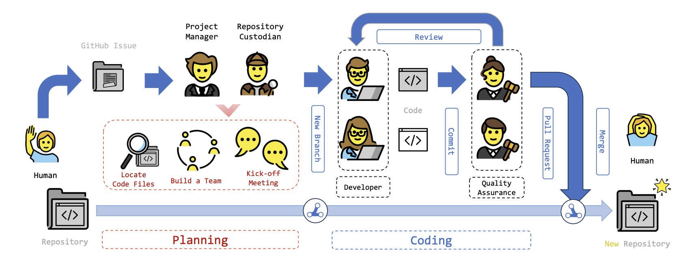

# Overview

MAGIS (Multi-Agent framework for GitHub Issue reSolution) addresses the challenge of resolving real-world GitHub issues at the repository level. While LLMs excel at function-level code generation (e.g., GPT-4 scores 67.0 on HumanEval), they struggle with repository-level tasks — GPT-4 resolves less than 2% of SWE-bench issues when applied directly.

## Motivation

GitHub issue resolution differs fundamentally from function-level code generation:
- It requires **locating** the correct files and lines across an entire repository
- It involves **maintaining** existing functionality while integrating changes
- The complexity scales with the number of files, functions, and hunks modified

Existing multi-agent systems (MetaGPT, ChatDev) focus on building code repositories from scratch but rarely address **software evolution** — modifying existing codebases to fix bugs or add features.

## Empirical Analysis

The authors conduct an empirical study on SWE-bench to understand why LLMs fail at issue resolution, examining three factors:

### File Localization

SWE-bench uses BM25 retrieval to find relevant files. Including more files improves recall but degrades LLM performance — Claude-2's resolved ratio drops from 1.96% to 1.22% as recall increases from 29.58 to 51.06. This suggests a need to maximize recall with a **minimal** set of files.

### Line Localization

The authors measure line locating accuracy using a **coverage ratio**:

$$
\text{Coverage Ratio} = \frac{\sum_{i=0}^{n}\sum_{j=0}^{m} [s_i, e_i] \cap [s'_j, e'_j]}{\sum_{i=0}^{n}(e_i - s_i + 1)}
$$

where the numerator is the intersection of modified lines between the reference (n hunks) and the generation (m hunks), and the denominator is the total modified lines in the reference. Logistic regression on Claude-2 results shows a statistically significant positive correlation (coefficient 0.5997, P-value < 0.05) between coverage ratio and issue resolution success.

### Code Change Complexity

| Index | GPT-3.5 | GPT-4 | Claude-2 |
|---|---|---|---|
| # Files | −17.57\* | −25.15\* | −1.47\* |
| # Functions | −17.57\* | −25.15\* | −1.47\* |
| # Hunks | −0.06\* | −0.06 | −0.11\* |
| # Added LoC | −0.02 | −0.10 | −0.09\* |
| # Deleted LoC | −0.03 | −0.04 | −0.07\* |
| # Changed LoC | −0.53\* | −0.21 | −0.44\* |

\* P-value < 0.05

All models show significant negative correlations between complexity indices (especially number of files and functions) and resolution success. More complex changes are harder for LLMs to generate correctly.

## Agent Role Design

The workflow draws inspiration from GitHub Flow, an effective human workflow paradigm adopted by many software teams. Four specialized LLM-based agents collaborate across two phases — **planning** and **coding** — each with a distinct role tailored for software evolution:

### Manager Agent

The Manager is pivotal in **planning**. Unlike conventional setups where managers allocate tasks to a pre-formed team, the MAGIS Manager agent first decomposes the issue into file-level tasks and then **dynamically designs Developer agents** to form a team. This improves team flexibility — each issue gets a custom team tailored to its specific needs.

**Responsibilities:**
- Receives candidate files from the Repository Custodian and the issue description
- Breaks the issue into detailed **file-level tasks** $t_i$ for each candidate file $f_i$
- Defines the **personality role** $r_i$ of each Developer agent (e.g., "Django Database Specialist", "Alex Rossini") using the LLM with a prompt based on the task
- Organizes and chairs the **kick-off meeting**
- Generates the **main work plan** $c_{main}$ as executable code, determining task ordering and parallelism

### Repository Custodian Agent

The Custodian is responsible for **locating relevant files** in the repository. Since LLMs cannot browse entire repositories efficiently, this agent employs a smart filtering strategy with a **repository evolution memory** mechanism:

**Locating Algorithm (Algorithm 1):**
1. **BM25 ranking** — Ranks all repository files by relevance to the issue description, selects top-$k$ candidates
2. **Memory-based summarization** — For each candidate file $f_i$:
   - If the file is **new** (never seen before): the LLM compresses it into a summary $s_i$, stored in memory $\mathcal{M}$
   - If the file was **previously summarized**: retrieves the prior summary $s_h$ and computes the diff $\Delta d$ between the old version $f_h$ and current version $f_i$. The LLM summarizes the diff as a "commit message" $m$, and the new summary becomes $s_h \cup m$ — **reusing** previous work instead of re-reading the entire file
3. **Relevance filtering** — The LLM judges whether each file's summary is relevant to the issue. Irrelevant files are removed, minimizing the candidate set

This memory mechanism avoids redundant LLM queries when the same code snippets appear across issues, and reduces context length by using summaries instead of full file contents.

### Developer Agent

Developer agents handle the actual **code modification**. Compared to human developers, they can work continuously and be scheduled in parallel easily. A key design decision: the framework decomposes code modification into sub-operations including code generation, allowing Developers to leverage LLMs' strength in generation while mitigating their weakness in direct code change.

**Coding Process (Algorithm 3):**
For each task $t_i$ and its associated code file $f_i$:

1. **Line localization** — The Developer uses the LLM to determine the **range of lines** to modify as a set of intervals $\{[s'_i, e'_i]\}$ (starting and ending line numbers for each hunk)
2. **Code splitting** — The intervals split the original file into `old_part` (to be modified) and parts to be retained
3. **Code generation** — The LLM generates `new_part` to replace `old_part`, leveraging LLMs' strength in code generation rather than direct editing
4. **Diff generation** — The code change $\Delta d_i$ is computed via Git tools between the original and new file versions

If the QA Engineer rejects the change, the Developer incorporates the review feedback into the task description and **iterates** — re-localizing lines and regenerating code until approved or a maximum iteration limit $n_{max}$ is reached.

### Quality Assurance (QA) Engineer Agent

In software evolution, QA Engineers maintain software quality through code review — a practice often undervalued (developers can wait up to 96 hours for review feedback). MAGIS pairs **each Developer with a dedicated QA Engineer**, designed to offer task-specific, timely feedback.

**Review Process:**
1. The Developer generates the QA Engineer's role description $a_i$ based on the task and file context
2. Given the task description $t_i$ and code change $\Delta d_i$, the QA Engineer produces:
   - `review_comment` — detailed feedback on the code change
   - `review_decision` — binary accept/reject decision
3. If rejected, the feedback is appended to the task description, prompting the Developer to revise
4. This iterative loop continues until the change is **approved** or the iteration limit is reached

**Example of QA effectiveness:** In a scikit-learn issue, the Developer initially modified `kmeans_single` without properly assigning the `random_state` parameter from `seeds`. The QA Engineer identified the flaw: *"Running the algorithm just one time could lead to worse results, compared to running it multiple times (n_init times) and choosing the best result."* This feedback led the Developer to correctly implement the iterative process in the next attempt.

## Collaborative Process

The four agents collaborate across two phases:

### Phase 1: Planning

```
GitHub Issue → Repository Custodian → Manager → Developers
                (locate files)        (build team, kick-off meeting)
```

1. **Locating Code Files** — The Repository Custodian identifies and filters candidate files using BM25 + memory-based summarization + LLM relevance filtering
2. **Team Building** — The Manager decomposes the issue into file-level tasks and designs specialized Developer agents for each task, forming a custom team
3. **Kick-off Meeting** — A circular-speech meeting where:
   - The Manager opens, guides discussion, and summarizes
   - Each Developer provides opinions based on previous discussion
   - **Purpose ①**: Confirm tasks are reasonable and Developers can collaboratively resolve the issue
   - **Purpose ②**: Determine which tasks can run **concurrently** vs. which have **dependencies** requiring sequential execution
   - After the meeting, Developers adjust their role descriptions based on the discussion, and the Manager generates the main work plan $c_{main}$ as executable code

### Phase 2: Coding

```
For each (file, task) pair:
  Developer → localize lines → generate code → QA Engineer reviews
                                    ↑                    |
                                    └── revise if rejected ←┘
```

1. Developers execute tasks according to the plan (parallel or sequential as determined in the kick-off meeting)
2. Each Developer's code change goes through the **locate → split → generate → review** pipeline
3. The QA Engineer iteratively reviews until approval or max iterations
4. All approved code changes are merged into the repository-level code change $\mathcal{D}$ as the final issue solution

## Key Contributions

1. **Empirical analysis** of why LLMs fail at GitHub issue resolution — identifying file/line localization and code change complexity as key factors
2. **Four-agent framework** (Manager, Repository Custodian, Developer, QA Engineer) that decomposes repository-level coding into manageable collaborative sub-tasks
3. **Eight-fold improvement** over direct GPT-4 application on SWE-bench, achieving 13.94% resolved ratio

## Research Questions

The paper investigates four research questions:

1. **RQ1**: Why is the performance of directly using LLMs to resolve GitHub issues limited? (Empirical study)
2. **RQ2**: How effective is the MAGIS framework overall? (Comparison with baselines)
3. **RQ3**: How effective is the planning process? (Repository Custodian and Manager evaluation)
4. **RQ4**: How effective is the coding process? (Developer and QA Engineer evaluation)
