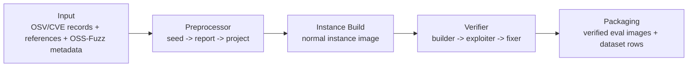
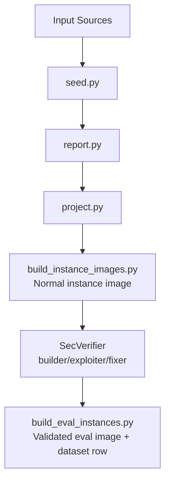
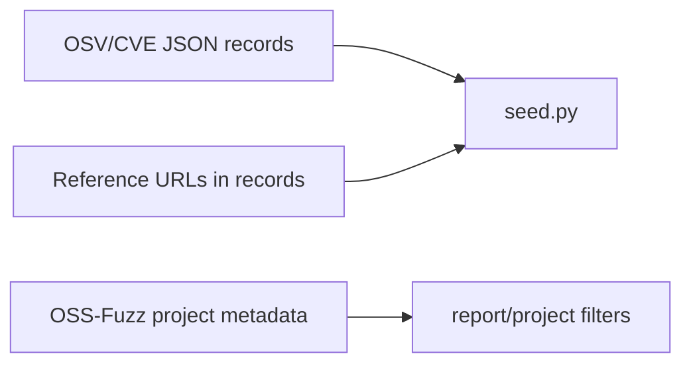
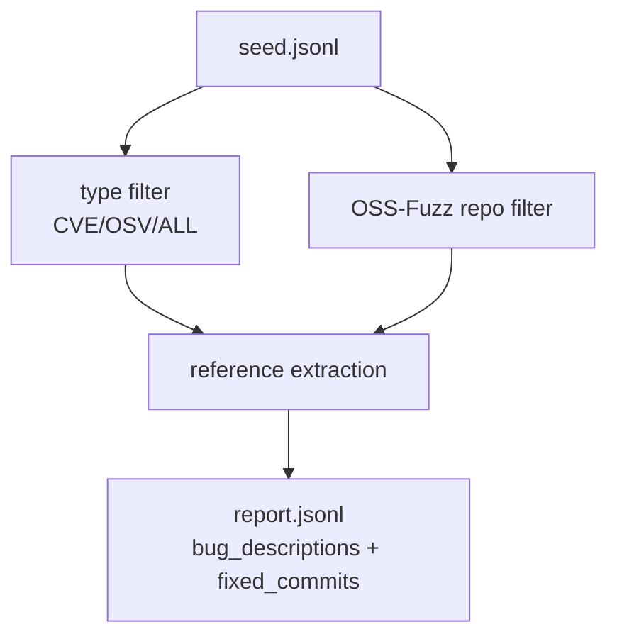
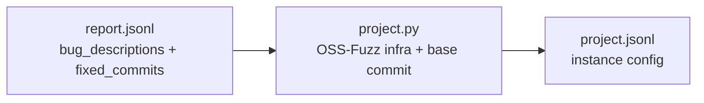
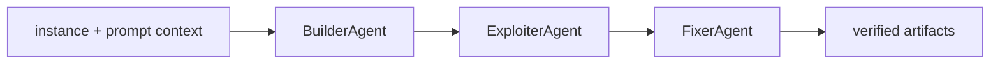
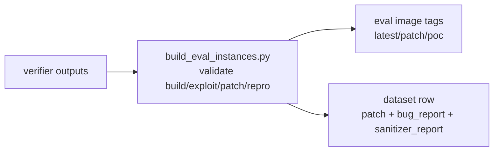

This document focuses on **construction** of SEC-bench assets (data, instances, verified outputs). It is **not** a scoring-method deep dive.

## 1) Construction Phase: Summary
SEC-bench construction can be understood as:



Key outputs by stage:
1. `seed` output: vulnerability metadata JSONL.
2. `report` output: metadata + extracted `bug_descriptions` and `fixed_commits`.
3. `project` output: reproducible instance configs (`bug_description`, `work_dir`, `sanitizer`, `candidate_fixes`, etc.).
4. normal instance image: `hwiwonlee/secb.x86_64.{instance_id}:latest`.
5. verified eval image: `hwiwonlee/secb.eval.x86_64.{instance_id}` plus tags (`latest`, `patch`, `poc`).
6. final dataset rows (including `patch`, `bug_report`, `sanitizer_report`, `exit_code`) from verified packaging.

Evidence:
`SEC-bench/run_preprocessor.sh:8`, `SEC-bench/run_preprocessor.sh:9`, `SEC-bench/run_preprocessor.sh:10`, `SEC-bench/secb/preprocessor/build_instance_images.py:27`, `SEC-bench/secb/preprocessor/build_instance_images.py:29`, `SEC-bench/secb/evaluator/build_eval_instances.py:28`, `SEC-bench/secb/evaluator/build_eval_instances.py:29`, `SEC-bench/secb/evaluator/build_eval_instances.py:1123`, `SEC-bench/secb/evaluator/build_eval_instances.py:1133`.

## 2) Repository Responsibility
| Repository | Construction responsibility | Evidence |
|---|---|---|
| `SEC-bench` | Canonical preprocess/build/package pipeline and eval-image generation | `SEC-bench/README.md:26`, `SEC-bench/README.md:93`, `SEC-bench/README.md:168`, `SEC-bench/README.md:211` |
| `SecVerifier` | Builder/Exploiter/Fixer agent workflow used to produce and verify artifacts for packaging | `SecVerifier/single-agent.py:917`, `SecVerifier/single-agent.py:960`, `SecVerifier/single-agent.py:1022` |

## 3) E2E Architecture


Pipeline order is explicitly wired as separate `seed`, `report`, `project` modes in the wrapper script:
`SEC-bench/run_preprocessor.sh:260`, `SEC-bench/run_preprocessor.sh:263`, `SEC-bench/run_preprocessor.sh:274`.

## 4) Each Step Flow

### Step 0. Input Data Collection
| Item | Details |
|---|---|
| Input data | OSV/CVE records + reference URLs + repository metadata + OSS-Fuzz project metadata |
| What this does | Provides raw vulnerability records and reference links for later extraction/filtering |
| Output data | raw records consumed by `seed.py` |



Evidence:
`SEC-bench/secb/preprocessor/seed.py:4`, `SEC-bench/run_preprocessor.sh:8`, `SEC-bench/run_preprocessor.sh:30`.

### Step 1. `seed` Phase
| Item | Details |
|---|---|
| Input data | Raw vulnerability JSON files (`--input-dir`) |
| What this does | Parses core vulnerability metadata and repo info |
| Output data | seed JSONL fields such as `id`, `references`, `fixed`, `repo_url`, `language` |


Evidence:
`SEC-bench/secb/preprocessor/seed.py:26`, `SEC-bench/secb/preprocessor/seed.py:29`, `SEC-bench/secb/preprocessor/seed.py:31`, `SEC-bench/secb/preprocessor/seed.py:33`, `SEC-bench/secb/preprocessor/seed.py:35`, `SEC-bench/run_preprocessor.sh:261`.

### Step 2. `report` Phase (CVE vs OSS-Fuzz consolidated here)
| Item | Details |
|---|---|
| Input data | seed JSONL |
| What this does | Filters by vuln type/language/repo/OSS-Fuzz and extracts report text + fix commits from references |
| Output data | report JSONL with `bug_descriptions` (list of `{source,url,text}`) and `fixed_commits` |



How CVE vs OSS-Fuzz differs in this step:
1. CVE/OSV is vulnerability-type filtering (`--type` + ID checks).
2. OSS-Fuzz is project-membership filtering (`--oss-fuzz` against known OSS-Fuzz project repos).

Evidence:
`SEC-bench/run_preprocessor.sh:26`, `SEC-bench/run_preprocessor.sh:30`, `SEC-bench/run_preprocessor.sh:272`, `SEC-bench/secb/preprocessor/report.py:2356`, `SEC-bench/secb/preprocessor/report.py:2360`, `SEC-bench/secb/preprocessor/report.py:2750`, `SEC-bench/secb/preprocessor/report.py:2952`, `SEC-bench/secb/preprocessor/report.py:2561`, `SEC-bench/secb/preprocessor/report.py:2595`, `SEC-bench/secb/preprocessor/report.py:2622`.

### Step 3. `project` Phase
| Item | Details |
|---|---|
| Input data | report JSONL |
| What this does | Resolves vulnerable base commit, fetches OSS-Fuzz project files, constructs reproducible build config, merges report list into one `bug_description`, maps `fixed_commits` to `candidate_fixes` |
| Output data | project JSONL (`instance_id`, `dockerfile`, `build_sh`, `work_dir`, `sanitizer`, `bug_description`, `candidate_fixes`) |



CVE vs OSS-Fuzz in this step:
1. The entry must match an OSS-Fuzz-supported project for this construction path.
2. OSS-Fuzz project files are fetched near vulnerable commit time.

Evidence:
`SEC-bench/secb/preprocessor/project.py:1425`, `SEC-bench/secb/preprocessor/project.py:1474`, `SEC-bench/secb/preprocessor/project.py:1540`, `SEC-bench/secb/preprocessor/project.py:1568`, `SEC-bench/secb/preprocessor/project.py:1573`, `SEC-bench/secb/preprocessor/project.py:1598`, `SEC-bench/secb/preprocessor/project.py:1609`, `SEC-bench/secb/preprocessor/project.py:1611`, `SEC-bench/run_preprocessor.sh:283`.

### Step 4. Normal Instance Image Build
| Item | Details |
|---|---|
| Input data | project JSONL |
| What this does | Builds vulnerable instance image for each instance config |
| Output data | normal image `hwiwonlee/secb.x86_64.{instance_id}:latest` |

```mermaid
flowchart LR
  A[project.jsonl] --> B[build_instance_images.py]
  B --> C[hwiwonlee/secb.x86_64.{instance_id}:latest]
```

Evidence:
`SEC-bench/secb/preprocessor/build_instance_images.py:21`, `SEC-bench/secb/preprocessor/build_instance_images.py:27`, `SEC-bench/secb/preprocessor/build_instance_images.py:29`, `SEC-bench/secb/preprocessor/build_instance_images.py:105`.

### Step 5. Verifier (Builder, Exploiter, Fixer)
| Item | Details |
|---|---|
| Input data | Instance workspace + `bug_description` + `candidate_fixes` |
| What this does | Builder validates/fixes build, exploiter reproduces sanitizer-triggering behavior, fixer creates patch and validates no sanitizer error remains |
| Output data | Verified run artifacts (`base_commit_hash`, `repo_changes.diff`, PoC artifacts, `model_patch.diff`, etc.) |



Evidence:
`SecVerifier/single-agent.py:303`, `SecVerifier/single-agent.py:307`, `SecVerifier/prompts/single_agent_instruction.j2:19`, `SecVerifier/prompts/single_agent_instruction.j2:24`, `SecVerifier/single-agent.py:917`, `SecVerifier/single-agent.py:935`, `SecVerifier/single-agent.py:1022`, `SecVerifier/single-agent.py:1086`, `SecVerifier/multi-agent.py:435`, `SecVerifier/multi-agent.py:459`, `SecVerifier/multi-agent.py:476`, `SecVerifier/multi-agent.py:477`.

### Step 6. Packaging to Eval Images + Final Dataset Rows
| Item | Details |
|---|---|
| Input data | Successful verifier outputs + base instance data |
| What this does | Builds eval image, validates behavior, creates tags, and writes final dataset rows |
| Output data | `hwiwonlee/secb.eval.x86_64.{instance_id}` images + tags and dataset rows with `patch`, `exit_code`, `sanitizer_report`, `bug_report` |



Evidence:
`SEC-bench/secb/evaluator/build_eval_instances.py:850`, `SEC-bench/secb/evaluator/build_eval_instances.py:1087`, `SEC-bench/secb/evaluator/build_eval_instances.py:1097`, `SEC-bench/secb/evaluator/build_eval_instances.py:1104`, `SEC-bench/secb/evaluator/build_eval_instances.py:1111`, `SEC-bench/secb/evaluator/build_eval_instances.py:1118`, `SEC-bench/secb/evaluator/build_eval_instances.py:1125`, `SEC-bench/secb/evaluator/build_eval_instances.py:1133`, `SEC-bench/secb/evaluator/build_eval_instances.py:796`, `SEC-bench/secb/evaluator/build_eval_instances.py:815`, `SEC-bench/secb/evaluator/build_eval_instances.py:819`.

## 5) Hugging Face Dataset Comparison (`SEC-bench/SEC-bench` vs `SEC-bench/Seed`)

| Item | `SEC-bench/Seed` | `SEC-bench/SEC-bench` |
|---|---|---|
| Constructed from | Preprocessor `project.py` style output | Verified packaging (`build_eval_instances.py`) output rows |
| Typical purpose | Construction input for builder/exploiter/fixer style generation | Final benchmark/eval dataset with validated patch/repro metadata |
| Gold patch column | No `patch` column in this schema | `patch` column exists and is treated as reference/gold patch in prompts/eval contexts |
| `bug_description` | Long merged report text | Published dataset has concise `bug_description` + long `bug_report` |
| `bug_report` | Not present in Seed schema | Present; generated as cleaned report text in packaging pipeline |

Where these are wired in code:
1. SEC-bench evaluation config defaults to `SEC-bench/SEC-bench`.
2. SecVerifier defaults to `SEC-bench/Seed` for construction runs.

Evidence:
`SEC-bench/config.example.toml:37`, `SEC-bench/secb/evaluator/eval_instances.py:1360`, `SecVerifier/single-agent.py:199`, `SecVerifier/single-agent.py:202`, `SecVerifier/single-agent.py:1185`, `SecVerifier/multi-agent.py:609`, `SecVerifier/multi-agent.py:612`, `SecVerifier/multi-agent.py:1837`.

### Where “gold patch” comes from
`patch` is written in packaging step from extracted `/testcase/model_patch.diff` when available, otherwise fallback patch payload.

Evidence:
`SEC-bench/secb/evaluator/build_eval_instances.py:509`, `SEC-bench/secb/evaluator/build_eval_instances.py:796`, `SEC-bench/secb/evaluator/build_eval_instances.py:804`.

### `bug_descriptions` / `bug_description` / `bug_report` lineage
```mermaid
flowchart LR
  A[report.py\nbug_descriptions list[source,url,text]]
  B[project.py\nbug_description merged full text]
  C[build_eval_instances.py\ncopy bug_description + derive bug_report]

  A --> B --> C
```

Evidence:
`SEC-bench/secb/preprocessor/report.py:2561`, `SEC-bench/secb/preprocessor/report.py:2595`, `SEC-bench/secb/preprocessor/project.py:1540`, `SEC-bench/secb/preprocessor/project.py:1568`, `SEC-bench/secb/preprocessor/project.py:1609`, `SEC-bench/secb/evaluator/build_eval_instances.py:781`, `SEC-bench/secb/evaluator/build_eval_instances.py:819`, `SEC-bench/secb/evaluator/build_eval_instances.py:820`, `SEC-bench/secb/evaluator/utils.py:136`.

### Do we actually use full-data report in SecVerifier?
Short answer: **SecVerifier uses `bug_description`, not `bug_report`**.

1. Prompt rendering in SecVerifier passes `instance['bug_description']` to builder/exploiter/fixer instructions.
2. There is no corresponding prompt usage of `bug_report` in these agent paths.
3. Since SecVerifier default dataset is `SEC-bench/Seed`, and Seed’s `bug_description` is full-report style, SecVerifier typically sees full report text by default.

Evidence:
`SecVerifier/single-agent.py:303`, `SecVerifier/single-agent.py:325`, `SecVerifier/multi-agent.py:435`, `SecVerifier/multi-agent.py:459`, `SecVerifier/multi-agent.py:476`, `SecVerifier/single-agent.py:202`, `SecVerifier/multi-agent.py:612`.

## 6) DockerHub Image Comparison

### 6.1 Normal instance image vs eval image
| Item | Normal instance image | Eval image |
|---|---|---|
| Naming | `hwiwonlee/secb.x86_64.{instance_id}:latest` | `hwiwonlee/secb.eval.x86_64.{instance_id}` (+ tags) |
| Built by | `build_instance_images.py` | `build_eval_instances.py` |
| Main role | Vulnerable reproducible environment | Verified evaluation-ready environment + benchmark packaging |

Evidence:
`SEC-bench/secb/preprocessor/build_instance_images.py:29`, `SEC-bench/secb/preprocessor/build_instance_images.py:105`, `SEC-bench/secb/evaluator/build_eval_instances.py:28`, `SEC-bench/secb/evaluator/build_eval_instances.py:29`, `SEC-bench/secb/evaluator/build_eval_instances.py:850`, `SEC-bench/CLAUDE.md:60`, `SEC-bench/CLAUDE.md:61`, `SEC-bench/CLAUDE.md:62`.

### 6.2 `:latest`, `:patch`, `:poc` tag differences (eval images)
| Tag | Cleanup behavior | Why |
|---|---|---|
| `latest` | Keep all files | Full reference state |
| `patch` | Remove `model_patch.diff` | Prevent patch leakage in patch-generation tasks |
| `poc` | Remove patch and PoC files under `/testcase` except base/repo-change control files | Prevent artifact leakage in PoC tasks |

Evidence:
`SEC-bench/secb/evaluator/build_eval_instances.py:458`, `SEC-bench/secb/evaluator/build_eval_instances.py:459`, `SEC-bench/secb/evaluator/build_eval_instances.py:460`, `SEC-bench/secb/evaluator/build_eval_instances.py:461`, `SEC-bench/secb/evaluator/build_eval_instances.py:542`, `SEC-bench/secb/evaluator/build_eval_instances.py:553`, `SEC-bench/secb/evaluator/build_eval_instances.py:558`, `SEC-bench/secb/evaluator/build_eval_instances.py:1104`, `SEC-bench/secb/evaluator/build_eval_instances.py:1111`, `SEC-bench/secb/evaluator/build_eval_instances.py:1118`.

### 6.3 Where these tags are consumed
Even though this doc is construction-focused, tags are consumed by evaluator as:
1. Patch task -> `:patch`
2. PoC task -> `:poc`

Evidence:
`SEC-bench/secb/evaluator/eval_instances.py:719`, `SEC-bench/secb/evaluator/eval_instances.py:722`.

---
Paper reference:
- SEC-bench: https://arxiv.org/pdf/2506.11791
