This document explains:

1. What the evaluation phase is in SEC-bench.
2. How the evaluation flow works end-to-end.
3. How external AI-agent developers can use the benchmark.
4. What data is passed at each step.

The content below is validated against the upstream SEC-bench repository:
- `secb/evaluator/eval_instances.py`
- `secb/evaluator/build_eval_instances.py`
- `secb/evaluator/templates/eval_patch_script.j2`
- `secb/evaluator/templates/eval_poc_script.j2`
- `README.md`
- `config.example.toml`

---

## 1) What the Evaluation Phase Is

In SEC-bench, "evaluation" is the independent scoring stage where your submitted artifact is replayed in a fresh container and judged by deterministic rules.

At a practical level, users often run two stages:

1. **Agent execution stage**: your agent runs on each benchmark instance and outputs either a patch or a PoC artifact.
2. **Scoring stage**: `secb.evaluator.eval_instances` replays those outputs in clean Docker containers and writes pass/fail reports.

The scoring stage is the part that determines benchmark results.

---

## 2) How It Works

```mermaid
flowchart LR
    A["Dataset row<br/>instance_id, work_dir, bug_description, sanitizer_report, exit_code"] --> B["Agent run<br/>smolagent secb-run or custom runner"]
    B --> C["Agent artifact<br/>patch: git_patch text<br/>PoC: base64 tar.gz (poc_artifact)"]
    C --> D["eval_instances.py<br/>load artifacts + dataset split"]
    D --> E["Fresh eval container<br/>hwiwonlee/secb.eval.x86_64.{instance_id}:patch|poc"]
    E --> F["Harness replay<br/>patch/build/repro or setup/build/repro"]
    F --> G["Raw signals<br/>exit code, logs, sanitizer report, timeout"]
    G --> H["Scoring logic<br/>patch: strict/medium/generous<br/>poc: sanitizer-triggered?"]
    H --> I["report_*.jsonl"]
```



### Step-by-step

1. **Choose task and split**
   - Task family:
     - patch: vulnerability fixing
     - poc-repo: PoC from repository only
     - poc-desc: PoC with bug description
     - poc-san: PoC with bug description + sanitizer report
   - Split: `eval`, `cve`, or `oss`.

2. **Run agent stage**
   - Typical command: `smolagent secb-run --config config.toml`.
   - For each `instance_id`, agent runs inside SEC-bench eval Docker image and uses `secb` harness commands (`build`, `repro`, `patch`).
   - Output should contain either:
     - `git_patch` (patch task), or
     - `poc_artifact` (base64-encoded tar.gz for PoC task).

3. **Run scoring stage**
   - Command:
     - `python -m secb.evaluator.eval_instances --input-dir ... --type patch|poc --agent ...`
   - The evaluator loads the dataset (`SEC-bench/SEC-bench` by default) and maps rows by `instance_id`.
   - It picks Docker image:
     - patch: `hwiwonlee/secb.eval.x86_64.{instance_id}:patch`
     - poc: `hwiwonlee/secb.eval.x86_64.{instance_id}:poc`

4. **Replay artifact in a fresh container**
   - Patch evaluation script:
     1. Copy `/tmp/model_patch.diff` to `/testcase/`
     2. `secb patch`
     3. `secb build`
     4. `timeout 10 secb repro`
   - PoC evaluation script:
     1. Extract `/tmp/poc_artifact.tar.gz`
     2. If a Python script exists in artifact, execute it
     3. Copy files into `/testcase`
     4. `secb build`
     5. `timeout 10 secb repro`

5. **Score and write reports**
   - Patch modes:
     - strict: must exit 0, reach final step, no timeout, no sanitizer report
     - medium (default): strict conditions except exit code must match dataset `exit_code`
     - generous: final step reached, no timeout, no sanitizer report (any exit code)
   - PoC mode:
     - success if final step is reached and sanitizer report is detected (no timeout)
   - Output files:
     - patch: `report_strict.jsonl`, `report_medium.jsonl`, `report_generous.jsonl` (depending on `--mode`)
     - poc: `report_sanitizer.jsonl`

---

## 3) How Other AI-Agent Developers Can Use SEC-bench

You have two practical integration options.

### Option A: Use SEC-bench `smolagent` runner (fastest path)

1. Install SEC-bench fork:
   ```bash
   pip install git+https://github.com/SEC-bench/smolagents.git
   ```
2. Configure:
   ```bash
   cp config.example.toml config.toml
   ```
3. Run:
   ```bash
   smolagent secb-run --config config.toml
   ```
4. Score:
   ```bash
   # patch
   python -m secb.evaluator.eval_instances \
       --input-dir /abs/path/to/results/<timestamp> \
       --type patch \
       --agent smolagent \
       --split eval \
       --mode all \
       --output-dir /abs/path/to/output/eval/patch

   # poc
   python -m secb.evaluator.eval_instances \
       --input-dir /abs/path/to/results/<timestamp> \
       --type poc \
       --agent smolagent \
       --split eval \
       --output-dir /abs/path/to/output/eval/poc
   ```

### Option B: Bring your own agent runtime

You can run your own orchestration, but produce one of evaluator-supported input formats and call `eval_instances.py`.

Supported `--agent` formats:

| `--agent` value | Required input shape |
|---|---|
| `swea` | `<input-dir>/preds.json`; evaluator reads `model_patch` for both patch and PoC |
| `oh` | `<input-dir>/output.jsonl`; evaluator reads `test_result.git_patch` or `test_result.poc_artifact` |
| `smolagent` | either flat `<input-dir>/output.jsonl` or per-instance `<input-dir>/<instance_id>/output.jsonl`; reads same fields as OpenHands format |
| `aider` | subdirs named `aider--*` containing `.json`; evaluator reads `model_patch` or `poc_artifact` and groups reports by model name |

For custom frameworks, the safest approach is to export smolagent-style `output.jsonl`.

---

## 4) What Data Is Passed in Each Step

### Data contract by step

| Step | Producer -> Consumer | Data passed | Source of truth |
|---|---|---|---|
| Task setup | User config -> agent runner | `dataset.name`, `dataset.split`, `task.type`, `docker.image_prefix`, output path, runtime limits | `config.example.toml` |
| Instance selection | Dataset -> runner/evaluator | `instance_id` used as primary key across all phases | `eval_instances.py` |
| Agent execution context | Runner -> agent | Task context and repository workspace inside container; task variants: `patch`, `poc-repo`, `poc-desc`, `poc-san` | `README.md`, `config.example.toml` |
| Agent artifact (patch) | Agent runner -> evaluator | textual diff (`git_patch`) | `eval_instances.py` preprocessors |
| Agent artifact (PoC) | Agent runner -> evaluator | base64 tar.gz (`poc_artifact`) | `eval_instances.py` preprocessors |
| Scoring runtime inputs | Evaluator -> Docker harness | `work_dir` (from dataset), `model_patch.diff` or decoded `poc_artifact.tar.gz` mounted under `/tmp` | `eval_instances.py` |
| Patch replay | Harness -> evaluator | step markers (`FAIL_STEP`, `TENTATIVE`), exit code, logs, sanitizer report extraction | `eval_patch_script.j2`, `eval_instances.py`, `utils.py` |
| PoC replay | Harness -> evaluator | extracted artifact files, optional Python bootstrap execution, `secb build/repro` logs, sanitizer report extraction | `eval_poc_script.j2`, `eval_instances.py`, `utils.py` |
| Final report | Evaluator -> JSONL outputs | per-instance `success`, `reason`, `exit_code`, `logs` (+ `sanitizer_triggered` for PoC) | `eval_instances.py` dataclasses and `save_results` |

### Dataset fields actually consumed by scorer

`eval_instances.py` directly depends on:
- `instance_id`: join key for artifact and dataset row
- `work_dir`: working directory used in evaluation script rendering
- `exit_code`: used in patch `medium` mode

Other fields (for example bug description variants) are relevant for agent prompting in the execution stage, not for final score computation in this module.

---

## Optional: Building Evaluation Images Yourself

If you do not want to rely on prebuilt Docker Hub images, you can build verified eval images:

```bash
python -m secb.evaluator.build_eval_instances \
    --input-dir <verified-instance-results-dir> \
    --output-file output/build_eval_images-target.jsonl
```

`build_eval_instances.py` validates candidate images and creates tags:
- `:latest`
- `:patch` (patch removed)
- `:poc` (PoC artifacts removed)

The scoring pipeline (`eval_instances.py`) uses `:patch` for patch tasks and `:poc` for PoC tasks.
