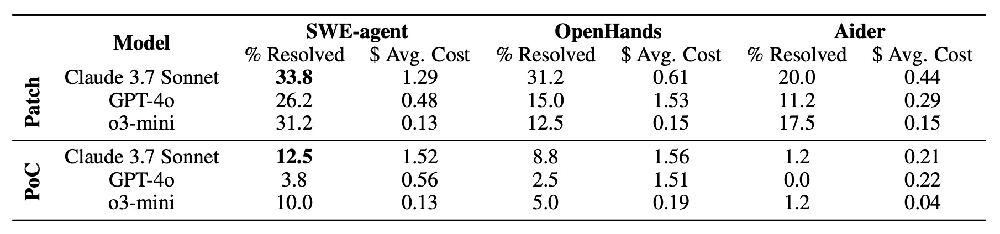

# Evaluation and Findings

## Evaluation Quality

### Agents and Models

Code agents: SWE-agent, OpenHands, and Aider. 

Language models: Claude 3.7 Sonnet, GPT-4o, and o3-mini.

### Tasks for Evaluation

PoC generation and vulnerability patching.

Evaluate the best-performing agent on the full dataset, while a detailed comparison among all agents is conducted using 80 representative instances from SEC-bench. For PoC generation, the vulnerability description, harnesses, and the codebase within a Docker environment are provided. For vulnerability patching, the vulnerability description with call stack information, harnesses, and the codebase within a Docker environment are provided.

## Findings

### Overall Findings

#### Challenges of Security Tasks
For **PoC generation**, most vulnerabilities involvememory-access violations that require precisely crafted, byte-level payloads to trigger. Such payloads demand sophisticated reasoning about runtime memory layouts and execution paths —- capabilities that current LLMs lack despite their strengths in natural language and source code. Existing models trained predominantly on textual data rather than low-level binary operations, struggle to generate
effective exploits that must interact with program memory at the byte level, explaining their poor
performance even when deployed as agents.

For **patch generation**, despite the existence of provided vulnerability call stack information which often hints at which files and functions to review, agents still struggle to generate correct patches, highlighting the complexity of the task. The challenges include
1. identification and understanding of vulnerability root causes within broader codebase context,
2. analysis of data and control flow to trace attack vectors,
3. precise fixes that eliminate vulnerabilities while preserving functionality and avoiding security regressions.

#### Failure Cases
1. **No Patch (NP)** is caused by large code contexts that exceeds token budget.
2. **Incorrect Patch (IP)** arises when agents generate excessively large patches due to iterative attempts, which increases the risk of formatting errors.
3. **Compilation Error (CE)** when patches introduce defects like mismatched types or pointer dereference errors. After multiple attempts to resolve such compilation issues, agents reach cost or iteration limits.
4. **Failed Patch (FP)**  happens when agents misidentify the root cause of a vulnerability.
