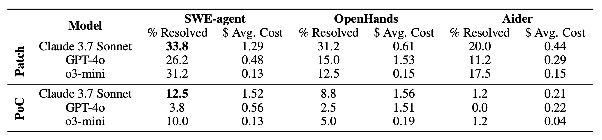

# Evaluation and Findings

## Evaluation Quality

**Agents and Models**. 

Code agents: SWE-agent, OpenHands, and Aider. 

Language models: Claude 3.7 Sonnet, GPT-4o, and o3-mini.

**Tasks for Evaluation**. 

PoC generation and vulnerability patching.

Evaluate the best-performing agent on the full dataset, while a detailed comparison among all agents is conducted using 80 representative instances from SEC-bench. For PoC generation, the vulnerability description, harnesses, and the codebase within a Docker environment are provided. For vulnerability patching, the vulnerability description with call stack information, harnesses, and the codebase within a Docker environment are provided.

## Findings

### Overall Findings

### LLM Findings

### Agent Findings
