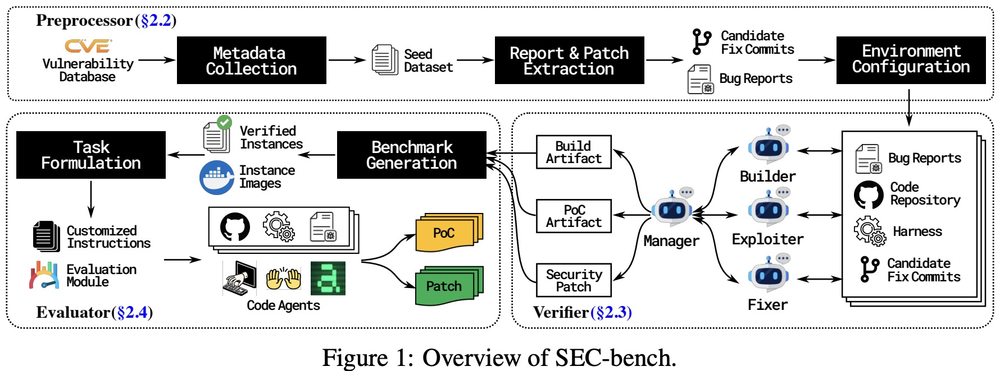

# SEC-Bench Method

The entire Sec-Bench framework is can be divided into three main modules: Preprocessor, Verifier, and Evaluator.

## Preprocessor Module
**Preprocessor** systematically selects in-the-wild vulnerability datasets and retrieves heterogeneous
bug reports across different platforms, establishing consistent interactive environments for verification.
It collects instances from public CVE databases and extracts essential metadata such as reference URLs and repository information, and then constructs interactive environments using Docker containers for verifying the collected instances.

Steps of the Preprocessor:

### Metadata Collection
CVE instances are collected from the [OSV database](https://osv.dev/). Compared to
[ARVO](https://arxiv.org/abs/2408.02153) or [OSS-FUZZ](https://google.github.io/oss-fuzz/), OSV was regarded better according to the SEC-Bench team, because it provides validated PoC's. Limitations of ARVO and OSS-Fuzz are also discussed on [the cybergym input dataset page](/cybergym/experiments/input-dataset). Essential metadata are collected, including vulnerability descriptions, reference URLs, provider information, and repository details. This initial collection yields 38,201 potential instances spanning 7,926 open-source projects.

### Bug Report and Candidate Fix Extraction 
For each instance, the SEC-Bench team employs
web scraping tools to gather vulnerability reports from bug tracking platforms (e.g. GitHub
Issues, RedHat Bugzilla, Chromium Issue Tracker). These reports often contain reproduction methods and potential fixes. 4,836 instances with sufficient documentation were generated.

### Environment Configuration
Verify each instance by creating interactive environments, with customized Docker configurations with project-specific dependencies and settings. The team developed a harness designed for LLM agents to build projects, execute PoCs, and validate patches. It enables efficient vulnerability verification by allowing LLM agents to focus on the core task without being distracted by unessential environmental details. After filtering for instances where sanitizer-generated reports are available, 898 instances as candidates were created.

## Verifier Module
**Verifier** deploys specialized LLM multi-agents to automatically reproduce and verify collected
instances in controlled environments, rigorously filtering out cases that lack reliable vulnerability
reproduction.

### Manager Agent
The manager agent oversees the verification process by coordinating specialized
sub-agents: builder, exploiter, and fixer. It assigns tasks, tracks their progress, and ensures effective
communication among agents. After each task, the manager evaluates outputs against predefined
objectives. If results do not meet the required standards, the manager provides targeted feedback and
reassigns the task to the appropriate sub-agent for improvement. This iterative process continues until
all verification criteria are met or a maximum number of iterations is reached, ensuring robustness
even with complex vulnerabilities or unclear bug reports.

### Builder Agent
The builder agent ensures that the vulnerable code repository can be successfully
compiled in the target environment. It systematically builds the project, diagnoses and resolves
compilation errors, and refines the harness for reliable project compilation. The builder outputs an
optimized build script, a dependency list, and a patch file addressing compilation issues.

### Exploiter Agent
The exploiter agent creates or validates a functional PoC artifact that demonstrates
the vulnerability. It analyzes bug reports to extract or construct the PoC, even when information is
incomplete or inaccurate. The agent identifies PoC-related content, downloads or adapts available
PoC files, validates the exploit by execution, and documents the commands required to reproduce the
vulnerability. When no available PoC is found, the agent generates one from scratch by analyzing the
root cause, vulnerability patterns, and affected code paths. The final artifact consists of a functional
PoC input and the command sequence needed to trigger it.

### Fixer Agent
The fixer agent synthesizes a unified patch that addresses the vulnerability. Because
fixes often span multiple commits, mixing relevant and unrelated changes, the agent analyzes
candidate fix commits to isolate only the vulnerability-related modifications. It then consolidates
these changes into a single comprehensive patch file. If no appropriate fix commits are available or
existing fixes fail, the agent independently devises a patch by investigating the underlying vulnerability
and tracing the relevant code paths. The agent validates the patch by ensuring it prevents the PoC
from triggering the vulnerability while preserving original functionality.

## Evaluator Module
**Evaluator** transforms verified instances into structured security tasks, packaging
them with secure, containerized environments as Docker images containing the vulnerable codebase, environment configurations, and essential artifacts from the verification process.

### PoC Generation
Let agents to create a working PoC for a known vulnerability, given only a basic vulnerability description with a sanitizer-generated report and access to the codebase. This tests an agent’s ability to understand vulnerability descriptions, analyze codebases, and craft specific inputs that trigger the vulnerability. Evaluation uses execution-based metrics where a successful solution must produce a PoC that, when executed, triggers the sanitizer to report the correct vulnerability type at expected locations.

### Vulnerability Patching
Let agents create security fixes for known vulnerabilities given a vulnerability description, access to the codebase, and a working PoC. This evaluates an agent’s capacity to understand root causes and create reliable security patches. The multi-stage evaluation process first applies the generated patch, then compiles the patched code to ensure successful project build, and finally executes the original PoC against the patched codebase to confirm mitigation. Success requires meeting two criteria: a valid patch that compiles correctly and prevents the sanitizer from reporting the vulnerability.

## Success Metric

## Input Construction

## Quality Checks