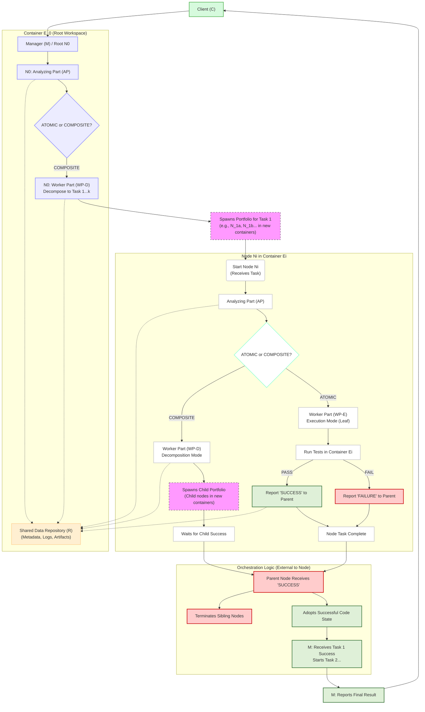

# Agent Tree Brainstorming

Research ideas for the tree-structured agentic system.

---

## Introduction
The goal of this brainstrom should settle down our fundamental design to create a tree-like agentic sturcutre to tackle cybersecurity tasks.

We have successfully reproduced and even refactored the SEC-Verifier with a better modular OpenHands core. This improvement allows us to easily test the 3-stage agents (Builder, Exploiter, and Fixer) on OpenAI, Gemini, and Claude models. We discovered that the 3-stage agentic system performance depends on the choice of models. For example, Claude Sonnet 4.5 is able to recreate the builder stage for `php.cve-2018-19935`, but all of powerful OpenAI models (GPT-5, GPT-5-mini, GPT-4o) failed to do so.

The weak point of the current SEC-Verifier is that it only allows a linear chain of agents. For example, if the Builder fails to create a working exploit, the Exploiter will not be able to proceed. To address this limitation, we propose a tree-structured agentic system where multiple agents can be spawned at each stage, and the decision-making agent is able to produce fine-grained actions to fix the issues.

## Core Algorithm of Tree-Structured Agentic System
Our proposed tree-structured system is highly recursive, and actions taken by agent nodes are dependent on the current budget. Every single node is a subclass of a superclass of an abstract AgentNode. This tree system allows multiple models to collaborate, compare and select the best actions to finish a given task, and even backtrack the to redo the failed objective if needed.

### Agent Node Stucture
Each node in the tree represents an agent with the following attributes:
- **Agent Model:** 
- **Current Budget:** 
- **Objective:**
- **Task List:** 
- **Supervisor Node:**
- **Subordiante Nodes:**

### Agent Node Actions
Each node in the tree represents an agent with the following attributes:
- **Agent Model:** 
- **Current Budget:** 
- **Objective:**
- **Task List:** 
- **Supervisor Node:**
- **Subordiante Nodes:**

### Tree Structure Illustration

TODO

### Tree Structure Workflow

### Example Use Case
Consider a scenario where the objective is the following:
- **Objective:** Count the number of words in a given text file.

