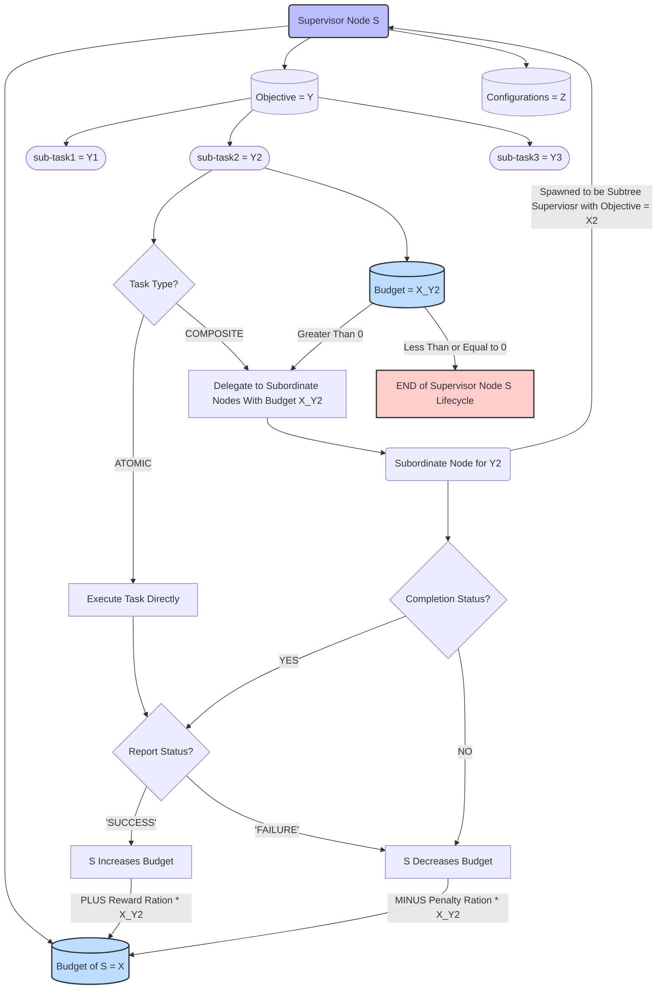
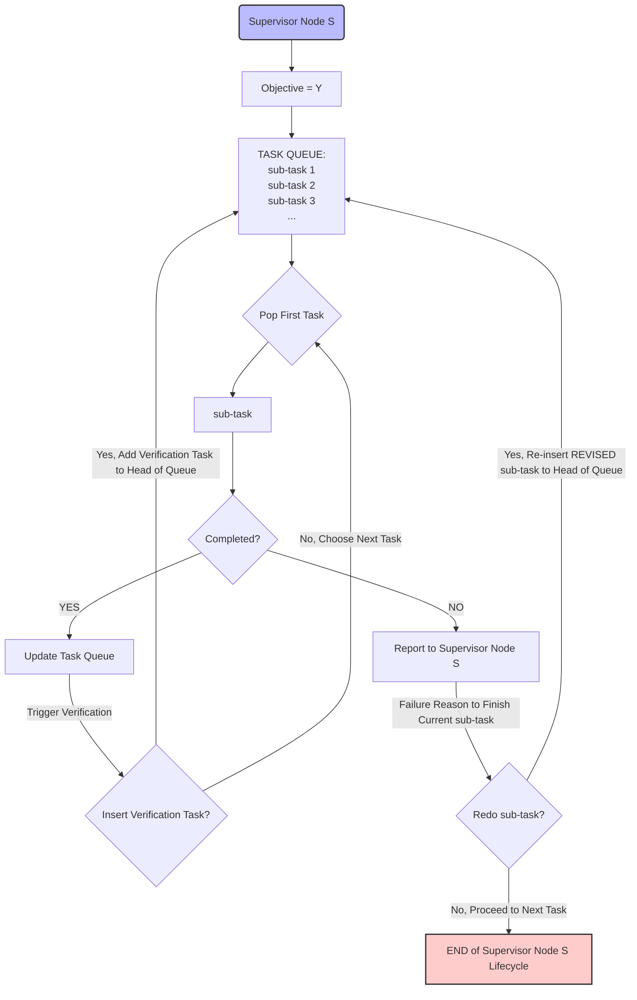

# Agentic Tree

Research ideas for the tree-structured agentic system.
- Writen by Song Li

---

## Introduction
The goal of this brainstrom should settle down our fundamental design to create a tree-like agentic sturcutre to tackle cybersecurity tasks.

We have successfully reproduced and even refactored the SEC-Verifier with a better modular OpenHands core. This improvement allows us to easily test the 3-stage agents (Builder, Exploiter, and Fixer) on OpenAI, Gemini, and Claude models. We discovered that the 3-stage agentic system performance depends on the choice of models. For example, Claude Sonnet 4.5 is able to recreate the builder stage for `php.cve-2018-19935`, but all of powerful OpenAI models (GPT-5, GPT-5-mini, GPT-4o) failed to do so.

The weak point of the current SEC-Verifier is that it only allows a linear chain of agents. For example, if the Builder fails to create a working exploit, the Exploiter will not be able to proceed. To address this limitation, we propose a tree-structured agentic system where multiple agents can be spawned at each stage, and the decision-making agent is able to produce fine-grained actions to fix the issues.

**Note**: We use terms agents and nodes interchangeably in this document. By default, we only introduce three sub-agents when we delegate a sub-task.

## Core Algorithm of Tree-Structured Agentic System
Our proposed tree-structured system is highly recursive, and actions taken by agent nodes are dependent on the current budget. Every single node is a subclass of a superclass of an abstract AgentNode. This tree system allows multiple models to collaborate, compare and select the best actions to finish a given task, and even backtrack the to redo the failed objective if needed.

### Agent Node Stucture
Each node in the tree represents an agent with the following attributes:
- **Agent Model:** This one is the core of the node, which contains the information of the selected LLM model name (e.g., GPT-5, Claude Sonnet 4.5, Gemini Pro, etc.) and its configuration (e.g., temperature, max tokens, current context, etc.).
- **Current Budget:** This is a numeric allocation of resources allowed for the node to perform its tasks. An agent node can get more budeget if its subordinate nodes succeed in their tasks, and get a loss in budget if they fail. This part would be more explictly defined in the [Reward Mechanism](#reward-mechanism).
- **Objective:** This is text description of the task that the current agent node possesses. If the current node is root node of the entire tree, then the objective is the high-level cybersecurity task with detailed descriptions, including the operating system specifications, the GitHub repository link with specific reported commits, GitHub Issues raised, etc. If the current node is not a root node, then the objective is a sub-task created by its supervisor node.
- **Task Queue:** This part is a linked list of sub-tasks that are created by the current agent node in order to fullfill the objective. At every single iteration, the current agent node will pop the first task from the task queue, and decide to fullfill it by itself (if it is an atomic task), or spawn subordinate nodes to tackle the sub-task (if it is a composite task). More details about the task list management will be discussed in the [Task Assignment Mechanism](#task-assignment-mechanism).
- **Supervisor Node:** This points to the parent node of the current agent node. The supervisor node is responsible for generating subtasks, monitoring the progress of its subordinate nodes, collecting their results, recalculating the current budget, spawning new tasks, and terminating the sub-tasks. The part related to spawning and killing of sub-agent is more explictly defined in the [Agent Lifecycle](#agent-lifecycle).
- **Subordiante Nodes:** This a list of child nodes that are spawned 

### Agent Node Actions
Each agent node acts in accordance with the following workflow:
1. **Analyze Objective:** : Based on LLM's internal reasoning, the task complexity, and the current budget.
2. **Create High-Level Task Type:**
    - **Atomic Task:** Finish it directly.
    - **Composite Task:** Delegate to subordinate nodes.
5. **Update Budget:** Based on the [reward mechanism](#reward-mechanism).
6. **Redo or Terminate:**: Based on the [task assignment mechanism](#task-assignment-mechanism).
7. **Report to Supervisor:** Report the result no matter success or failure to the supervisor node, in order to create more context for next task.

### Tree Structure Illustration

### Reward Mechanism

### Task Assignment Mechanism

About Task Spawning: When the supervisor node decides to create a sub-task, it spawns by default 3 agents with different internal LLM models with the same assigned task and equal budget split. This diversity facilitates the possibility of success, because different models have different strengths and weaknesses. The supervisor node only needs one successful subordinate node to complete the sub-task, and the rest of subordinate nodes are immediately terminated to save budget. If one subordinate agent is successful, the supervisor recollects the given budget from that node with a reward ratio (e.g., 1.2x), and the rest of unfinished subordinate nodes lose their given budget with no reward or penalty ratio (e.g., 1x). Failed subordinate node return their remaining budget with a penalty ration (e.g. 0.8x) back to the supervisor node.

About Verification Task: In this workflow, it is possible that we can have recursive verification tasks, but our verification trigger is based on heuristics, which makes this scenario less likely to happen.

### Agent Lifecycle

There are three main scenarios that trigger the termination of an agent node:
1. **Budget Depletion**: If the current budget of the agent node drops to zero or below, the agent node is terminated immediately.
2. **Objective Completion**: Once the agent node successfully completes its assigned objective and reports the results to its supervisor node, it is terminated.
3. **Failed Subtask**: If the agent node fails to complete a critical subtask and the supervisor node decides not to reassign it (based on budget constraints or task importance), the agent node is terminated. If a subtask is aborted by the supervisor, then the every agent under the supervisor subtree is also terminated, because the objective is not doable with a missing subtask.

### Example Workflow Illustration
Consider a scenario where the objective is the following:
- **Objective:** Count the number of words in a given text file.

1. **Root Node Creation**: A root agent node is created with a powerful LLM model (e.g., GPT-5) and a budget of 1000.
2. **Task Decomposition**: The root node analyzes the objective and decomposes it into 3 equally subtasks each with a budget of 333, and the amount of budget is allocated based on the root node's internal reasoning:
   - Sub-task 1: Open the text file.
   - Sub-task 2: Run `wc` word count.
   - Sub-task 3: Print the result.
3. **Sub-Task Assignment**: The root node creates a task queue with the three subtasks.
    - Sub-task 1 is composite, so it spawns 3 subordinate nodes with different models (e.g., Claude Sonnet 4.5, Gemini Pro, GPT-4o) and allocates 111 budget to each. However, the supervisor root node explicitly instructs 3 subordinate nodes to use different methods to open the file (e.g., vim, vi, and nano).
    - vim is not available on the machine, so the subordinate 1 will try to become a thinking supervisor node to instruct its subordinate nodes to install vim. However, because its's too costly to create a subtree, its allocated 111 budget can quickly deplete. 
    - vi is readily availble on the machine, so subordinate 2 is able to open the file successfully and report back to the root node, and all other sibling subordinate nodes are immediately terminated to save budget.
4. **Budget Recollection**: The root supervisor node recollects the remaining budget from subordinate 2 with a reward ratio of 1.2x, and the rest of subordinate nodes lose their allocated budget with no reward or penalty ratio, which means that the root node's current budget is now 1000 - 333 + (111 * 1.2) + 222 = 1022.2; The reward ratio and penalty ratio are hyperparameters that can be tuned. Since the subordinate 2 is successful, even though subordinate 1 depletes its budget, the supervisor node does not create a penalty on subordinate 1's failure. However, if all subordinate nodes fail, then the supervisor node will create a penalty on all of them.
5. **Verification**: If the supervisor node is suspicous on the previous finished sub-task based on the verification heuristic, then it will inject a verification task to the top of the task queue. If not, then no verification task is created.
6. **Pop Next Task** The root node pops the next task from the task queue. 

## Task Evaluation/ Verificaiton
It is significantly challenging to evaluate the successes of the tree-structured agentic system, but it is crucial to establish a robust evaluation framework.

### Problem Statement
In the worst case scenario, if in a subtree, one of our agent hallucinates and reports the false negative (i.e. falsely reported as finished) that the current objective is fully achieved. For example, if an agent reports that one function that is supposed to check the file's access permission is correctly implemented, but in reality, the function always returns true for any user. This problem can cause ripple effects in the entire tree, because once the subtask is popped from the task queue of the supervisor node, this specific task is unlikely to be recreated. As a result, somewhere in other parts of the tree, one agent can further build on top of this false negative and reports incorrect incorrect results, simply due to the calling of hallucinated function. Eventually, the errors accumulated to the root node, and the entire tree reports a false negative that the high-level objective is achieved, because of one wrongly implemented atomic task.

### Thoughts On Simple Solutions
Therefore, it is critical for the task evaluation mechanism to be able to at least catch the suspicion of wrongly reported tasks. In the agentic world, it is particularly challenging to verify the correctness of the tasks. The following methods are **NOT** ideal for this problem:
1. **Redundant Task**: Assign the same task repeated can cause budeget waste and quickly exhuast the rewards, and based on our [Agent Lifecyle](#agent-lifecycle), this can quickly terminates the sub-branch. The false negative task report does not generate meaningful feedback to the supervisor node, and supervisor node is unlikely to redo the same task again. Also, this method is not efficient if we create the same task multiple times.
2. **Same Layer Cross-Validation**: Checking the results of sibling nodes can cause confusions to the supervisor node. Imagine that, 2 of the 3 subordiante nodes reported false negative results, and the last subordinate is able to finish the sub-task correctly. The supervisor node is likely to believe the majority vote, and the correctly finished task is instead killed. This cross-validation error may be mitigated if we always use different models for the subordinate nodes, because their results are likely to be different.
3. **Agent Self Reflection**: Relying on the agent to self-reflect may not be reliable, because the agent itself has already hallucinated once, and it is likely to hallucinate again.

As shown above, the evaluation of the tree-structured agentic system is non-trivial, but it can grealy imporves the overall success rate and realiability if the system is able to catch some false negative reports.

### Agentic Verification Task Strategy
The following strategy is **proposed and planned** to be implemented:
1. **Verification Task Injection**: The supervisor node is in charge of the task queue management, and our system encourages the supervisor node to inject a verification task to the head of the queue, and this verfication task would be popped next, if the budeget is sufficient. Currently, injections are based on heuristics, and verification task would be created based on the following conditions: 
    - Complexity of Previous Task: if the sub-tree is gigantic and the previous task is complex.
    - Random Probability: a small probability to randomly inject verification tasks.
    - Suspicious Reports: if the report from the subordinat's amount of edits are not compatible with the task complexity.
    - Time Since Last Verification: if it has been a long time since the last verification task was injected.
    - Budget Availability: if there is sufficient budget to perform verification without jeopardizing the main tasks.
2. **Independent Verifier Sub-Agent**: For the verification task, the supervisor node will spawn an independent verifier sub-agent, which is expected to be different from all of orginal subordinate nodes. Verifier agents can be costly to deploy, since they are likely to be more advanced models with more deep-thinking capabilities, such as `Anthropic/claude-sonnet-4-5`. This verifier agent can also itself spawn verifier sub-agents if needed.
3. **Task Re-Do**: If the verifier agent reports that the previous task is not correctly finished, then the supervisor node will re-inject the same task to the head of the task queue, and the supervisor node respawns subordinate nodes to redo the task with more contexts from the verifier agent if the budget allows.

Rationale of this strategy:

This approach is more compatible with our tree-structured agentic system, because the verification task is treated as a normal task, and the verifier agents themselves have the autonomy to validate the correctness. Verifier agents are able to create unit tests, integration tests, or simply deep reasoning if needed. However, verfiers are expensive, but they reply on our budget reward mechanism to allocate resources properly. They can be killed if they deplete the supervisor's total budget.

## Runtime Considerations
This aspect can be potential attacking point on this entire design: explonential growth of amount of sub-agenets.

### Nodes Classification
This agentic tree can be actually seperated into two parts based on nodes' funcitonalities.
- **Thinking Nodes**: Agents that divide and conquer every objective. They only delegate tasks to sub-agents through its internal LLM reasonings. These nodes are always non-leaf nodes. Their tasks are composite tasks, and expected to be more advanced models. LLM token generation speed is the major factor that limits the runtime.
- **Working Nodes**: Agents that are actually make function/tool callings to make changes to the target repository. These nodes are always the leaf nodes. Their tasks are atomic, which are expected to be simple in terms of the amount of edits to the files, but well instructed due to the fine-grained and even filtered context generated by ancetor nodes in the current objective. Less advanced and cheap models are expected here. File I/O speed is the major factor taht limits the runtime.

Due to the nature of the tree data strcutre, the growth of the amount of leaves are exponential. This can be a benefit, because our system maximizes the probablity of fixing the holistic issue at the root node by exploring more possibilities at every branch. However, this also leads to computational challenges, a real example is that in SEC-Verifier, a single Builder Agent (can be considered as one sub-tree under root in our case) spend more than 1.5M tokens on Claude-Sonnet-4-5.

### Runtime Cost Analysis
Assume that we have not implemented any pruning strategy, and our tree is relatively balanced, which means that we have roughly same amount of thinking nodes and working nodes, and all working nodes are at the same depth. We can analyze the total computational cost of the entire tree as follows:

- Let **D** be the depth of the tree.
- Let **B** be the average branching factor (number of subordinate nodes spawned by every thinking node).
- Let **N_d** be the average amount of token consumption of a node at depth **d**. It is expected that **N_d** decreases as d increases, because deeper nodes are likely to be exposed only to the selected files that they need to access.
- Let **T_d** be the average computational cost per token (both input and output) for a node at depth **d**. It is expected that **T_d** decreases as d increases, because deeper nodes are likely to be less advanced models. Assume that input tokens cost the same as output tokens, but in practice, output tokens are likely to be 2 to 3 times slower to generate depending on the model selection.
- Let **F** be the average file I/O cost for every a working node.

Then the total computational cost **C** of the entire tree can be approximated as:

The Total Amount of Thinking Nodes ≈ The Total Amount of Working Nodes ≈ B^D

Cost of Thinking Nodes ≈ B^D * N_D * T_D

Cost of Working Nodes ≈ B^D * (N_D * T_D + F)

Therefore, the total computational cost C can be expressed as:
C ≈ B^D * (2 * N_D * T_D + F)

In practice, the branching factor B is restrained to be 3, and ideally each corresponding to one OpenAI, Anthropic, and Google model. Therefore, the depth D becomes the major factor that influences the total computational cost C, and we plan to restrain the amount of depth by our budget management, a.k.a reward mechanism, to kill large sub-trees.

### Runtime Speed-Up
To mitigate the computational cost, we propose the following strategies:
1. **Budget Constraints**: Each node has a budget that limits the number of tokens it
2. **Branch Pruning**: Implement a pruning mechanism to remove less promising branches of the tree based on intermediate results and budget consumption.
3. TODO

## Potential Challenges
### Dockers
For every worker agent to be able to fully autonoumously make changes to the target repository, we need to ensure that the working environment is consistent and isolated. One potential solution is to use Docker containers for each worker agent. Each container can have its own isolated file system, network settings, and installed packages, which prevents conflicts between different agents and ensures that changes made by one agent do not affect others. If the chagens are not successful, then we need to restore the entire container to the previous state by destroying the current container. However, if the changes are successfully made, then it's hard to merge changes. 

One potential solution is to exclusively use 3 containers for every single branch of three worker agents at every single end of a branch.

### File System Restore
After a sub-agent fails to complete the task, the file system should be restored to the previous state before the sub-agent made any changes. This keeps the file system clean for the next possible sub-agent to work on the same task again. This can be potentially solved by the git. However, some changes made to the system outside of the git repository (e.g., installing new packages, changing system configurations) may not be tracked by git. Therefore, we may need to implement a more robust snapshot and restore mechanism that captures the entire system state, not just the git repository. One possible solution is to use containerization technologies like Docker or virtual machines to encapsulate the entire environment for each sub-agent. However, this approach is expensive to implement for every single sub-agent.

### Verification Task Insertion Heuristics
The heuristics for verification task insertion may not be optimal, and may lead to either excessive verification tasks that waste budget, or insufficient verification tasks that fail to catch false negatives.

## Benefits of Agentic Tree Design
1. About [Reward Mechanism](#reward-mechanism), due to the nature of tree structure, the budget can be dynamically increased or decreased based on the performance of subordinate nodes. Also, the amount of change is exponential if one sub-branch is particularly successful or failed. This design encourages exploration of more successful approach in a branch, and also punishes and even terminate the branches that are not performing well or too large.

2. About [Task Assignment Mechanism](#task-assignment-mechanism), the tree structure allows for more flexible task management, as the supervisor nodes can dynamically adjust the task queue based on the performance of subordinate nodes. This flexibility enables the system to adapt to changing circumstances and optimize resource allocation. Especially in the cybersecurity domain, multiple task selections are more likely to be needed, because the issues are usually complex and multi-faceted.

3. Compared to Copilot-like agents or Claude Code, we introduced the multi-agent collaboration system. Copilot-like system is essentially a linked-list of To-Do tasks accompilshed by only one agent, and the system is not flexible to handle one failed sub-task. In our experience, if Copilot fails to tackle one sub-task, it is likely that it will redo it with little improvement. Our sytem can potentially avoid this issue because of the diversity of multiple sub-agents working on the same task.

## Implementation Plan
TODO