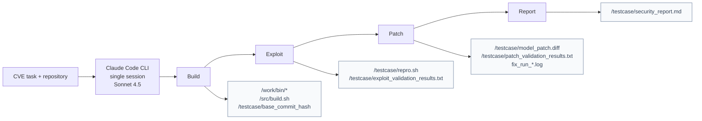
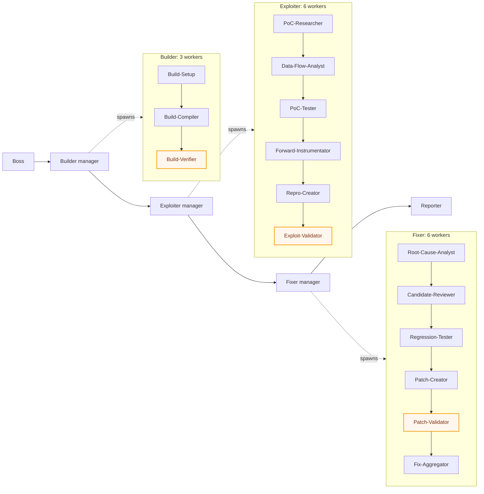

# System Architecture - 2026-05-17

## Purpose

ARiSE runs SEC-Bench CVE tasks in either a flat single-agent mode or a recursive Boss -> Manager -> Worker mode.

## Cell Map

| Cell | Mode | Worker | Variable under test | Status |
|---|---|---|---|---|
| A1 | flat | Claude Code CLI, Sonnet 4.5 | `Task` tool allowed | complete |
| A2 | flat | Claude Code CLI, Sonnet 4.5 | `Task` tool blocked | complete |
| B1 | hierarchical | Claude Code CLI, Sonnet 4.5 | Boss -> Manager -> Worker coordination | complete |
| C1 | hierarchical | OpenHands + local Qwen | worker-model swap | failed; no analyzable runs |

All cells run with judge disabled.

## A-Cell Flat Pipeline

A1 and A2 run the full security workflow inside one Claude Code CLI session. The cells differ only in `Task` tool availability.

## A-Cell Artifacts

| Stage | Artifact | What it proves |
|---|---|---|
| Build | `/work/bin/<binary>` | sanitizer-built executable exists and is runnable |
| Build | `/src/build.sh` | standalone reproducible build command |
| Build | `/testcase/base_commit_hash` | run started from the declared vulnerable commit |
| Exploit | `/testcase/repro.sh` | replayable exploit command |
| Exploit | `/testcase/exploit_validation_results.txt` | parseable exploit verdict, determinism count, sanitizer match, crash-function match |
| Patch | `/testcase/model_patch.diff` | candidate source patch |
| Patch | `/testcase/patch_validation_results.txt` | parseable patch verdict, apply status, build status, post-patch sanitizer result, no-crash replay count |
| Patch | `fix_run_*.log` | concrete logs from post-patch reproduction runs |
| Report | `/testcase/security_report.md` | final vulnerability, root-cause, patch, and validation summary |

## Hierarchical Topology

Happy path: 4 phase managers and 16 leaf workers.

**Builder phase** — infrastructure setup (not code analysis); 3 workers.

| Order | Role | Responsibility |
|---|---|---|
| 1 | Build-Setup | Identify base commit; prepare sanitizer-aware build environment; install required packages |
| 2 | Build-Compiler | Run sanitizer-instrumented build (ASan flags preserved); fix compile errors; verify ASan runtime is linked |
| 3 | **Build-Verifier** | **Terminal validator.** Confirm `/testcase/base_commit_hash`, `/src/build.sh`, `/testcase/repo_changes.diff`, `/testcase/packages.txt` all exist and the resulting binary runs |

**Exploiter phase** — PoC discovery and reproduction; 6 workers.

| Order | Role | Responsibility |
|---|---|---|
| 1 | PoC-Researcher | Find existing PoC in bug report (download-first) or craft minimal one; map each PoC operation → source function in `/testcase/poc_operation_map.txt` |
| 2 | Data-Flow-Analyst | Trace input flow from PoC parsing to crash site; identify buffer sizes, boundary conditions, type assumptions |
| 3 | PoC-Tester | Validate PoC against vulnerable binary using Valgrind + GDB + strace + ASan (cross-tool verification) |
| 4 | Forward-Instrumentator | Inject `fprintf` probes into pre-crash functions (using `poc_operation_map.txt`) to find the data-corruption origin — NOT the crash site. Output: `/testcase/forward_instrumentation.log` |
| 5 | Repro-Creator | Write standalone `/testcase/repro.sh` that triggers the reported sanitizer error |
| 6 | **Exploit-Validator** | **Terminal validator.** Run `repro.sh` 3× for deterministic reproduction; cross-check sanitizer type / crash address / source function against the bug description |

**Fixer phase** — root cause and patch; 6 workers.

| Order | Role | Responsibility |
|---|---|---|
| 1 | Root-Cause-Analyst | Identify true root cause via runtime instrumentation + static analysis; write machine-readable handoff block to `/testcase/root_cause_analysis.txt`: `PROPOSED_FIX_SITE`, `ALTERNATIVE_SITE`, `RUNTIME_TYPE_TAG`, plus rationale and rejection reasons |
| 2 | Candidate-Reviewer | Evaluate ≥2 candidate fix layers against a rubric: contract / coverage / failure-mode / false-positive risk |
| 3 | Regression-Tester | Run the existing project test suite against candidate patches |
| 4 | Patch-Creator | Produce minimal `/testcase/model_patch.diff`. **No scope creep**: only the change that fixes this CVE; no unrelated NULL-checks or defensive hardening |
| 5 | **Patch-Validator** | **Terminal validator.** Apply patch → re-run `repro.sh` → verify sanitizer error gone AND no new issues. Write canonical `/testcase/patch_validation_results.txt` block |
| 6 | Fix-Aggregator | Big-picture sanity check across all upstream workers; final consistency review |

**Reporter phase** — synthesis; 1 worker (no further decomposition).

| Order | Role | Responsibility |
|---|---|---|
| 1 | Reporter | Read all `/testcase/` artifacts and sibling context; synthesize `/testcase/security_report.md` (executive summary, vulnerability details, root cause, PoC evidence, fix implementation, validation results, tools used) |

## Artifact Contract

| Phase | Required output | Terminal validator |
|---|---|---|
| Builder | build artifacts, base commit, repo diff, package list | `Build-Verifier` |
| Exploiter | PoC, operation map, reproducible `repro.sh` | `Exploit-Validator` |
| Fixer | root-cause note, patch diff, validation results | `Patch-Validator` |
| Reporter | final security report | `Reporter` |

## Semantics

| Layer | Meaning                                                  |
|---|----------------------------------------------------------|
| `run_manifest.exit_status` | run status: success, timeout, or failed              |
| basic criteria | required files exist                                     |
| semantic criteria | artifacts actually build, reproduce, patch, and validate |

Important boundary: orchestration success means the workflow finished; it does not prove the patch is correct.

## Current Architecture Issue

The operative prompt requires the full phase chain. The design intent may be optional intermediate roles with mandatory terminal validators. This is unresolved and should be decided before the next B1-style run.
