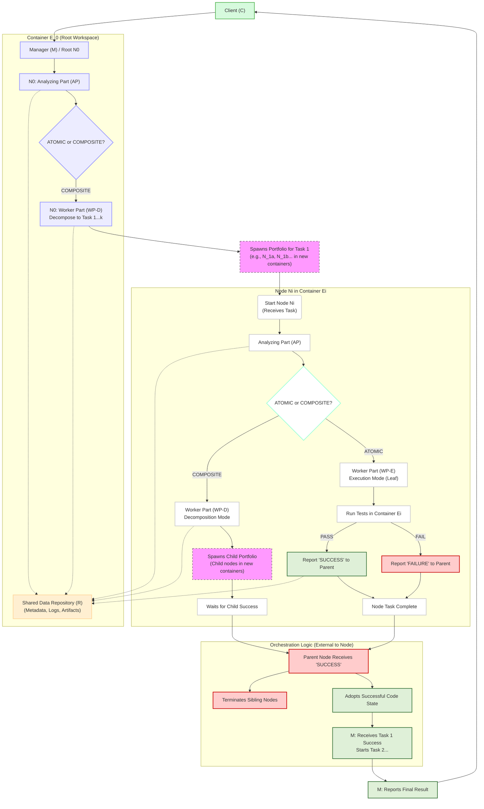

# Research Sync 2025-11-14

**Attendees:** Caroline Cahill, In Keun Kim, Song Li

**Date:** 2025-11-14
---

## Summary

Our task is split into two sections:

1. **Engineering:** A flexible, decoupled platform built on the OpenHands SDK(or Claude Code) to enable rapid
   prototyping.
2. **Algorithm:** The first hypothesis we are building to test on this platform: the **Dynamic AI Task-Resolution Tree (
   DART)**.

**Current Status:** 🟢 On Track / 🟡 Minor Obstacles / 🔴 Blocked

🟢 **On Track**: We refactored the SEC-Verifier with the newest release of OpenHands SDK, and now we are able to reproduce all instances on all OpenAI, Claude, and Gemini models faster and clearer. We devised a new tree-structured agentic system.

🟡 **Minor Obstacles**:

🔴 **Blocked**: None.

---

## Key Accomplishments This Week

### 1. Engineering: The Experiment Platform

#### Objective: Rapid Hypothesis Testing

The primary engineering goal is to create an "experiment platform" that enables "rapid hypothesis testing" using the *
*OpenHands SDK** and **Claude Code**.

**Why we are building this:**

* The `SecVerifier` architecture is tightly coupled with its paper's concepts, making it almost impossible to change
  control variables (e.g., model, temperature, number of agents, each agent's responsibility, etc.).
* We have many hypotheses for testing and need a flexible code architecture for this rapid prototyping of concepts.
* We have the modern OpenHands SDK and, despite some critical bugs, we have found effective workarounds.

#### Current Status (90% Complete)

* We have successfully cut the dependency between our repository and the original `Sec-Bench/Verifier` repo.
* The **only** remaining dependency is the "per-instance docker image setup," which we will continue to use.
* We can now **freely set models, filter instances on the go,** and re-architect agent workflows without being
  constrained by the old 3-phase-linear design.

## 2. Algorithm: Dynamic AI Task-Resolution Tree (DART)

## Revised Project Proposal: Dynamic AI Task-Resolution Tree (DART)

### 1. Project Objective

To create a **Dynamic AI Task-Resolution Tree (DART)** platform. This system autonomously manages a tree of "Nodes" to solve complex coding tasks. Each node determines its own role (Intermediate or Leaf) by analyzing its assigned task, then either recursively decomposes the task or executes it within a fully isolated Docker environment.

### 2. Core Components

* **Human Client (C):** Provides the initial, high-level task prompt.
* **Manager Agent (M) / Root Node ($N\_0$):** The `Layer 0` Node. This is the **most intelligent agent** in the system (e.g., GPT-5, Claude 4). Its job is to perform the initial task decomposition into a sequential list of high-level subtasks (`Task_1`, `Task_2`, ... `Task_k`).
* **Shared Data Repository (R):** A central database (e.g., PostgreSQL, MongoDB) that acts as the system's "Single Source of Truth." It stores **all metadata and artifacts**, including:
  * Node IDs, parent-child relationships, and tree structure.
  * The `status` of each node (e.g., `PENDING`, `RUNNING_AP`, `RUNNING_WP`, `SUCCESS`, `FAILED`).
  * All prompts, hyperparameters, and LLM responses for every node.
  * The final, successful code from any completed Leaf Node path, stored as an artifact.
* **Node ($N\_i$):** The fundamental computational unit of the tree. It is a stateful component that transitions between roles. Each Node contains:
  * **Analyzing Part (AP):** A fast, lightweight agent (e.g., Claude Sonnet, Gemini Pro) that classifies the given task.
  * **Worker Part (WP):** A more powerful, capable agent that has two distinct modes. The `AP`'s output determines which mode is activated:
    1. **Execution Mode (WP-E):** (If `ATOMIC`) Uses a specialized coding model (e.g., Claude Code, OpenHands) to write, test, and validate code.
    2. **Decomposition Mode (WP-D):** (If `COMPOSITE`) Uses a strategic, high-level model (e.g., GPT-5, Claude 4) to break the task into sub-tasks and define the next layer.
* **Dockerized Workspace Environment ($E$):** A **container specification** that defines a fully isolated environment.
  * **Image:** A pre-built Docker image containing all necessary tools: language runtimes (Python, Node.js), test frameworks (`pytest`, `jest`), linters, and `git`.
  * **Instantiation:** When a new solution path is spawned, the platform **instantiates a new Docker container** from this image.
  * **State:** The current codebase is copied or mounted into this container. All file I/O, code execution, and testing happen *inside* this sandbox.
  * **Lifecycle:** The container is **ephemeral**. It is created on-demand for a node path and **destroyed** upon success, failure, or termination.

### 3. Core Algorithm: The Node Lifecycle

This is the recursive logic that runs at **every Node ($N\_i$)** in the tree.

1. **Receive Task & Initialize Environment:**
   * A parent node spawns $N\_i$ (or `M` spawns $N\_1$).
   * The DART platform provisions a new **Docker Container ($E\_i$)** for this node, copying the parent's current code state into it.

2. **Analysis:**
   * $N\_i$ invokes its **Analyzing Part (AP)**.
   * **Input to AP:** The task description and the context of the code *within* $E\_i$.
   * **Output from AP (JSON):** `{ "plan": "[...]", "classification": "ATOMIC" | "COMPOSITE" }`

3. **Log & Transition:**
   * The `AP`'s output is logged to the **Shared Data Repository (R)**.
   * The Node $N\_i$ now transitions its state based on the classification.

4. **Decision & Work (The `if/else` branch):**
   * **If `classification == "ATOMIC"`:**
     * $N\_i$ becomes a **Leaf Node**.
     * It invokes its **Worker Part (WP)** in **Execution Mode (WP-E)**.
     * `WP-E` executes *inside the container $E\_i$*. It writes code, runs linters, and **executes unit tests**.
     * **If tests pass:** $N\_i$ reports "SUCCESS" to its parent. The final, validated code from $E\_i$ is extracted and stored in `R`. The container $E\_i$ is **destroyed**.
     * **If tests fail:** $N\_i$ reports "FAILURE." The container $E\_i$ is **destroyed**.
   * **If `classification == "COMPOSITE"`:**
     * $N\_i$ becomes an **Intermediate Node**.
     * It invokes its **Worker Part (WP)** in **Decomposition Mode (WP-D)**.
     * `WP-D` generates an ordered list of sub-tasks (e.g., `T_{i,1}`, `T_{i,2}`).
     * This sub-task list is logged to `R`.
     * $N\_i$ then spawns a "portfolio" of child nodes (e.g., $N\_\{i,1,a\}$, $N\_\{i,1,b\}$) to solve the *first* sub-task, `T_{i,1}`.

### 4. Key Architectural Principles




#### 4.1 The "Moat": The `Analyzing Part` (AP) Prompt (WIP)

The core logic of the system remains the `AP`'s prompt, which forces the AI to generate a plan to justify its classification.

> **Prompt for `Analyzing Part` Agent:**
>
> You are a `TaskAnalyzer` agent. Your job is to assess the complexity of a given programming task.
>
> **Task:** `[Parent node inserts subtask here]`
> **Context (from $E\_i$):** `[Parent node inserts relevant file names, class/function definitions, etc.]`
>
> **Your Steps:**
>
> 1. Write a brief, high-level **pseudocode plan** (1-3 lines) for how you would *personally* solve this task.
> 2. Examine your plan. Classify this task as `ATOMIC` or `COMPOSITE`.
>    * `ATOMIC`: The task can be reliably solved in a single coding action (e.g., writing one function, modifying one file).
>    * `COMPOSITE`: Your plan requires multiple distinct steps, sequential logic, or interaction between different files/components.
>
> **Respond in JSON format ONLY:**
>
> ```json
> {
>   "plan": "[Your 1-3 line pseudocode plan]",
>   "classification": "ATOMIC" | "COMPOSITE"
> }
> ```

#### 4.2 State vs. Artifact Separation

This separation is now hardware-enforced:

* **Artifacts (in R):** The **Shared Data Repository** is the permanent, centralized "brain" and logbook of the entire operation.
* **State (in $E$):** The **Dockerized Workspace** is the temporary, disposable "workbench" for a specific node path. It is completely isolated and can be destroyed without side effects.

#### 4.3 Parallel Portfolio Spawning

When an Intermediate Node $N\_i$ spawns children for a sub-task `T_{i,1}`, it spawns a competing portfolio of new Nodes ($N\_\{i,1,a\}$, $N\_\{i,1,b\}$, etc.).

* The platform spins up a **new, separate Docker container** ($E\_\{i,1,a\}$, $E\_\{i,1,b\}$) for *each* node in the portfolio.
* Each container is a *copy* of $N\_i$'s current code state from container $E\_i$.
* This is a **parallel race** between isolated containers.

#### 4.4 First-Success Termination

As soon as a "winning" node (e.g., $N\_\{i,1,a\}$) reports "SUCCESS":

1. **Termination:** The parent node $N\_i$ issues commands to **`docker stop` and destroy** all sibling containers (e.g., $E\_\{i,1,b\}$, $E\_\{i,1,c\}$) and their entire descendant trees.
2. **Adoption:** $N\_i$ receives the successful code state from the winning path. It **updates its own container $E\_i$** with this new code.
3. **Continuation:** $N\_i$ now moves on to its next sub-task, `T_{i,2}`, and spawns a new portfolio of children, all based on the newly updated code in $E\_i$.

### 5. High-Level System Workflow

1. **C $\rightarrow$ M:** Client submits the main problem.
2. **M ($N\_0$):** (Runs in its own container, $E\_0$)
   * Invokes **AP**, gets `COMPOSITE`.
   * Invokes **WP-D**, gets `Task_1`, `Task_2`, `Task_k`. Logs to **R**.
3. **M (for `Task_1`):**
   * Spawns a portfolio of Layer 1 Nodes ($N\_\{1,a\}$, $N\_\{1,b\}$).
   * The platform spins up **Container $E\_\{1,a\}$** and **Container $E\_\{1,b\}$**, both as copies of $E\_0$'s state.
4. **Node $N\_\{1,a\}$ (in $E\_\{1,a\}$):**
   * Invokes **AP**, gets `COMPOSITE`.
   * Invokes **WP-D**, gets `Task_{1,a,1}`.
   * Spawns a portfolio for this sub-task (e.g., $N\_\{1,a,1,x\}$). The platform spins up **Container $E\_\{1,a,1,x\}$**, a copy of $E\_\{1,a\}$'s state.
5. **Node $N\_\{1,a,1,x\}$ (in $E\_\{1,a,1,x\}$):**
   * Invokes **AP**, gets `ATOMIC`.
   * Becomes a **Leaf Node**.
   * Invokes **WP-E**. Code is written and tests pass *inside $E\_\{1,a,1,x\}$*.
6. **Propagation & Termination:**
   * $N\_\{1,a,1,x\}$ reports "SUCCESS" to $N\_\{1,a\}$.
   * The final code is extracted from $E\_\{1,a,1,x\}$ and saved to **R**.
   * Container $E\_\{1,a,1,x\}$ is **destroyed**.
   * $N\_\{1,a\}$ receives this success, terminates any sibling paths (e.g., $N\_\{1,a,1,y\}$), and updates its *own* container $E\_\{1,a\}$ with the new code.
   * This continues until $N\_\{1,a\}$ completes all its sub-tasks and reports "SUCCESS" for `Task_1` up to **M**.
7. **M (Root Node):**
   * Receives "SUCCESS" from $N\_\{1,a\}$.
   * Issues commands to **destroy Container $E\_\{1,b\}$** and its entire (now redundant) branch.
   * **Adopts** the final code state from $N\_\{1,a\}$ into its main container, $E\_0$.
8. **Repeat:** M now starts this entire process over for `Task_2`, using the newly updated codebase in $E\_0$.
9. **M $\rightarrow$ C:** After `Task_k` is complete, M reports the final, fully-coded result to the Client.